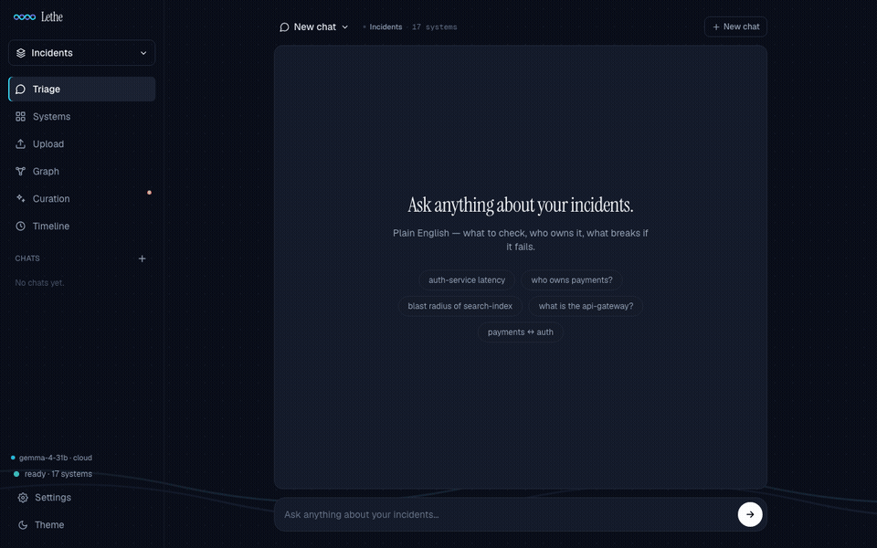
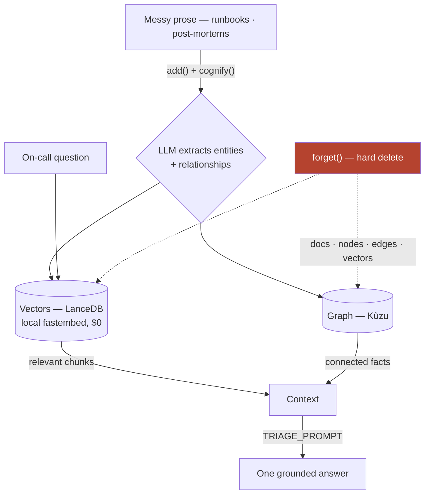
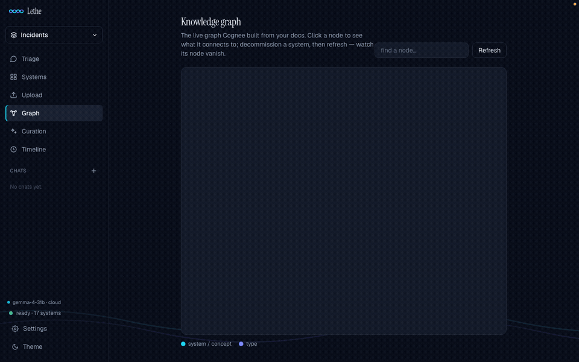
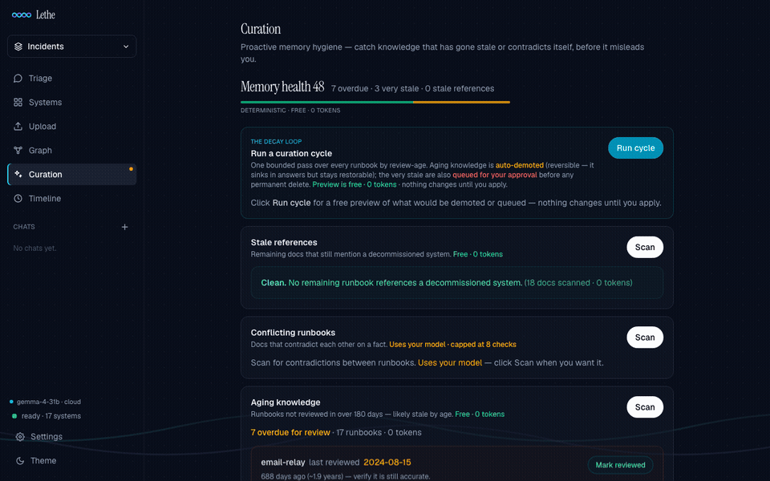

<div align="center">


It remembers your team's runbooks, answers on-call questions from a knowledge **graph**, and — the part almost everyone skips — **forgets** a decommissioned system so it never gives 3 a.m. advice about something you killed last quarter.

    



<em>The whole product in 18 seconds — same question asked twice; in between, one system is verifiably forgotten.</em>

### ⚡ [**Try it live → vinayaksonthalia-lethe.hf.space**](https://vinayaksonthalia-lethe.hf.space)

Ask *"If auth-service latency is high, what should I check?"* → decommission `legacy-cache` in **Systems** → ask the **same question** again — the answer flips. **Re-arm the demo** to run it again.

</div>

---

## What it is

> Drop in messy runbooks → Cognee builds a knowledge graph + vector index from the prose, **no schema** → ask plain on-call questions, get grounded, cited answers → and when a system is decommissioned, **forget it** — a real hard delete with a measured receipt — so the same question stops giving stale advice.

**Memory that stays current instead of rotting.** Everyone builds AI memory that accumulates; Lethe ships the half nobody does — *verifiable forgetting, as a first-class feature*.

---

## The hero beat

```
You:   If auth-service latency is high, what should I check?
Lethe: Check the legacy-cache — flush and resize the cluster, as it sits
       in front of the auth-service session reads.
```

Decommission `legacy-cache` → Lethe hard-deletes it and prints a **receipt**:

```
Forgot 2 documents · 10 graph nodes · 18 relationships · 0 chunks left in the index
Re-query proof — "What is legacy-cache?" → "It is not documented in the runbooks."
```

Ask the **exact same question** again:

```
Lethe: Check the session-store connection pool and its hit rate — the
       auth-service reads session state directly from the session-store.
```

The advice **flipped to the live system**. Not a soft filter — the docs, nodes, edges, and vectors are *gone*, and Lethe proves it. (Azure SRE Agent and Graphiti soft-invalidate; mem0's forgetting is hosted-only. Lethe's is entity-level, verifiable, self-hosted.)

---

## How it works



- **Vectors find what's relevant, the graph adds what's connected, the LLM writes one answer** — grounded by a custom `TRIAGE_PROMPT` that names systems, cites sources, and answers *"not documented"* instead of hallucinating.
- **Two layers of forgetting:** hard `forget` (permanent, receipted) + reversible **demote** via Cognee's feedback weights — a human-gated curation cycle sinks aging knowledge automatically and queues hard deletes for approval. It never deletes on its own.
- Deep dives on every stage: [`/learn`](https://vinayaksonthalia-lethe.hf.space/learn) (served in-app) or [`learning/`](learning/README.md).

## What's in the app

**Triage chat** (streamed, cited) · **Proof-of-Forgetting receipts** + erasure certificates · **Curation** (stale-refs, contradictions, aging — mostly 0-token) · **Memory timeline** (audit log of learn/review/forget) · **Live knowledge graph** (hover for blast radius) · **Workspaces** · **Bring-your-own-key** (any OpenAI-compatible or Ollama — fully offline capable) · **MCP server** for Claude Code / Cursor.

<table>
<tr>
<td width="50%"><br><em>The graph Cognee builds from plain prose — click a node for its blast radius.</em></td>
<td width="50%"><br><em>Curation — health score, decay-cycle preview, reversible demotes.</em></td>
</tr>
</table>

---

## Quickstart

> Python 3.12 · one OpenAI-compatible LLM key (Groq free tier works) · embeddings are local & free · pinned to Cognee 1.1.3.

```bash
# 1. clone + install
git clone https://github.com/vinayaksonthalia/lethe.git && cd lethe
uv venv && uv pip install -r requirements.txt        # or: python3.12 -m venv + pip

# 2. add one LLM key
cp .env.example .env                                 # paste it into LLM_API_KEY

# 3. build the demo graph (one time, ~1 min)
./.venv/bin/python scripts/setup.py

# 4. run — starts instantly
./.venv/bin/python -m uvicorn app:app --port 8077    # → http://localhost:8077
```

```bash
# reset the demo to a clean state any time (instant, zero quota)
./.venv/bin/python scripts/reset_demo.py
```

No key? The app still runs — Systems, Graph, Timeline, and the free Curation scans work offline; only chat/ingest need a model. Deploy your own: [`docs/DEPLOY.md`](docs/DEPLOY.md).

### Use it from your editor (MCP)

```bash
claude mcp add -s user lethe -- /abs/path/.venv/bin/python /abs/path/mcp_server.py
```

Then: *"Use lethe to triage: auth-service latency is high."* Tools: `triage` · `decommission_system` · `curation_scan` · `memory_timeline` + more ([details](learning/08-mcp-server.md)). Or install the bundled [Claude Code plugin](lethe-plugin/README.md).

---

## The research story (why we trust the hero)

We tested three Cognee capabilities against plain RAG at temperature 0 and **reported the losers**: multi-hop tied at demo scale, self-improvement didn't beat baseline — only **`forget` held**. Then we measured forgetting **twice** with an independent blind judge (different model family, scores correctness 0–2):

| Judged 0–2, before → after forget | Run 1 · 18 docs, 3 forgets | Run 2 · 27 docs, 6 forgets |
|---|---|---|
| **Update** — stale advice gets fixed | 1.0 → **2.0** | 1.5 → **2.0** |
| **Control** — unrelated answers stay right | 2.0 → 2.0 | 2.0 → 2.0 |
| **Abstention** — says *"not documented"* | 0.0 → 0.67 | 0.0 → 1.0 |
| **Index-level deletion proof** | ✓ 3/3 | ✓ 6/6 |

Per-question data in [`research/`](research/forget_correctness_results.json); our first benchmark was thrown out for being circular, and one rate-limit-corrupted run was discarded, not published. Full story: [`learning/05`](learning/05-the-research-story/what-we-tested-and-killed.md).

## Honest limits

Forgetting deletes from the **corpus**, not the model's training priors (we verify behaviorally too) · single-tenant by design (workspaces isolate; RBAC is roadmap) · citations are name-match provenance, not scored traces · benchmark is directional, not a p-value · pinned to 1.1.3 (1.2.x upgrade scoped in [`learning/07`](learning/07-cognee-capability-audit.md)).

---

## Project map

```
incident_brain.py   core: ingest() · ask() · forget_system() · TRIAGE_PROMPT
app.py              FastAPI app (:8077) + /learn in-app docs · templates/ page shells
mcp_server.py       MCP server (stdio) · lethe-plugin/ Claude Code plugin
scripts/            setup.py · reset_demo.py · dev tools     research/  experiments & evidence
learning/           every design decision explained, with flowcharts (served at /learn)
```

## Stack

| Layer | Choice | Why |
|---|---|---|
| Memory engine | **Cognee 1.1.3** | the full lifecycle in one API — `add` · `cognify` · `search` · `forget` |
| Graph store | **Kùzu** | embedded property graph; the incident world as typed nodes + edges |
| Vector store | **LanceDB** | file-based chunk embeddings — zero servers to run |
| Embeddings | **fastembed** `bge-small-en-v1.5` | local, 384-dim, $0 — nothing leaves the box |
| API & app | **FastAPI** + uvicorn | one process; page shells in `templates/` |
| UI | **Tailwind** + Instrument Serif / Geist | editorial cool-blue, no build step |
| Agent surface | **MCP** (FastMCP) | 10 tools callable from Claude Code / Cursor |
| LLM | any OpenAI-compatible or **Ollama** | swappable at runtime; the live demo runs Cerebras `zai-glm-4.7` |

## AI assistance disclosure

This project was built with **Claude Code** (Anthropic) as an AI pair-programmer — used throughout for implementation, debugging, the benchmark harness, docs, and content. Every architectural decision, the core thesis (verifiable forgetting), and the verification of all results — including reading actual output strings, discarding the first circular benchmark, and re-proving forget both structurally and behaviorally — were owned and checked by me. AI accelerated the build; it didn't make the calls.

<div align="center">

*Built by Vinayak Sonthalia for the WeMakeDevs × Cognee hackathon. Lethe — the river of forgetting.*

</div>
