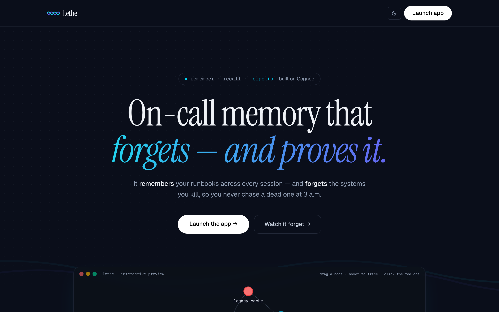
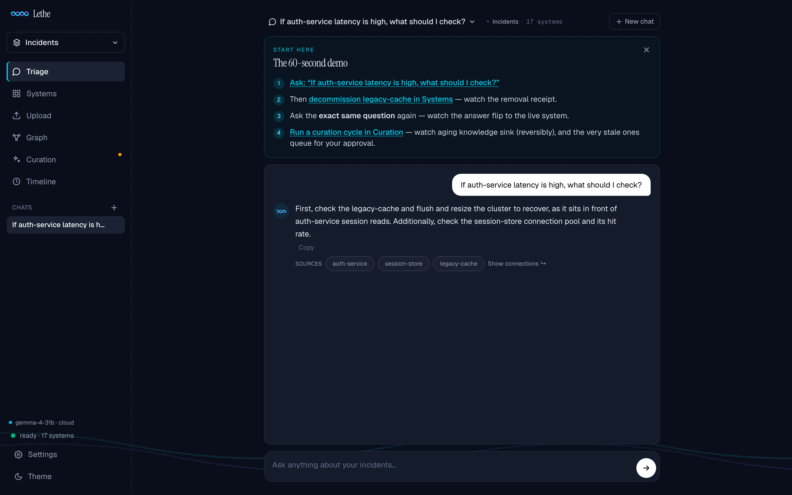
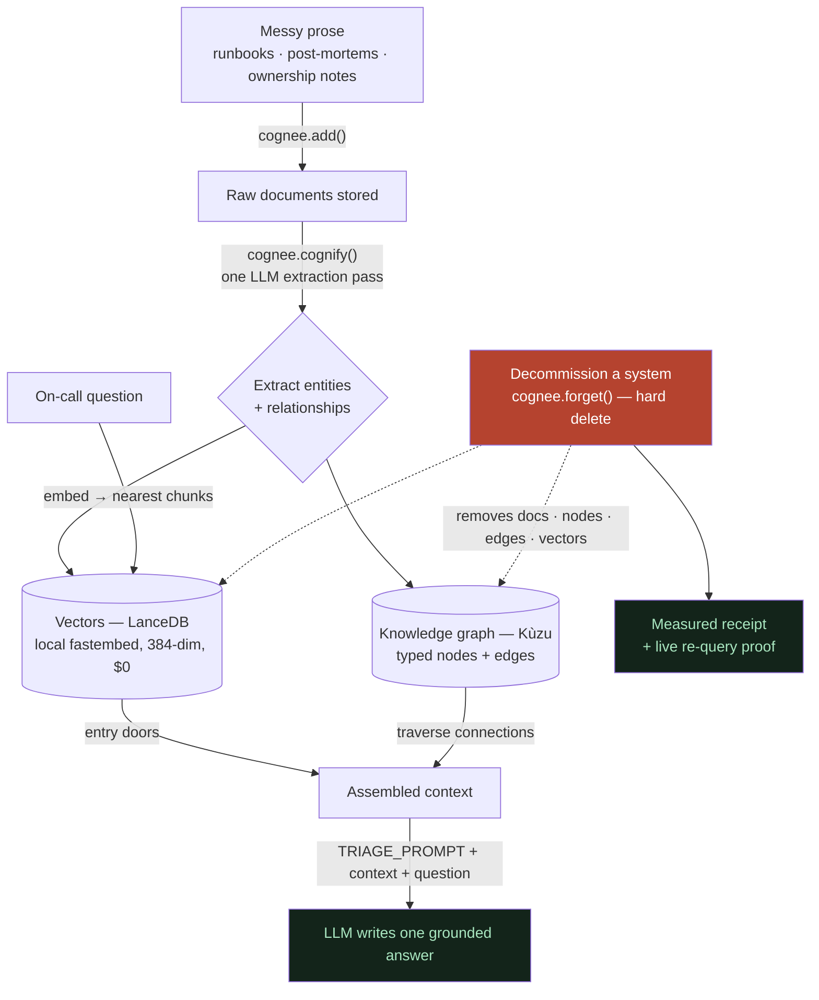
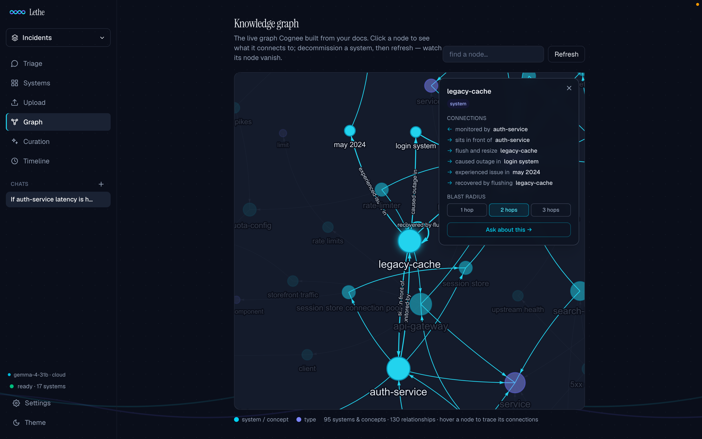
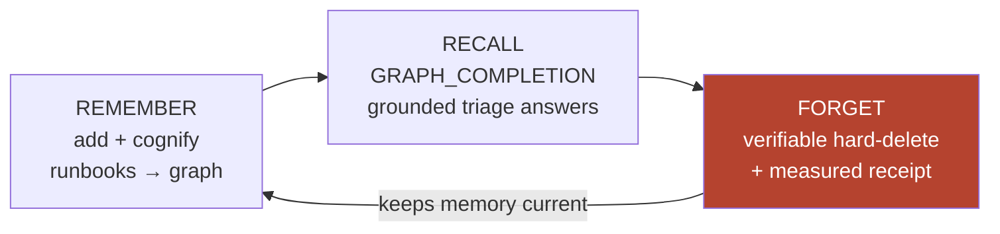
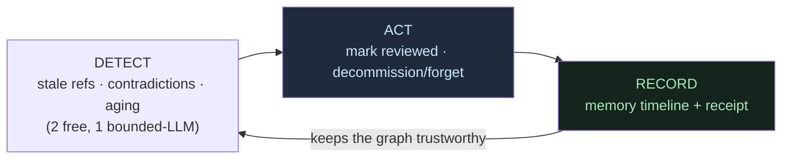
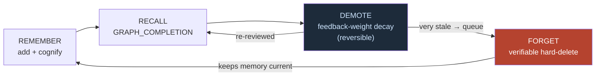
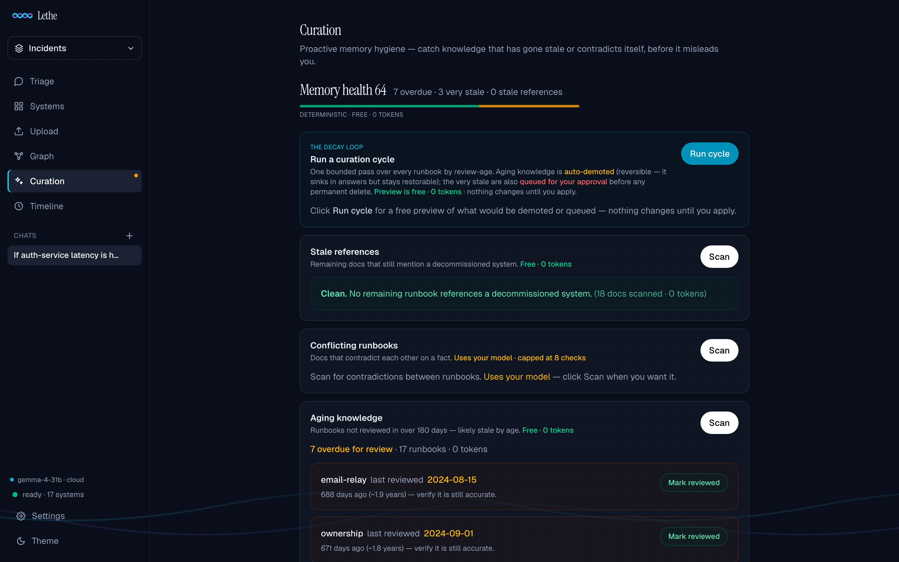
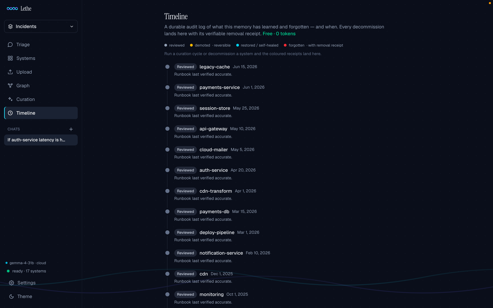

<div align="center">


It remembers your team's runbooks across every session, answers on-call questions from a knowledge **graph** (not a pile of disconnected facts), and — the part almost everyone skips — it can **forget** a decommissioned system so it never gives 3 a.m. advice about something you killed last quarter.

    



### ⚡ [**Try it live → vinayaksonthalia-lethe.hf.space**](https://vinayaksonthalia-lethe.hf.space)

No signup. Ask *"If auth-service latency is high, what should I check?"* → decommission `legacy-cache` in **Systems** (watch the receipt) → ask the **exact same question** again — the answer flips. Then hit **Re-arm the demo** and run it as many times as you like.

</div>

---

## The one-sentence version

> Drop in messy runbooks and post-mortems → Cognee builds a knowledge graph + vector index from the prose with **no schema** → ask plain on-call questions and get grounded answers → and when a system is decommissioned, **forget it** (a real hard delete, with a measured receipt) so the same question stops giving the stale advice.

**Memory that stays current instead of rotting.**

<sub>Jump to: [Judging criteria](#how-it-maps-to-the-judging-criteria) · [The hero](#the-hero-the-same-question-before-and-after) · [How it works](#how-it-works) · [Two layers of forgetting](#two-layers-of-forgetting-hard-delete-and-soft-decay) · [Everything it does](#everything-it-does) · [Quickstart](#quickstart) · [MCP](#use-it-from-your-editor-mcp) · [Research story](#the-research-story-why-we-trust-the-hero) · [Honest limits](#honest-limits-what-we-dont-claim)</sub>

---

## How it maps to the judging criteria

| Criterion | Where Lethe earns it |
|---|---|
| **Best Use of Cognee** | Uses the *whole* lifecycle — `add` + `cognify` → graph+vectors, `GRAPH_COMPLETION` search, hard `forget`, feedback-weight `demote`/`restore` — plus an upstream PR back to Cognee ([decay_memory #3443](https://github.com/topoteretes/cognee/pull/3443)). See [Built on Cognee's full memory loop](#built-on-cognees-full-memory-loop). |
| **Creativity** | `forget` as the first-class hero — with a measured deletion receipt and a blind-judged benchmark — in a field of accumulate-more apps. See [The hero](#the-hero-the-same-question-before-and-after). |
| **Impact** | Kills the 3 a.m. stale-runbook failure mode (Reddit's Pi-Day outage is the canonical example). See [Why this exists](#why-this-exists). |
| **Technical Excellence** | Graph+vector hybrid, local $0 embeddings, an independent blind-judge benchmark, self-heal curation loop, opt-in auth, MCP + Claude Code plugin. See [The research story](#the-research-story-why-we-trust-the-hero). |
| **UX** | Editorial dashboard, streamed answers with citations, a live theme-aware graph, one-click decommission with a receipt. See [Everything it does](#everything-it-does). |
| **Presentation** | This README, the [90-second demo beat](#the-hero-the-same-question-before-and-after), and the honest [limits](#honest-limits-what-we-dont-claim). |

> **We report our negative results, too.** We gauntleted three Cognee differentiators against plain RAG at temperature 0 — **only `forget` held**; multi-hop tied and self-improvement didn't beat baseline, so we *demoted* both. We even threw out our own first benchmark for being circular, and killed a chain-of-thought retriever that was 38× slower for no gain. The honest version is the whole [research story](#the-research-story-why-we-trust-the-hero).

---

## Why this exists

Two things are wrong with how most AI "memory" works today, and Lethe is built around both:

**1. Plain AI memory remembers *facts* but forgets *relationships*.**
Vector/RAG memory stores each chunk as an isolated fact and, at recall, fetches the nearest few. It can tell you *"legacy-cache is a memcached store"* and *"auth-service latency is high"* as two separate facts — but it can't traverse *"legacy-cache **sits in front of** auth-service, and **caused** the login outage."* The edges — the part that actually matters during an incident — vanish. Cognee fixes this by extracting a real **knowledge graph** alongside the vectors.

**2. Memory that only ever *grows* becomes its own hangover.**
Everyone races to remember *more*. But a runbook that was right 18 months ago, for a system you've since retired, is worse than no memory at all — you follow it at 3 a.m. and it sends you down a dead path. The cure isn't more memory; it's **curation** — and the sharpest tool for that is the one operation nearly every "AI memory" product treats as an afterthought: **`forget`.**

Lethe leans all the way into both. It's the contrarian primitive made into a product: *verifiable forgetting, as a first-class feature.*

---

## The hero: the same question, before and after

This is the whole pitch in 15 seconds. Ask one question, forget one system, ask the **byte-identical** question again — and watch the answer change on its own.

```
You: If auth-service latency is high, what should I check?

Lethe: Check the legacy-cache — flush and resize the legacy-cache cluster to
       recover, as it sits in front of the auth-service session reads.
       Sources: auth-service, session-store, legacy-cache
```

Now `legacy-cache` gets decommissioned. Lethe hard-deletes it and shows a **receipt** of exactly what was removed:

```
Decommissioned 'legacy-cache' — forgot 2 documents from the graph + vectors.

Proof of Forgetting — measured removal:
  • documents removed:      2
  • graph nodes removed:    10
  • relationships removed:  18
Re-query proof — "What is legacy-cache?":
  "It is not documented in the runbooks."
```

Ask the **exact same question** again:

```
You: If auth-service latency is high, what should I check?

Lethe: Check the session-store connection pool and its hit rate — the
       auth-service reads session state directly from the session-store.
```

The advice **flipped to the current system**, with zero re-prompting and no trace of the forgotten one. That's not a soft filter or a re-ranked exclusion — the documents, the 10 graph nodes, the 18 relationships, and the vectors are *gone*, and Lethe proves it.

> No competitor surfaces deletion like this. Azure's SRE agent and Graphiti *soft-invalidate*; mem0 has a forgetting policy but it's hosted-only. Lethe does **entity-level, verifiable, self-hosted** hard-delete — and shows you the measured diff.

---

<div align="center">



<em>That exact answer in the app — graph-grounded, with the source runbooks it drew from.</em>

</div>

## How it works

One `cognify()` pass turns plain prose into **two stores that are queried together** — a graph for *structure* and vectors for *relevance*. The LLM is the final combiner; there's no numeric score fusion.



- **Graph = Kùzu** — nodes + edges, for *"what's connected"* (and what coreference-merged into one entity across docs).
- **Vectors = LanceDB** — chunk embeddings via **local** `BAAI/bge-small-en-v1.5` (fastembed). Fully offline, **zero embedding quota** — only the LLM calls cost anything.
- **Answers come from `TRIAGE_PROMPT`, not phrasing.** Cognee's default completion prompt says *"be as brief as possible,"* which collapses under-specified questions to a bare fragment. Our `system_prompt` override makes short, natural on-call questions return a concise, full answer — while its "say so plainly" clause keeps a *forgotten* system honestly answering *"not documented"* (that clause protects the hero).

Want the deep version? Every stage is a flowchart in [`learning/01-how-it-works/`](learning/01-how-it-works/00-overview-the-pipeline.md).

<div align="center">



<em>The live graph Cognee builds from plain prose. Click a node to read its real connections — <code>legacy-cache → caused → memory eviction storm → impacted → login system</code>. These edges are exactly what plain vector memory forgets.</em>

</div>

---

## Built on Cognee's *full* memory loop

Most projects use one or two of Cognee's operations. Lethe uses the whole lifecycle — **remember → recall → forget** — and treats `forget` as the headline, not a footnote.



And on top of the loop, a **memory-hygiene layer** that's genuinely ahead of the canonical Cognee "Company Brain" starter (which defers contradiction-detection and recency to a future version — we ship them now):

- **Curation trilogy** — *stale references* (docs still mentioning a decommissioned system) + *contradictions* (runbooks that disagree) + *aging* (overdue for review). Two are deterministic and **0-token**; the contradiction scan is a **bounded** LLM pass (capped, with the cost printed in the UI).
- **Detection → action** — aging findings have a one-click **"Mark reviewed"** that refreshes the date *and* lands on the memory timeline. It's a workflow, not just a report.
- **Memory timeline** — a durable audit log of everything learned, reviewed, and forgotten — and *when*. Every forget lands here with its receipt. (The GDPR / right-to-be-forgotten angle: *prove what you forgot, and when.*)

The three close a loop most "AI memory" never does — they don't just *store*, they **keep memory honest**:



### Two layers of forgetting: hard delete *and* soft decay

Hard `forget` is the permanent, GDPR-shaped answer. But most stale knowledge doesn't need deleting — it needs to *sink*. So Lethe adds a second, reversible layer built on Cognee's **feedback-weight** subsystem (`set_node_feedback_weights` + `feedback_influence`):

- **Demote** — an aging runbook's nodes are down-weighted so they stop surfacing in answers, but nothing is deleted. It can be **restored** at any time.
- **The curation cycle** — one bounded, human-gated pass over every runbook by review-age: mildly overdue → auto-demote, very overdue → auto-demote **and** queue a hard-delete *proposal for a human*. It **never deletes on its own** (that solves the absent-approver problem: stale advice sinks automatically; permanent removal always waits for a person). The dry-run preview costs **0 tokens**.
- **Self-heal** — mark a demoted runbook reviewed and it auto-restores. The loop closes itself.

This isn't speculative: Cognee's founder, asked how he thinks about forgetting, said *"naturally fading is the most effective, but over time memory maintenance will likely be added to the mix."* That's exactly these two layers — **demote** is the natural fade, the **curation cycle** is the maintenance. Lethe ships both today.



> The capability audit — what Cognee's installed `1.1.3` actually exposes, what we use, and what we deliberately *don't* (and why) — is in [`learning/07`](learning/07-cognee-capability-audit.md). It even documents two experiments we **killed** (chain-of-thought retrieval was 38× slower for no gain; a raw-context evidence panel would have broken our trust model). Saying "no" with evidence is part of the work.

---

## Everything it does

| Area | What you get |
|---|---|
| **Triage chat** | Graph-grounded answers **streamed token-by-token** with clickable **source citations**; multi-turn context; persistent per-workspace threads; honest "not documented" on off-domain questions (no hallucination); 60s timeout + Retry so a stalled model never freezes the chat. |
| **Proof of Forgetting** | Decommission → premium confirm → measured receipt (docs / nodes / edges removed) → live re-query proof. |
| **Curation** | Stale-reference + contradiction + aging scans, each labeled by token cost; the view opens as a live dashboard (free scans auto-run, the paid one stays opt-in). |
| **Memory timeline** | Chronological audit log of add / review / forget events; forgets carry their receipt. |
| **Knowledge graph** | Obsidian-style, degree-sized, hover-to-trace; **click a node** for a plain-text panel of its real connections (`legacy-cache → caused → memory eviction storm → impacted → login system`). |
| **Workspaces** | Isolated knowledge bases, each with its own graph + ledger; fail-closed routing (a stale id can never corrupt the golden graph); hard-delete on workspace removal. |
| **Bring your own key** | Swap LLM provider at runtime (OpenAI / Anthropic / OpenRouter / Groq / Ollama / custom) — validated and **auto-reverted** if the key is bad, so a typo can't break the running app. |
| **Runs offline** | Local fastembed embeddings + a local Ollama model = nothing leaves your machine. |
| **Callable over MCP** | `triage`, `decommission`, curation, timeline exposed as MCP tools — use Lethe from Claude Code / Cursor without a browser. |

A flowchart for every one of these lives in [`learning/06-the-product-now.md`](learning/06-the-product-now.md).

<table>
<tr>
<td width="50%"><br><em align="center">Curation — stale refs + aging auto-run (free); contradictions stay opt-in.</em></td>
<td width="50%"><br><em>Memory timeline — a durable audit log of what was learned, reviewed, and forgotten.</em></td>
</tr>
</table>

---

## Quickstart

> Requires Python 3.12. Bring **one** OpenAI-compatible LLM key — tested end-to-end on **Groq's free tier** with `openai/llama-3.3-70b-versatile`. Embeddings run locally (`fastembed`) — no embedding key, no embedding cost. Pinned to **Cognee 1.1.3**.

```bash
git clone https://github.com/<your-username>/lethe.git && cd lethe

# 1. create the venv + install deps (uv recommended; plain venv+pip works too)
uv venv && uv pip install -r requirements.txt
#   or:  python3.12 -m venv .venv && ./.venv/bin/pip install -r requirements.txt

# 2. add ONE LLM key (embeddings are local — nothing else needed)
cp .env.example .env      # then paste a Groq key into LLM_API_KEY

# 3. one-time cold build — ingests the demo runbooks + builds the graph (~1 min)
./.venv/bin/python scripts/setup.py

# 4. run the app — starts INSTANTLY (loads the prebuilt graph, no cognify at serve time)
./.venv/bin/python -m uvicorn app:app --port 8077
#    → http://localhost:8077  (landing)  ·  http://localhost:8077/app  (dashboard)

# reset the demo to the golden build any time (instant, zero quota — restores the snapshot)
./.venv/bin/python scripts/reset_demo.py
```

**No key yet?** The app still starts and the prebuilt graph loads: **Systems**, **Graph**, **Timeline**, and the free **Curation** scans all work offline. Only the parts that call the model — **Triage chat**, **Upload/ingest**, and the forget re-query proof — need a key.

**The demo beat:** in the dashboard, ask *"If auth-service latency is high, what should I check?"* → decommission **`legacy-cache`** (watch the receipt) → re-type the **same** question → the answer flips to *"the session-store connection pool and its hit rate."* Reset with `scripts/reset_demo.py` to do it again.

---

## Use it from your editor (MCP)

Lethe's memory is callable as MCP tools, so an on-call engineer can triage from inside Claude Code or Cursor.

```bash
# with the app running on :8077, register the server (works from any directory):
claude mcp add -s user lethe -- /abs/path/.venv/bin/python /abs/path/mcp_server.py

# then, in a claude session:
#   "Use lethe to triage: auth-service latency is high, what should I check?"
#   → calls mcp__lethe__triage and answers from Lethe's graph memory.

# zero-setup sanity check (no client needed):
./.venv/bin/python scripts/try_mcp.py
```

Tools exposed: `triage` · `decommission_system` · `list_systems` · `curation_scan` · `check_conflicts` · `mark_reviewed` · `memory_timeline` · `list_workspaces`. Full setup + design notes: [`learning/08-mcp-server.md`](learning/08-mcp-server.md).

**Or install it as a Claude Code plugin.** [`lethe-plugin/`](lethe-plugin/) bundles the MCP server *and* an `incident-triage` **skill** that teaches an agent the whole beat — triage → decommission → re-ask the same question and watch it flip. One-line install from the repo:

```
/plugin marketplace add <path-to-repo>   &&   /plugin install lethe@lethe-marketplace
```

Details in [`lethe-plugin/README.md`](lethe-plugin/README.md).

---

## The research story (why we trust the hero)

We didn't assume `forget` was the differentiator — we **gauntleted three of them** against plain RAG at temperature 0, and reported the losers honestly:

- **Multi-hop lookup** — ties RAG at demo scale. *Killed.*
- **Self-improvement / blast-radius** — doesn't reliably beat the temp-0 baseline. *Demoted.*
- **`forget`** — the one that held. Verified *structurally* (0 residue in retrieved context after a forget) and *behaviorally* (20/20, plus adversarial probes), then re-confirmed through the full app and the MCP path.

**And we measured it — honestly (the "Stale-Advice Eradication" benchmark).** [`research/forget_correctness_benchmark.py`](research/forget_correctness_benchmark.py) runs on an **18-document / 17-system** corpus answered by **`llama-3.3-70b`** (the demo model), decommissions three systems (`legacy-cache`, `email-relay`, `image-resizer`), and re-asks — then an **independent model of a different family (`gemini-2.5-flash`), blind to before/after, scores each answer 0–2** against the known-correct current guidance. It scores **correctness, not the mere absence of a deleted word** — an earlier benchmark did the latter, which is circular (deleting a doc trivially removes its name), so we threw it out.

**The result** (independent blind judge, 0–2 scale):

| Dimension | Before → After |
|---|---|
| **Update** — does stale advice get fixed? | **1.0 → 2.0** |
| **Abstention** — does it correctly say *"not documented"* about a forgotten system? | **0.0 → 0.67** |
| **Control** — do unrelated answers stay correct (surgical)? | **2.0 → 2.0** |
| **Retrieval-layer deletion** — are the forgotten doc's chunks gone from the index? | **✓ verified** (3/3 systems) |

Forgetting fixed the stale advice (update 1.0 → 2.0) without touching unrelated answers (control held at 2.0). Abstention rose from 0 to 0.67: the hero `legacy-cache` cleanly answers *"not documented"* after forget, while `email-relay`/`image-resizer` instead **redirect to their replacements** — a nuance we report rather than hide. And beyond the answer text, a chunk-level search proves the forgotten documents are **gone from the retrieval index**, not merely rephrased around. Numbers live in [`research/forget_correctness_results.json`](research/forget_correctness_results.json) and on the landing's *"Forgetting, proven"* panel (`GET /evidence`). It's a run-once, capture-the-result artifact (the blind judge is LLM-quota-heavy).

**Replicated at 2× scale with a different model pair.** We re-ran the same protocol on a **27-document / 18-system corpus with six decommissions**, with a completely different pairing — system under test `zai-glm-4.7` (the model the live demo runs), judge `gpt-oss-120b`, both families different from run one. Result: update **1.5 → 2.0** (the stronger model partially resists stale bait even before the forget — an honest finding, and forgetting still lifts it to perfect), control held **2.0 → 2.0**, abstention rose **0.0 → 1.0**, and the chunk-level deletion proof passed **6/6 systems**. Full data in [`research/forget_correctness_results_n6.json`](research/forget_correctness_results_n6.json). One failed attempt along the way (provider rate-limiting silently dropped half the corpus mid-ingest) was **discarded, not published** — the fix (batched cognify) is in the benchmark script.

That honesty is deliberate: the judging criteria reward craft and depth, not a fragile "we beat RAG" claim. The full story is in [`learning/05-the-research-story/`](learning/05-the-research-story/what-we-tested-and-killed.md).

---

## Honest limits (what we don't claim)

- **Not "the only ones who can forget."** mem0 ships a forgetting policy too. Our defensibility is the *product*: entity-level, **verifiable**, self-hosted, workflow-wired forgetting + proactive curation.
- **Auth + rate limiting are opt-in (off by default).** Locally the routes are open — correct for a 127.0.0.1 demo. Before any public deploy, set `LETHE_AUTH_TOKEN` and every API route requires `Authorization: Bearer <token>` (the web UI and MCP server attach it automatically; landing/`/app`/`/health` stay open so the page can load), and set `LETHE_RATE_LIMIT="N/S"` to throttle the mutating/quota-spending routes (`/forget`, `/upload`, `/curation/*`, `/llm-config`) per IP. Both are single-instance guards, not multi-user RBAC — **single-tenant by design** (see below), right-sized for a self-hosted instance, not a SaaS.
- **Single-tenant by design.** One instance per team — like early Grafana or a self-hosted Sentry. Workspaces isolate knowledge bases (each its own Cognee dataset + graph); the opt-in bearer token gates a shared deploy. Org-level accounts and RBAC are an enterprise-roadmap layer on top, not a missing bolt — the memory primitive is the product, and it's deliberately deployable as a private box before it's a SaaS.
- **Chat threads are client-side today.** History/threads live in the browser (`localStorage`), so they're per-device, not synced. That's fine for a single operator at a terminal; server-side sessions are roadmap (and would ride on the same auth layer).
- **Citations are provenance by name-match**, not a scored retrieval trace — they tell you *which runbooks the answer drew on*, honestly, without claiming a ranking they don't have.
- **The benchmark is directional, not a p-value.** Two blind-judged runs — 3 decommissions/18 docs, replicated at 6 decommissions/27 docs with a different model pair — enough to show the effect is real, surgical, and holds across models; not enough to call it "proven at scale." We say so.
- **Pinned to Cognee 1.1.3.** 1.2.x's structured graph build fails with our weak local-friendly LLM (empty graph). The path forward — a tight custom `graph_model` to shrink the structured-output target — is scoped in [`learning/07`](learning/07-cognee-capability-audit.md).
- **One soft edge:** a question about a *facet* of a system that *has* a runbook can occasionally over-point to that runbook instead of admitting the facet is undocumented. It's an LLM limit, not prompt-fixable; the demo is hero-driven so it's a documented residual, not a blocker.

---

## Project map

```
incident_brain.py     core loop: ingest() · ask() · forget_system() · TRIAGE_PROMPT
app.py                FastAPI app (:8077) — landing, dashboard, all endpoints
mcp_server.py         MCP server (stdio) — thin proxy exposing Lethe's tools
scripts/              setup.py (cold build → ledger.json) · reset_demo.py (restore golden, instant) · dev tools (verify_clean · smoke_web · qa_harness · capture_screens · try_mcp)
research/             one-off experiments & evidence (RAG-vs-graph · forget validation · feedback probes)
learning/             the whole project explained twice over (kid + judge), with flowcharts
  ├─ 00–05            big picture · how-it-works · cognee deep-dive · stack · Q&A · research story
  ├─ 06-the-product-now.md         every feature as a control-flow flowchart  ← fastest orientation
  ├─ 07-cognee-capability-audit.md  what Cognee offers vs what we use (+ killed experiments)
  └─ 08-mcp-server.md               the MCP doorway
```

The `learning/` folder isn't an afterthought — it's verified against the running app and Cognee's source, and it's the raw material this README is built from. Start at [`learning/README.md`](learning/README.md).

---

## Roadmap

- **Deploy it** (a live URL beats "clone and run"). The shared-secret auth gate is **already built** (`LETHE_AUTH_TOKEN`, opt-in) — remaining: a Docker image + a deployment guide (which would also close [cognee-integrations#89](https://github.com/topoteretes/cognee-integrations/issues/89)).
- **De-risk the Cognee 1.2.x upgrade** behind a tight custom `graph_model` (also cleans up extracted entities).
- **Enterprise layer** — org accounts + RBAC and server-side chat sessions on top of the existing auth gate (turns single-tenant boxes into a managed multi-team deployment).
- **Split `app.py` into modules** (routes / views / templates) post-hackathon — it's one file today for a reason (zero-config, one-command run), but it's the obvious next refactor.
- **Submission assets** — a <90s demo video built on the same-question-flip, and a blog ("I tested 3 Cognee differentiators at temp 0 — only `forget` held").

---

## Stack

**Cognee 1.1.3** (graph + vector memory) · **Kùzu** (graph) · **LanceDB** (vectors) · **fastembed** `bge-small-en-v1.5` (local embeddings) · **FastAPI** + **uvicorn** · **Tailwind** (browser CDN) + Instrument Serif / Geist Mono · **MCP** (FastMCP) · LLM via any OpenAI-compatible provider or local **Ollama**.

<div align="center">

*Built for the WeMakeDevs × Cognee hackathon. Lethe — the river of forgetting.*

</div>
