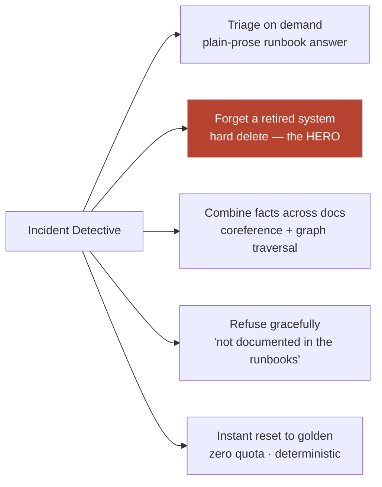

# Is the Research Done?

**In one line:** Yes — the research and the hard build are done and verified against running code; what remains is presentation polish (UI, README, demo recording, blog, optional PR).

---

## ELI10 (explain like I'm 10)

Think of building a treehouse. The hard part — climbing up, hammering the boards, making sure it holds your weight — is **finished and tested**. We jumped up and down on it; it's solid.

What's left is the fun, easy stuff: painting it a nice color, putting up a sign, and taking a photo to show your friends. None of that is *figuring out how to build a treehouse* anymore. It's just making the finished thing look good.

That's where this project is. The thinking and the building are done. The decorating and the showing-off are what remain.

---

## The honest done / not-done line

This matters for a hackathon judge, so let's be precise and avoid overclaiming.

**Done — and verified this session against the actual running code and Cognee source:**

- The full **ingest → ask → forget** loop works.
- **Forget is a real hard delete**, proven *two* ways: structurally (raw files removed, doc count 7→5, zero residue across 5 phrasings in `only_context`) and behaviorally (the retired system never resurfaced under re-asks, name lookups, and adversarial phrasings).
- The **`TRIAGE_PROMPT` fix** for the bare-fragment bug, validated by three controlled experiments with retrieval held constant and the prompt as the only variable.
- The **two-store Cognee pipeline** (Kùzu graph + LanceDB vectors) with **local** offline embeddings (zero API quota for retrieval).
- The **FastAPI app** (port 8077, `/ask`, `/forget`, `/health`, `/`) and the **snapshot/restore demo reset** (instant, deterministic, zero quota).

**Not done — presentation only, no open research questions:**

- UI polish on the chat page.
- README.
- Demo recording.
- Blog post.
- Optional upstream PR.

**Honest limits we did NOT solve (and chose not to fake):**

- **Forget cleans the corpus, not the model's training knowledge.** A clean graph is necessary, not sufficient — which is why we also verified behavior. (Full reasoning in [the-problem-static-memory-rots.md](the-problem-static-memory-rots.md).)
- **Prompt leverage has a ceiling.** It can't conjure a fact retrieval never fetched (the vector top-k limit), and it can't *fully* kill hallucination. We hit that ceiling and correctly **stopped tuning** rather than chasing diminishing returns.
- **Off-corpus over-confidence on a facet of an existing system.** If you ask about a *sub-question* of a system that *has* a runbook (e.g. "what's the deploy process for search-index?"), the model can over-confidently point at the runbook instead of admitting that specific step isn't documented. This is an LLM inference limit — telling "I have a doc about X" apart from "this doc answers *this specific* sub-question" — **not** prompt-fixable. It's documented, and since the demo is hero-driven (forget), it's a known, acceptable residual.
- **At this small corpus, the graph layer adds little over vectors for simple lookups** (graph ≈ RAG). The graph's edge grows with scale and on relationship / multi-hop questions. We tested three Cognee differentiators against plain RAG at temperature 0; only **forget** held cleanly. Saying that out loud is the spine of the blog and the reason the project is honest rather than hype.

So: research **done**, hero **verified**, limits **stated**. Nothing left is a question mark — it's a to-do list.

---

## Five cool things it can do

1. **Triage on demand.** Ask a plain-English incident question and get a calm, plain-prose runbook answer that names the specific systems and actions — e.g. *"If auth-service latency is high, what should I check?"*

2. **Forget a decommissioned system.** Retire a system and the assistant hard-deletes its docs (files + graph + embeddings), so its stale advice can never resurface. This is the hero.

3. **Combine facts across documents.** Because the same entity is merged into one node across docs (coreference resolution), it can answer questions that stitch together multiple runbooks — e.g. understanding the full auth read path or a blast radius.

4. **Refuse gracefully when it doesn't know.** Thanks to the `TRIAGE_PROMPT`, when the corpus lacks an answer it says *"not documented in the runbooks"* instead of inventing one — which both curbs hallucination and keeps the forget hero clean.

5. **Reset to a perfect clean state instantly.** Snapshot/restore brings the knowledge base back to a known-good golden build with zero quota and full determinism, so the hero beat is repeatable on demand.

---

## Who it's for (four audiences)

1. **The on-call engineer (3am, site down).** The primary user. They need one calm, current sentence telling them what to check — not 50 pages, and *never* a pointer to a system that no longer exists.

2. **The new hire.** Someone who just joined and doesn't yet know how the systems connect. They can ask the assistant instead of interrupting a senior engineer, and the graph's cross-document links surface relationships a newcomer wouldn't know to look for.

3. **The post-incident reviewer.** After an outage, someone writing up what happened can query the knowledge base to reconstruct dependencies and ownership ("who owns payments-service?" → *"The payments-team owns the payments-service."*).

4. **The knowledge-base keeper.** The person responsible for keeping docs *current*. Forget is their tool: when a system is decommissioned, they retire it from the assistant in one action, preventing the slow rot that makes static memory dangerous in the first place.

---

## Why it matters (demo / judging)

- **"Research done, limits stated" beats "everything works perfectly."** Judges trust a team that knows exactly where its guarantees end more than one that overclaims.
- **The five capabilities map to real workflows**, and the four audiences show the project isn't a toy — it has a believable user on the other side of every feature.
- **The remaining work is all presentation**, which means there's no risk of an unsolved core question blowing up on demo day — the hard part is behind us and verified.

---

## Related

- [what-is-this.md](what-is-this.md) — the project and the 3am panic moment
- [the-problem-static-memory-rots.md](the-problem-static-memory-rots.md) — the thesis and the honest limit of forget
- [what-we-built.md](what-we-built.md) — the components and the hero beat step-by-step
