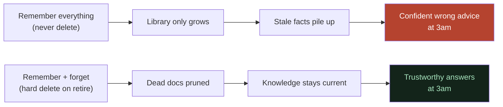

# The Problem: Static Memory Rots

**In one line:** Everyone is racing to build AI that remembers *more*, but the real on-call disaster is AI that confidently remembers the *wrong, stale* thing — so the goal should be memory that can forget.

---

## ELI10 (explain like I'm 10)

Think about the contacts list in a phone. If you *only ever add* names and never delete anyone, what happens over a few years? You end up calling your old friend's number — except a stranger has that number now. You followed your "memory" perfectly and still got it completely wrong.

The problem wasn't that you forgot a number. The problem was that you **kept one you should have deleted.**

That's what happens to AI helpers that are built to "remember everything." Old facts pile up. The world changes. The helper keeps confidently repeating things that *used to* be true. It doesn't feel broken — it feels *sure* — which is exactly what makes it dangerous.

---

## The real thing: stale advice at the worst moment

In software, teams write **runbooks** — step-by-step notes on how to fix things when they break. Over time, systems get retired. A team might shut down an old caching server, replace a database, or kill a feature. But the *runbooks that mention those things often stick around*. Nobody remembers to delete them. They rot in place.

Now it's 3am, the site is down, and the on-call engineer asks the AI helper for help. If the helper is built on a "remember everything forever" design, here's the failure:

> Engineer: *"auth-service is slow, what do I check?"*
>
> Helper: *"Check the legacy-cache — flush and resize the cluster."*

Except the legacy-cache was **decommissioned last month**. It doesn't exist. The engineer now wastes precious minutes hunting for a box that was unplugged, while real customers can't log in. The helper didn't malfunction. It did *exactly* what it was designed to do: remember. It just remembered something that should have been forgotten.

This is what we mean by **static memory rots**: a memory that can only grow, never shrink, slowly fills with confident lies.

---

## Why "remember more" is the wrong north star

Most memory-focused AI projects optimize one axis: *recall*. Can it remember more facts, over longer time, across more documents? That's a real and useful axis — but it quietly assumes every remembered fact stays *true*.

In a living system, that assumption breaks constantly:

- Systems get **decommissioned**.
- Owners change teams.
- "The fix" from last year becomes the *thing that breaks you* this year.
- A post-mortem describes a system that no longer exists.

A bigger memory just means **more stale facts**, stated with the same confidence as the fresh ones. The helper has no way to tell "still true" from "used to be true." More memory makes that *worse*, not better.

So the right question isn't *"How much can it remember?"* It's *"Can it stop remembering the things that have stopped being true?"*

---

## The sharper thesis

> Static memory rots. The hard, unglamorous, genuinely valuable capability is **forgetting the right thing at the right time** — so the assistant's knowledge stays *current*, not just *large*.

This reframes the whole project. We are not competing on "remembers the most." We're claiming a different, neglected axis: **knowledge hygiene**. An assistant that prunes dead knowledge is more trustworthy than one that hoards everything, because trust at 3am comes from *currency*, not volume.

That's why the hero capability of Lethe is **forget** — and why we treat *remember* as table stakes and *learn/improve* as only a weak supporting leg. (See the hero beat in [what-we-built.md](what-we-built.md).)

---

## What "forget" actually has to mean (and the honest limit)

It's easy to fake forgetting. A lazy version just *hides* a fact — soft-excludes it from search while the data still sits in the database. That's not forgetting; it's looking away.

Real forgetting in this project is a **hard delete**, verified at the data layer: the system's raw text files are removed from disk, and its nodes, edges, and embeddings are purged from the graph and vector stores. We watched the document count drop from 18 to 16 after retiring the legacy-cache's two docs, and confirmed zero residue across five different phrasings.

But here is the honesty that makes the thesis credible rather than hype:

> **Deleting data from the corpus does NOT erase what the language model learned during its own training.**

The retrieved knowledge is an *influence* on the answer, not an iron law. Even with a perfectly clean library, the model could in principle reach into its own training priors and mention the dead system anyway. Two failure modes exist: **confabulation** (inventing facts to fill a gap — common) and **flat contradiction** (negating clear context — rare).

This is exactly why "the graph is clean" is **necessary but not sufficient** proof. We verified forgetting on *two* layers:

1. **Structural** — the data is provably gone (file count 18→16, zero residue across phrasings).
2. **Behavioral** — across many re-asks, name lookups, and adversarial phrasings, the retired system never resurfaced in an answer.

Claiming only the first layer would be overclaiming. Stating the limit out loud is what makes the claim trustworthy.

---

## Why it matters (demo / judging)

- **It reframes the category.** Judges have seen a hundred "AI that remembers your docs" demos. "AI that forgets the *wrong* docs" is a fresh, defensible angle.
- **It maps to a real cost.** Stale advice during an incident isn't a cute bug; it's downtime and lost revenue. The thesis is grounded in an actual operational failure mode.
- **It forces intellectual honesty.** By distinguishing corpus-deletion from training-knowledge, we show we understand *where the guarantee ends* — which is more persuasive than pretending it's absolute.
- **It justifies the architecture.** A forget capability is only meaningful if the data is structured enough to delete cleanly. That's the bridge to *why Cognee* — see [what-we-built.md](what-we-built.md).

---

## Related

- [what-is-this.md](what-is-this.md) — the project and the 3am panic moment, including the before/after forget answers
- [what-we-built.md](what-we-built.md) — the components and the hero beat that demonstrates this thesis live
- [is-the-research-done.md](is-the-research-done.md) — the honest done/not-done line and who this serves
