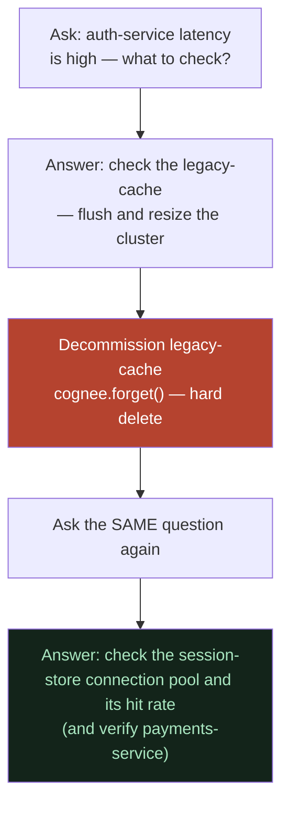

# What Is This?

**In one line:** Lethe is an on-call helper that remembers a team's incident knowledge *and forgets* the systems they retire, so it never gives stale advice at 3am.

---

## ELI10 (explain like I'm 10)

Imagine you have a really smart older sibling who has read every note your family ever wrote about fixing things around the house: how to unstick the back door, what to do when the WiFi dies, why the upstairs toilet runs.

One night something breaks. You run to them in a panic and ask, *"The lights flickered, what do I check?"* and they instantly tell you the answer — calmly, in plain words.

Now here's the clever part. Last month your family threw away the old broken space heater. A *dumb* helper would still say *"check the space heater!"* — because it remembers everything forever, including junk. Our helper is smarter: when something gets thrown away, it **forgets** it. So it never sends you chasing a thing that doesn't exist anymore.

That's Lethe. Most people try to build an AI that **remembers more**. We built one that knows how to **forget the right things**.

---

## The real thing: the 3am panic moment

Picture a software engineer who is "on-call." That means if the company's website breaks in the middle of the night, *their* phone buzzes. They wake up groggy, scared, and have to fix something fast while customers can't buy anything.

In that moment they don't want to read 50 pages of documentation. They want one calm sentence: *"Here's what to check first."*

Lethe is the thing you ask. You type a question like:

> *"If auth-service latency is high, what should I check?"*

and it answers in plain runbook language, naming the exact systems and actions — pulled from the team's own written knowledge, not made-up internet advice.

### What the helper actually knows

It has read a small library of the team's real incident docs (we call this the **corpus**). For the demo there are 18 short documents about a pretend company's systems:

- **api-gateway** — the front door that routes shopping traffic
- **auth-service** — checks that your login is real
- **payments-service** — charges customers (it needs auth-service to work)
- **legacy-cache** — an *old* speed-up box (memcached) sitting in front of auth-service
- **legacy-cache post-mortem** — the story of the time it caused a giant login outage
- **search-index** — powers product search
- **ownership doc** — which team owns which system

These are written as **plain English prose**. There are no tags, no spreadsheets, no special structure. Just sentences a human wrote. The helper figures out the connections by itself.

---

## The magic: it forgets

Here is the trick that makes this project different from "yet another chatbot that remembers stuff."

Suppose the team **decommissions** (retires, throws away) the `legacy-cache`. It's gone. It no longer exists in production.

Watch what happens to the **same question**, asked before and after:

**Before forgetting — "If auth-service latency is high, what should I check?"**

> "To troubleshoot high auth-service latency, check the legacy-cache by flushing and resizing the legacy-cache cluster to recover, as it sits in front of the auth-service session reads."

**After forgetting — the exact same question:**

> "To troubleshoot high auth-service latency, check the session-store connection pool and its hit rate, as the auth-service reads session state from it, and also verify the payments-service, which requires and calls the auth-service to validate login tokens."

The answer **flips**. It stops mentioning the dead system entirely and re-routes you to what's actually still there. And if you ask directly *"What is the legacy-cache?"* it now says:

> "The legacy-cache is not documented in the runbooks, so its description and dependencies are unknown."

That is the hero moment of the whole project. Not "I remember more." Instead: **"I stopped remembering the wrong thing."**

### Why "forget" is harder than it sounds

When we say forget, we mean a real, hard delete — verified two different ways:

1. **Structurally**: the data is actually gone. The raw text files disappear from disk (we watched the count go from 18 docs to 16 after forgetting the legacy-cache's 2 docs), and the graph/embeddings show zero leftover traces of it across many phrasings.
2. **Behaviorally**: no matter how we re-ask or trick it, the legacy-cache never sneaks back into an answer.

We checked *both* because deleting data from the helper's library doesn't erase what the underlying language model learned during its own training. A clean library is necessary but not, by itself, proof. So we tested the actual behavior too. (More on this honesty in [the-problem-static-memory-rots.md](the-problem-static-memory-rots.md).)

---

## Judge version (one paragraph)

Lethe is a self-hosted on-call triage assistant for the WeMakeDevs Cognee hackathon. It ingests a team's plain-prose incident runbooks with Cognee, which infers a hybrid knowledge graph (Kùzu) plus vector store (LanceDB) from unstructured text with no schema or tagging, and answers via `SearchType.GRAPH_COMPLETION` — vector recall finds what's relevant, graph traversal finds what's connected, and the LLM combines both into one plain-language answer governed by a custom triage system prompt. The differentiator is **forget**: when a system is decommissioned, the app hard-deletes its documents from the corpus (raw files + graph nodes/edges + embeddings), so the assistant stops giving stale advice. We prove forget both structurally (zero residue across phrasings, file count drops 18→16) and behaviorally (the retired system never resurfaces under adversarial re-asking). The thesis: everyone is building AI that remembers *more*; the real on-call failure is AI that confidently remembers the *wrong, stale* thing — and `forget` is precisely the capability the official starter project lacks.

---

## Why it matters (demo / judging)

- **It's a felt problem.** Anyone who has been on-call knows the terror of stale docs sending you down a dead end. The demo lands emotionally because the pain is real.
- **The hero beat is visible in one screen.** Same question, asked twice, answer flips and the dead system vanishes. No explanation needed — the judge *sees* it.
- **It's honest.** We don't claim the AI is perfect. We show exactly what forget guarantees (data is gone) and what it can't guarantee (the model's training priors), and we verified both layers.
- **It's the missing leg.** Remember and learn are common; **forget** is the capability the official "companybrain" starter doesn't have, which is what makes this a genuine contribution rather than a clone.

---

## Related

- [the-problem-static-memory-rots.md](the-problem-static-memory-rots.md) — why "remember everything" is the wrong goal, and the sharper thesis
- [what-we-built.md](what-we-built.md) — the actual components and the hero beat step-by-step
- [is-the-research-done.md](is-the-research-done.md) — what's finished, what's left, and who this is for
