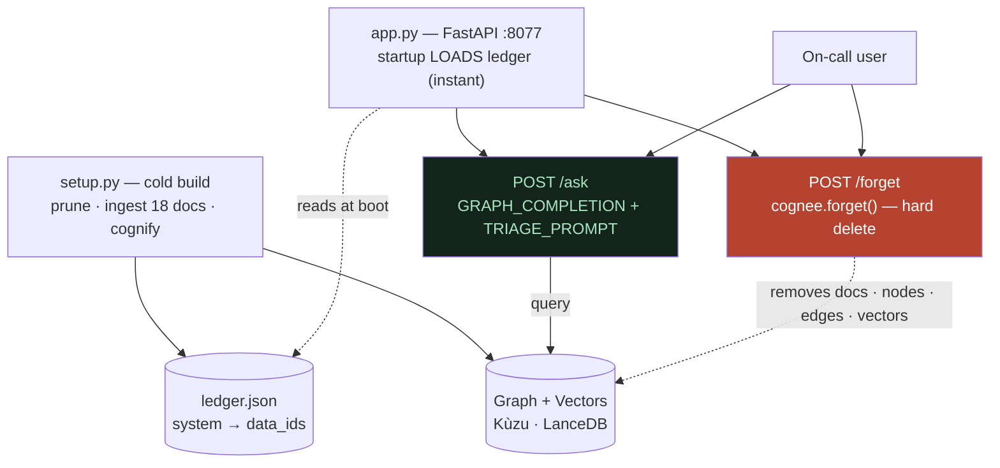

# What We Built

**In one line:** A self-hosted on-call triage app — a core remember/ask/forget loop, a web chat page, and an instant demo reset — whose hero beat is asking the same question twice and watching the answer flip after a system is forgotten.

---

## ELI10 (explain like I'm 10)

We built three things that work together, like a toy kitchen:

1. **The brain** — it reads the recipe cards (the team's notes) and can answer questions about them. It can also *throw a recipe card in the trash* when a dish gets taken off the menu.
2. **The window you order through** — a simple chat page in a web browser where you type a question and get an answer.
3. **A reset button** — a saved "clean copy" of the brain, so after we do a demo and throw a card away, we can snap everything back to perfect in one second to do it again.

The coolest trick is this: we ask the *exact same question*, then throw away one recipe card, then ask again — and the answer **changes by itself** to leave out the thrown-away thing.

---

## The components (the real architecture)

### 1. The core loop — `incident_brain.py`

This is the heart. It holds:

- **The WIKI** — the 18 demo documents written as plain prose (no schema, no tags).
- **`ingest()`** — feeds the docs into Cognee. Under the hood this calls `cognee.add(text)` to store the raw documents, then `cognee.cognify()` which runs **one** LLM extraction pass over the text and builds a knowledge graph: typed **Nodes** (`id`, `name`, `type`, `description`) and **Edges** (`source_node_id`, `target_node_id`, `relationship_name`, `description`). The same entity across different docs is merged into **one** node (coreference resolution), which is what makes multi-document, multi-hop answers possible.
- **`ask(question)`** — runs `cognee.search()` with `SearchType.GRAPH_COMPLETION`. The flow: embed the question → vector search in LanceDB finds the nearest text chunks (the "entry doors") → graph traversal from those doors pulls in connected nodes and edges → both are serialized to plain text, concatenated, and handed to the LLM, which writes **one** answer. There is no numeric score fusion; the **LLM itself is the combiner**.
- **`forget_system(name, ledger)`** — the hero capability. It looks up the system's document `data_id`s in `ledger.json` and calls `cognee.forget(data_id=..., dataset="main_dataset")` for each — a **hard delete** (not a soft exclude, no `memory_only`). This removes the raw text file, the derived graph nodes/edges, and the vector embeddings.
- **`load_ledger()`** — reads `ledger.json`, the map of `system → [data_id, ...]` written during ingest, so the app knows which docs belong to which system.
- **The `TRIAGE_PROMPT`** — our custom system prompt passed into `cognee.search()`. (Why it exists is below.)

It also sets `os.environ` `CACHING=false` **before** importing Cognee, so a query asked *after* a forget can't be masked by a stale cached answer.

#### Two stores, one build

A single `cognify()` pass populates **two** stores that are later queried *together*:

- **Graph** = Kùzu — nodes + edges, for structure and traversal ("what is *connected*").
- **Vectors** = LanceDB — chunk embeddings, for semantic recall ("what is *relevant*").
- (Relational metadata lives in SQLite.)

Embeddings use a **local** model — `BAAI/bge-small-en-v1.5`, 384-dimensional, via fastembed. It runs fully offline and costs **zero API quota**. That's a deliberate swap away from Cognee's default OpenAI embedder; it's why dozens of re-ingests during testing never burned embedding quota (only the LLM calls cost anything).

> The one-liner for *why Cognee*: **"vectors find what's relevant; the graph finds what's connected to it"** — and Cognee infers that graph from plain prose with no schema and no tagging.

### 2. The build script — `setup.py`

A **cold build**: prune everything, ingest the 18 docs, write `ledger.json`. Takes about a minute. You run this once to create a fresh knowledge base from scratch.

### 3. The web chat — `app.py`

A FastAPI server on **port 8077**. Crucially, **startup only loads `ledger.json`** — it does *not* run `cognify()` at serve time, so the server comes up instantly. Routes:

- `POST /ask` — ask a question
- `POST /forget` — retire a system
- `GET /health` — liveness check
- `GET /` — a single-file dark-themed HTML chat page

### 4. The demo reset — `snapshot_golden.py` + `reset_demo.py`

- `snapshot_golden.py` saves a clean, freshly built knowledge base into `golden_snapshot/` (run with the server stopped).
- `reset_demo.py` **restores** that snapshot.

This is how we reset between demo runs: **instant, zero quota, deterministic.** We use restore *instead of* re-running `setup.py`, because the build doesn't affect answer quality, so any clean build makes a perfectly good golden snapshot. A single `forget` permanently mutates the persisted graph, so we always restore the golden before each demo run.

---

## Why the `TRIAGE_PROMPT` exists (the bug we fixed)

Cognee's **default** completion prompt (`answer_simple_question.txt`) literally says: *"Answer the question using the provided context. Be as brief as possible."* That brevity instruction caused a real bug: the same demo question sometimes returned a **bare fragment** — just the word `"legacy-cache"` instead of a full sentence.

We chased several wrong suspects (the build, the question phrasing, the extraction) before `only_context=True` (which returns the assembled context *without* running the completion LLM) proved retrieval was **always** rich. The culprit was the prompt going terse on under-specified questions.

Our fix, the **`TRIAGE_PROMPT`**, passed as `system_prompt=` into `cognee.search()`, instructs the model to:

- answer in plain prose like a runbook,
- name the specific systems and actions,
- stay concise,
- **never** expose graph internals (no nodes, edges, or tag syntax),
- and if the context lacks the specific answer, say it is **"not documented in the runbooks."**

That last rule is doubly important: it keeps the **forget hero** clean (a forgotten system reads as "not documented") and it curbs hallucination.

We ran **three controlled experiments** holding retrieval constant and varying *only* the prompt: terse → fluent; leaked `--[owns]-->` graph syntax → clean plain language; invented facts → admits "not documented." This proves the prompt is the **high-leverage knob** precisely *because* the LLM is the combiner. (Prompt leverage has a ceiling — see [is-the-research-done.md](is-the-research-done.md).)

---

## The hero beat, step-by-step

This is the moment to put on screen. Reset to golden first, then:

1. **Ask** — *"If auth-service latency is high, what should I check?"*

   > "To troubleshoot high auth-service latency, check the legacy-cache by flushing and resizing the legacy-cache cluster to recover, as it sits in front of the auth-service session reads."

   The helper correctly points at the legacy-cache — that *was* the right answer.

2. **Forget** — hit `/forget` for the `legacy-cache`. Its 2 documents are hard-deleted: raw files removed (doc count drops 18 → 16), nodes/edges purged, embeddings purged.

3. **Ask the exact same question again** —

   > "To troubleshoot high auth-service latency, check the session-store connection pool and its hit rate, as the auth-service reads session state from it, and also verify the payments-service, which requires and calls the auth-service to validate login tokens."

   The answer **flipped on its own**. No mention of the dead system; it re-routed to what's actually still in the graph.

4. **Probe directly** — *"What is the legacy-cache?"*

   > "The legacy-cache is not documented in the runbooks, so its description and dependencies are unknown."

   No invented description, no leftover trace. Clean forget.

We proved this forget **two ways**: structurally (`only_context` shows zero legacy-cache residue across 5 phrasings; files drop 18→16) and behaviorally (across re-asks, name lookups, and adversarial phrasings, it never resurfaced). Both are needed because the retrieved context is *influence*, not law.

---

## What's built

Everything the thesis needs, end to end:

- The core loop — ingest, ask, forget, ledger, snapshot/restore.
- The two-store Cognee pipeline (Kùzu graph + LanceDB vectors) with local, $0 embeddings.
- The verified forget hero — proven both structurally *and* behaviorally.
- The `TRIAGE_PROMPT` fix and the three controlled prompt experiments.
- The FastAPI app — the chat page, the live graph / curation / timeline views, and the instant demo-reset flow.
- The presentation layer — this in-app documentation, the README, the demo video, and the research write-up.

---

## Why it matters

- **The architecture serves the thesis.** Hard-deletable, structured knowledge is what makes forget *real* rather than a soft hide — the build and the hero aren't separate, they're cause and effect.
- **Determinism is a feature.** Snapshot/restore makes the hero beat repeatable on demand, deterministically, with zero quota — no fragile live rebuild.
- **The prompt experiments show rigor.** Holding retrieval constant and varying one knob is real methodology, not vibes.
- **It's genuinely Cognee.** The graph is *inferred from prose* with no schema; the answer fuses vector recall and graph structure — Cognee's full remember / recall / forget loop, used as intended.

---

## Related

- [what-is-this.md](what-is-this.md) — the project and the 3am panic, with the before/after answers
- [the-problem-static-memory-rots.md](the-problem-static-memory-rots.md) — why forget is the hero and the honest limits of it
- [is-the-research-done.md](is-the-research-done.md) — the done/not-done line, the five capabilities, and who it's for
