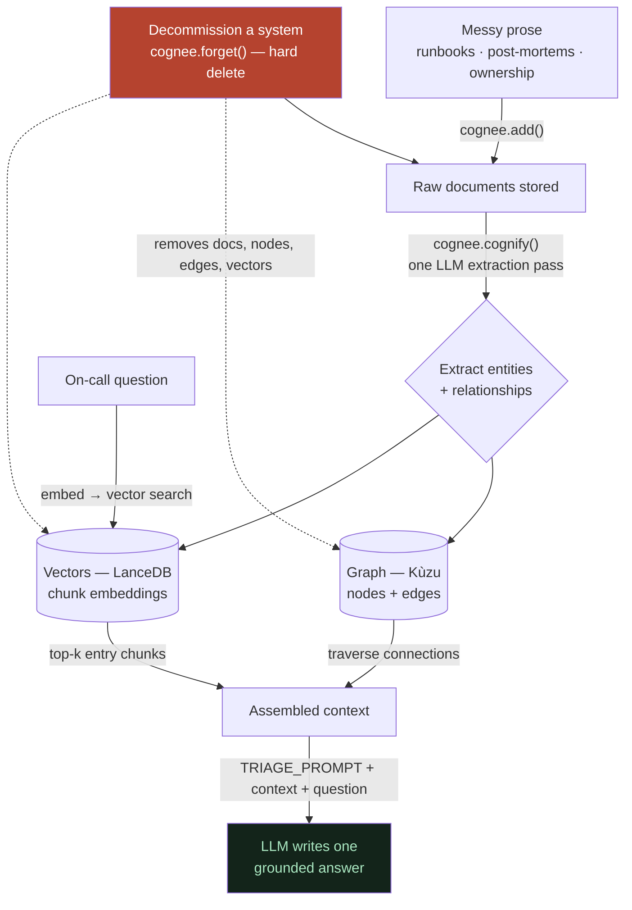

# 00 — Overview: The Whole Pipeline in One Map

**In one line:** Messy incident docs go in, become a graph + a pile of "meaning vectors," and when you ask a question the system pulls the relevant + connected pieces, lets an LLM write one answer — and crucially, when a system is decommissioned, it *forgets* it so the next answer is built on current truth.

---

## ELI10 — the analogy

Imagine the on-call engineer's brain is a big **corkboard**.

1. You pin up a bunch of sticky notes (the runbooks and post-mortems).
2. A very careful helper reads every note and draws **strings** between the notes that talk about the same things — "this service calls that service," "this team owns that service." Now it's not just a pile of notes, it's a *web*.
3. When someone shouts a question, the helper first finds the notes that *sound* most like the question, then follows the strings to grab everything *connected* to those notes, and finally writes a clean answer out loud.
4. Here's the special part: when a machine in the basement gets thrown away, most "smart brains" keep the old sticky note up forever and keep giving outdated advice. **Our brain takes the note down — string and all — and shreds it.** So it never tells you to go check a machine that no longer exists.

That last step — taking the note *down* — is the trick almost nobody builds. Everyone builds brains that remember **more**. The hard, useful thing is a brain that forgets the **wrong** thing.

---

## The real pipeline (this project)

Here is the end-to-end flow, with the real Cognee mechanic at each stage. The coral node is the **forget** hero (a hard delete that reaches all three stores); the teal node is the grounded answer the LLM writes.

The four real mechanics, named: `cognee.add(text)` stores raw prose (no schema, no tags). `cognee.cognify()` runs ONE LLM extraction pass that fills the Kùzu graph and the LanceDB vectors together. `ask()` calls `cognee.search(GRAPH_COMPLETION, system_prompt=TRIAGE_PROMPT)` — embed the question, take the top-k LanceDB chunks as entry doors, traverse the graph from there, concatenate both into one prompt, and the LLM writes one answer. `forget_system("legacy-cache", ledger)` looks up the system's `data_id`s in `ledger.json` and calls `cognee.forget(data_id=…, dataset="main_dataset")` per doc — a hard delete that drops the raw `.txt` files (verified 18 → 16), the derived graph nodes/edges, and the vectors. After that, the **same** question re-grounds on what is still true (the primary session store and the payments-service) and legacy-cache never resurfaces.

---

## The five stages, in plain words

1. **Ingest.** `cognee.add(text)` stores the raw docs with **no schema and no tags** — just prose. Then `cognee.cognify()` runs a single LLM pass that reads the text and *infers* a knowledge graph from it. You did not define entity types or relationship types up front. → See [01-ingest-messy-docs-to-graph.md](01-ingest-messy-docs-to-graph.md).

2. **Entities & relationships.** That extraction pass decides what counts as a *thing* (a Node) and what counts as a *connection* (an Edge), and — importantly — it **merges the same entity across different docs into one node** (coreference resolution). That merge is what lets one answer combine facts written in different files, and what makes "blast radius" traversal possible. → See [02-entities-and-relationships.md](02-entities-and-relationships.md).

3. **Two stores, one pass.** The same `cognify()` call fills **two** databases: a **Kùzu graph** (nodes + edges, good for *structure* and *traversal*) and a **LanceDB vector store** (chunk embeddings, good for *semantic recall*). Querying them together is the heart of "Best Use of Cognee." → See [03-graph-and-vectors-hybrid.md](03-graph-and-vectors-hybrid.md).

4. **Embeddings & meaning space.** Questions and chunks are turned into 384-dimensional vectors by a **local** model (`BAAI/bge-small-en-v1.5` via fastembed — offline, zero API quota). Nearest-by-cosine gives the top-k "entry doors." This is why a short, sloppy question still finds the right doc — and where the top-k *limit* lives, which the graph helps cover. → See [04-embeddings-and-meaning-space.md](04-embeddings-and-meaning-space.md).

5. **Forget.** The hero. `forget_system()` hard-deletes a decommissioned system's data — raw files, graph nodes/edges, and vectors — so the next answer can't lean on stale knowledge. (Forget is covered in depth in the sibling folder on the forget hero; this overview just shows where it sits in the pipeline.)

---

## One concrete before/after (verified, temp 0, golden graph)

Question both times: **"If auth-service latency is high, what should I check?"**

- **Before forget:**
  > "To troubleshoot high auth-service latency, check the legacy-cache by flushing and resizing the legacy-cache cluster to recover, as it sits in front of the auth-service session reads."

- **After forgetting legacy-cache (2 docs):**
  > "To troubleshoot high auth-service latency, check the session-store connection pool and its hit rate, as the auth-service reads session state from it, and also verify the payments-service, which requires and calls the auth-service to validate login tokens."

Same question, same model, same temperature. The *only* thing that changed is that the corpus no longer contains the decommissioned system — so the answer re-grounds on what is still true. That is the whole thesis in two sentences.

---

## What is doing the "merging" of graph + vectors?

A subtle but important point that we verified against Cognee 1.1.3 source: **there is no numeric fusion** between the graph results and the vector results. Cognee serializes *both* the matched chunks and the traversed graph into **plain text**, concatenates them into one prompt, and the **LLM is the combiner**. "Merge" here literally means "paste together and let the model read it all." Knowing this is what made the prompt (`TRIAGE_PROMPT`) the single highest-leverage knob in the whole system — because the model, not a scoring function, writes the answer.

---

## Why it matters (demo / judging)

- **It's one clean story end-to-end.** Prose in → graph+vectors → retrieve → one answer → *forget* → re-grounded answer. A judge can follow the whole thing on one screen.
- **The hero is the rare leg.** Remember and learn are common; **forget** is the leg the official "companybrain" starter — and even Cognee's own integrations shelf — does not ship. That's our differentiation for "Best Use of Cognee."
- **It's honest.** We don't claim magic. The LLM is the combiner (not a fusion algorithm); forget is a *hard delete* we verified two ways; and we state the limits (the model still has parametric priors; off-corpus questions can be over-confident). Honesty is a feature, not an apology.

---

## Related

- [01-ingest-messy-docs-to-graph.md](01-ingest-messy-docs-to-graph.md) — how prose becomes a graph with no schema
- [02-entities-and-relationships.md](02-entities-and-relationships.md) — what's a node, what's an edge, and the cross-doc merge
- [03-graph-and-vectors-hybrid.md](03-graph-and-vectors-hybrid.md) — the two stores and why both
- [04-embeddings-and-meaning-space.md](04-embeddings-and-meaning-space.md) — 384-d vectors, cosine, top-k, and its limit
