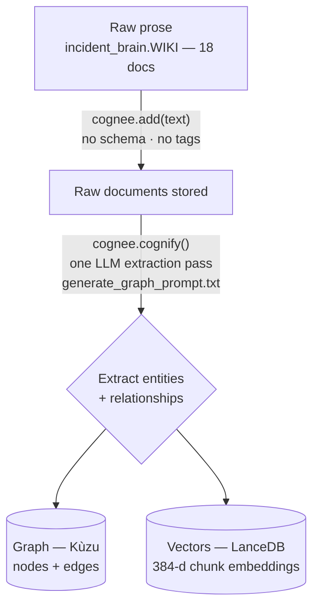

# 01 — Ingest: Turning Messy Docs Into a Graph

**In one line:** We drop plain-prose runbooks in with `cognee.add()` (no schema, no tags), then `cognee.cognify()` runs a single LLM pass that *reads* the text and *infers* a knowledge graph from it — that automatic prose-to-graph step is the genuinely-Cognee magic.

---

## ELI10 — the analogy

Think of two ways to organize a messy drawer of receipts.

- **The boring way (plain RAG):** you photocopy every receipt and keep the stack. When you need one, you flip through and grab the ones that *look* like what you want. You never actually understand how they relate.
- **The strict way (old-school knowledge graph):** before you can file *anything*, you must first design a giant form — "every receipt MUST have a Store field, a Date field, a Category field" — and then hand-fill that form for every receipt. Slow, and prose doesn't come pre-shaped like a form.
- **The Cognee way:** you hand the stack to a very sharp reader and say "read these and draw me a diagram of who relates to whom." The reader figures out *on its own* what the important things are and how they connect. **No form to design first. No fields to tag.** You just give it the words.

Our project uses the third way.

---

## The real mechanics

### Step 1 — `cognee.add(text)`: store the raw prose

The 18 demo docs live as plain strings in `incident_brain.WIKI` (in `incident_brain.py`). They are ordinary English — a runbook reads like something a tired on-call engineer typed at 3am:

> "legacy-cache (memcached): when auth-service latency is high, the first thing to check is the legacy-cache: flush and resize the cluster. It sits in front of the auth-service session reads."

`cognee.add()` stores that **raw text as-is**. There is:

- **No schema** — we never declared "a Service has a name and an owner and dependencies."
- **No tags** — we never labeled a doc `#auth` or `#runbook`.
- **No structure** — it's just prose.

This matters because real incident knowledge *is* messy prose. Nobody writes runbooks as clean database rows.

### Step 2 — `cognee.cognify()`: one LLM extraction pass

`cognify()` does the heavy lifting. Verified against Cognee 1.1.3 source, it:

1. **Chunks** the text into pieces.
2. Runs **one LLM extraction pass** over those chunks using Cognee's built-in prompt, `generate_graph_prompt.txt`. That prompt instructs the model (paraphrased from the real file) to act as a "top-tier algorithm" that:
   - extracts **entities** as typed nodes with human-readable names,
   - extracts **relationships** as snake_case edges,
   - performs **coreference resolution** — i.e. merge the same entity mentioned in different places into *one* node,
   - and **does NOT add outside knowledge** (only what's in the text).
3. Builds a `KnowledgeGraph` of `Node`s and `Edge`s from what the model found.

The output of that pass populates two stores at once (a Kùzu graph and a LanceDB vector store) — covered in [03-graph-and-vectors-hybrid.md](03-graph-and-vectors-hybrid.md). For ingest, the key idea is: **structure is inferred, not declared.**

### What the inferred graph looks like (real example)

From the prose above and its sibling docs, the pass produces nodes like `legacy-cache`, `auth-service`, `session store`, and edges like:

```
legacy-cache --[sits_in_front_of]--> auth-service session reads
auth-service --[reads_session_state_from]--> primary session store
payments-service --[calls]--> auth-service
payments-team --[owns]--> payments-service
```

We never told it these relationships existed. It read the sentences and drew the strings.

### The ingest flow at a glance



One `cognify()` call, two stores filled together: the Kùzu graph (structure) and the LanceDB vectors (semantic recall). The split is covered in [03-graph-and-vectors-hybrid.md](03-graph-and-vectors-hybrid.md).

---

## Three-way comparison: why this beats the alternatives

| | Plain RAG | Traditional KG | **Cognee (this project)** |
|---|---|---|---|
| What you store | text chunks only | rows that fit a schema | raw prose |
| Schema needed up front? | no | **yes** (design it first) | **no** |
| Tagging needed? | no | usually yes | **no** |
| Captures relationships? | **no** (just similarity) | yes (but you defined them) | **yes** (inferred) |
| Can answer "what's connected to X?" | poorly | yes | yes |
| Effort to onboard messy docs | low | **high** | low |

- **Plain RAG** only embeds chunks. It can find a doc that *sounds* relevant, but it has no idea that payments-service *depends on* auth-service unless that exact phrasing happens to land in one retrieved chunk. No structure.
- **A traditional knowledge graph** captures structure beautifully — but you must define the schema *before* you can ingest anything, and then someone has to map every messy doc onto that schema. For a pile of ad-hoc runbooks, that's a project in itself.
- **Cognee** gives you the structure of a KG with the low onboarding cost of RAG, because it **infers** the structure from the prose. That's the genuinely-Cognee differentiator we lean on for "Best Use of Cognee."

---

## Important honesty notes (don't overclaim)

- **The extraction is an LLM judgment call, not a parser.** What counts as an entity and which edges get drawn depends on the model reading the prompt. It's good, but it's not deterministic in the way a regex is. (Details in [02-entities-and-relationships.md](02-entities-and-relationships.md).)
- **`cognify()` costs LLM quota; embeddings do not.** The extraction pass makes real LLM calls. The *embeddings*, by contrast, run on a local model (fastembed), so they're free — see [04-embeddings-and-meaning-space.md](04-embeddings-and-meaning-space.md). This is why dozens of re-ingests during testing never burned embedding quota; only the LLM extraction did.
- **"No outside knowledge" is an instruction, not a guarantee.** The prompt tells the model to stick to the text. The model usually obeys at extraction time, but LLMs can still drift. We rely on the prompt here and verify behavior downstream rather than assuming perfect compliance.
- **At this small corpus, structure adds little for simple lookups.** Honestly: for "who owns payments-service?" the vector layer alone would basically nail it. The graph's advantage grows with **scale** and on **multi-hop / relationship** questions. We say this plainly rather than pretending the graph is doing heavy lifting on 18 short docs.

---

## Where ingest happens in the app

- `incident_brain.py` → `ingest()` calls `cognee.add()` for each WIKI doc, then `cognee.cognify()`, and records each system's document `data_id`s into `ledger.json`. (That ledger is what `forget_system()` later uses to find exactly what to delete.)
- `setup.py` → the **cold build**: prune everything, run `ingest()`, write `ledger.json`. Takes ~1 minute. Run once.
- `app.py` (FastAPI, port 8077) → at serve time it **only loads** `ledger.json`. It does **not** run `cognify()` when the server starts — ingest is a build-time cost, not a request-time cost. Startup is instant.

So: ingest is slow-ish and happens **once at build time**; serving is fast because the graph and vectors are already on disk.

---

## Why it matters

- **The "wow" is the absence of work.** We point at 18 blobs of messy prose and a graph appears — no schema designed, no doc tagged. That's the line that lands with a reader: *"I didn't define any of this structure; Cognee inferred it from the words."*
- **It sets up everything downstream.** The cross-doc answers, the blast-radius traversal, and the clean forget all depend on this pass having built a real graph from real prose.
- **It's honest about cost.** Ingest is the one place we spend LLM quota; we built around that (local embeddings + snapshot/restore for demo resets) so the live demo spends almost nothing.

---

## Related

- [00-overview-the-pipeline.md](00-overview-the-pipeline.md) — where ingest sits in the whole flow
- [02-entities-and-relationships.md](02-entities-and-relationships.md) — the Node/Edge schema and the cross-doc merge
- [03-graph-and-vectors-hybrid.md](03-graph-and-vectors-hybrid.md) — the two stores ingest fills at once
- [04-embeddings-and-meaning-space.md](04-embeddings-and-meaning-space.md) — the local, free embedding side of ingest
