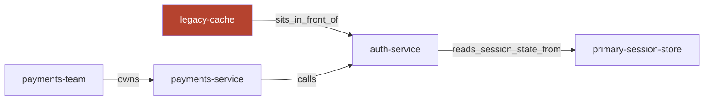

# 02 — Entities & Relationships: Nodes, Edges, and the Cross-Doc Merge

**In one line:** During `cognify()`, an LLM (steered by Cognee's `generate_graph_prompt.txt`) decides what's a *thing* (a Node) and what's a *connection* (an Edge), and merges the same thing mentioned in different docs into **one** node — and that merge is exactly what lets a single answer combine facts from separate files and trace a system's blast radius.

---

## ELI10 — the analogy

Imagine you have five different diary pages, and three of them mention "Grandma."

A clumsy helper would make **three different Grandmas** — one per page — and never realize they're the same person. So if page 1 says "Grandma bakes pies" and page 3 says "Grandma lives next door," the helper could never tell you "the pie-baker lives next door," because to it they're two strangers.

A smart helper notices: *"these all mean the same Grandma,"* and pins them to **one** Grandma card. Now everything written about Grandma — across all the pages — hangs off that single card. Ask anything about her, and the helper can pull all of it together.

Cognee is the smart helper. When `auth-service` is mentioned in the runbook, in the post-mortem, and in the ownership doc, it doesn't make three `auth-service`s. It makes **one**, and connects everything to it. That single merged card is what makes our cross-document answers possible.

---

## What counts as an entity? (LLM judgment, not a parser)

There is no hard-coded list of "valid entity types." What becomes a node is decided by the LLM during the `cognify()` extraction pass, shaped by Cognee's built-in prompt `generate_graph_prompt.txt`. Paraphrasing the real prompt, it tells the model to behave like a "top-tier algorithm" that:

- extracts **entities as typed nodes** with **human-readable names**,
- extracts **relationships as snake_case edges**,
- performs **coreference resolution** (merge the same entity across mentions into one node),
- and adds **no outside knowledge** — only what the text supports.

So in our corpus the model decides that `payments-service`, `auth-service`, `legacy-cache`, `primary session store`, `payments-team`, and `search-index` are entities, because the prose treats them as distinct, named things. It draws edges like `calls`, `owns`, `requires`, `reads_session_state_from`, `sits_in_front_of` because the sentences describe those relationships.

Here is a slice of the real inferred graph — every node and edge below came from prose, not from a schema we wrote:



The coral node is `legacy-cache` — the system we later forget. When it goes, its node and the `in_front_of` edge are hard-deleted, and an auth-service question re-grounds on the rest of this subgraph (the primary-session-store and the payments-service).

**Honesty note:** because this is an LLM judgment, the exact set of nodes/edges isn't guaranteed to be identical on every rebuild, and the model could in principle name or split things slightly differently. It's reliable enough for the demo, but it's "inferred structure," not "parsed structure." We don't pretend otherwise.

---

## The exact default schema (verified from `cognee.shared.data_models`)

Every node and edge follows this fixed shape. We did not define it — it's Cognee's default `KnowledgeGraph` schema:

```python
Node {
    id           # unique identifier
    name         # human-readable, e.g. "auth-service"
    type         # inferred type label, e.g. "service"
    description  # short text the model wrote about it
}

Edge {
    source_node_id     # the "from" node
    target_node_id     # the "to" node
    relationship_name  # snake_case, e.g. "reads_session_state_from"
    description        # short text about the relationship
}
```

A few things worth noticing:

- **Names are human-readable.** This is why answers can say "the payments-team owns the payments-service" instead of spitting out opaque IDs.
- **`relationship_name` is snake_case.** Internally an edge reads like `payments-team --[owns]---> payments-service`. (That raw form is *internal*; we explicitly forbid the answer from exposing it — see the leak fix below.)
- **`description` fields** give the model extra prose to work with at answer time, beyond just the bare name.

---

## Entity resolution / coreference: the merge that powers everything

This is the most important idea in this file. **The same entity mentioned across different docs becomes ONE node.**

In our corpus, `auth-service` appears in at least three places:

- the **auth-service runbook** ("validates login tokens; required by payments-service; reads session state from the primary session store"),
- the **legacy-cache runbook** ("sits in front of the auth-service session reads"),
- the **payments-service runbook** ("calls auth-service to validate each login token").

Because the extraction prompt instructs coreference resolution, all three mentions collapse onto a **single** `auth-service` node. Now that node has edges reaching into all three docs.

### Why the merge is load-bearing

1. **Cross-doc answers.** Ask "what's in the auth read path?" and the system can pull facts that were *written in different files* — because they all hang off the one merged `auth-service` node. Without the merge, those facts would live on disconnected islands.

2. **Blast radius / traversal.** Because `payments-service --[requires]--> auth-service` and `payments-service --[calls]--> auth-service` connect to the same node, the graph can answer "if auth-service is down, what else is affected?" by walking outward from that node. That's the "what's *connected* to it" power that plain RAG lacks.

This is precisely why the **after-forget** answer can say:

> "…and also verify the payments-service, which requires and calls the auth-service to validate login tokens."

It found `payments-service` by traversing from `auth-service` — a connection that only exists because the merge unified `auth-service` into one node with edges drawn from multiple docs.

---

## How nodes/edges actually reach the answer

When you ask a question, Cognee serializes the relevant nodes and edges into **plain text** and pastes them into the LLM's prompt (alongside the matched chunks). We captured the real format with `only_context=True`:

- A node renders like:
  ```
  Node: auth-service ... __node_content_start__ <original text> __node_content_end__
  ```
- A relationship renders as a triple:
  ```
  payments-team --[owns]---> payments-service
  ```
- Tag-style lists appear like:
  ```
  [team, ownership, api-gateway]
  ```

The LLM reads all of that and writes one answer. **There is no numeric fusion** — the graph contributes *text*, the vectors contribute *text*, and the model combines them. (More on that in [03-graph-and-vectors-hybrid.md](03-graph-and-vectors-hybrid.md).)

---

## The graph-internals leak (a real bug we fixed)

Early on, "Who owns the payments-service?" sometimes answered with the **raw edge syntax** — literally spitting out `--[owns]-->` instead of a sentence. That's the internal triple representation leaking into the user-facing answer.

The fix lives in `incident_brain.ask()`: our `TRIAGE_PROMPT` (passed as `system_prompt=` to `cognee.search()`) explicitly instructs the model to **never expose graph internals** — no nodes, no edges, no tags — and to answer in plain runbook prose. After the fix:

> "The payments-team owns the payments-service."

Clean. Same retrieval, same graph — the only change was the instruction telling the model not to leak the plumbing. This is one of the three controlled prompt experiments that prove the prompt is the high-leverage knob (because the LLM is the combiner).

---

## Honesty / limits

- **The graph adds little on tiny lookups.** For "who owns X?" on 18 short docs, vectors alone basically suffice. The graph's real edge shows up at **scale** and on **multi-hop / relationship** questions. We say this plainly.
- **Merge quality depends on the model.** Coreference is an instruction; on messier or more ambiguous corpora a model could under- or over-merge. Ours is clean for the demo, but it's not a guarantee for arbitrary input.
- **Forget removes nodes/edges from the corpus, not from the model's priors.** Deleting the `legacy-cache` node cleans the graph, but the model may still "know" memcached from training. That's why we verified forget *behaviorally* as well as structurally — the clean graph alone is not proof. (Covered in the forget-hero folder.)

---

## Why it matters (demo / judging)

- **The merge is the quiet hero of intelligence.** "It combined facts from two different documents I never linked" is a sentence that makes a judge sit up — and it's true, because of coreference resolution onto one node.
- **The schema is principled, not ad-hoc.** We can show the exact `Node`/`Edge` shape from Cognee source, so the structure isn't hand-wavy.
- **We fixed a real leak honestly.** Showing the `--[owns]-->` leak and its prompt-level fix demonstrates we understand *where* the structure ends and the *presentation* begins.

---

## Related

- [00-overview-the-pipeline.md](00-overview-the-pipeline.md) — where extraction sits in the flow
- [01-ingest-messy-docs-to-graph.md](01-ingest-messy-docs-to-graph.md) — the `cognify()` pass that builds these nodes/edges
- [03-graph-and-vectors-hybrid.md](03-graph-and-vectors-hybrid.md) — how nodes/edges combine with vector chunks at answer time
- [04-embeddings-and-meaning-space.md](04-embeddings-and-meaning-space.md) — the vector side that finds the entry nodes
