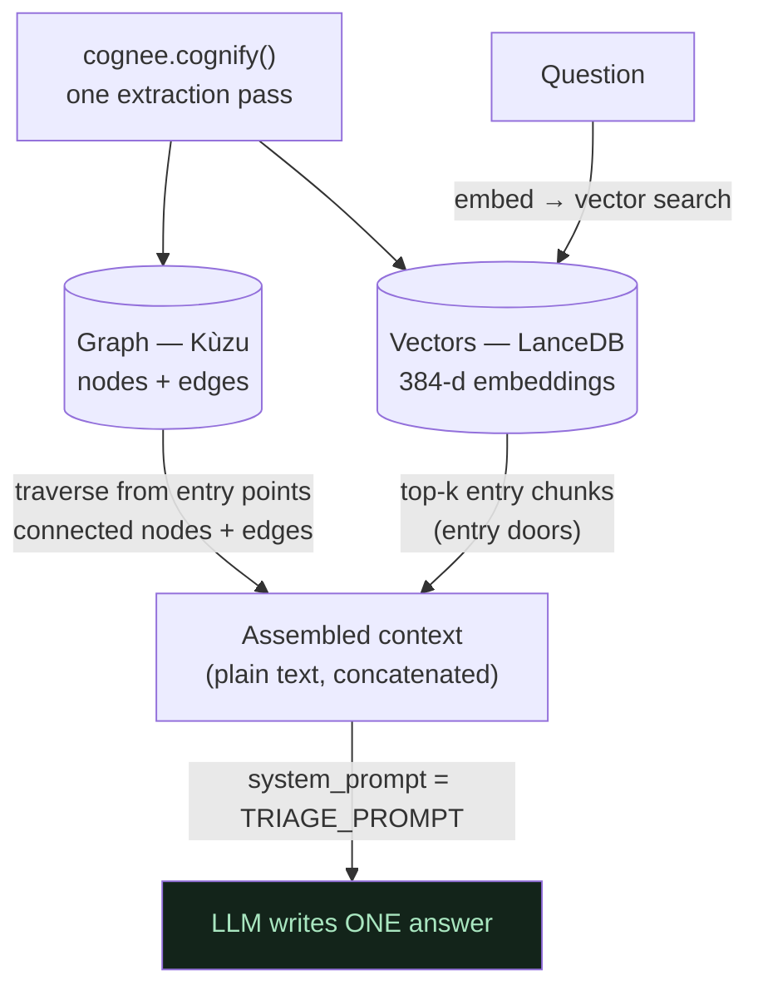

# 03 — Graph + Vectors: The Hybrid, Built in One Pass

**In one line:** A single `cognify()` call fills **two** databases — a Kùzu **graph** (nodes + edges, for *structure and traversal*) and a LanceDB **vector store** (chunk embeddings, for *semantic recall*) — and querying them *together* is the heart of "Best Use of Cognee": vectors find what's *relevant*, the graph finds what's *connected to it*.

---

## ELI10 — the analogy

Imagine a library with two superpowers stapled together.

- **The vector store is the "vibes" librarian.** You mumble "uh, the login slowness thing," and she instantly hands you the few books that *feel* most like what you said — even though you didn't know any titles. She's great at "find me what this is *about*," but she has no idea how books relate to each other.
- **The graph is the "map" librarian.** Once you're holding a book, he points at the wall map and says "this book is connected to *these three other books* — the team that owns it, the service that calls it, the cache in front of it." He's great at "what's *attached* to this," but he needs a starting book first.

The trick: the vibes librarian finds your **entry book**, then the map librarian shows you **everything connected** to it. One finds *relevant*; the other finds *connected*. Together they beat either one alone. That tag-team **is** the hybrid.

---

## The real mechanics

### One pass, two stores

When `cognee.cognify()` runs (see [01-ingest-messy-docs-to-graph.md](01-ingest-messy-docs-to-graph.md)), it populates **both** stores from the *same* extraction pass:

| Store | Engine | Holds | Good for |
|---|---|---|---|
| **Graph** | **Kùzu** | nodes + edges (`Node{id,name,type,description}`, `Edge{source,target,relationship_name,description}`) | structure, traversal, "what's connected to X," blast radius, multi-hop |
| **Vectors** | **LanceDB** | chunk embeddings (384-d, from local fastembed) | semantic recall, "find the doc that's about this," fuzzy/short queries |

Plus a third, supporting store:

- **Relational metadata** lives in **SQLite** — the bookkeeping (which doc is which, the `data_id`s, etc.). This is also what the **ledger** side leans on, and what `forget` walks to delete the right records.

So the stack is: **Kùzu (graph) + LanceDB (vectors) + SQLite (metadata)**, all built from one `cognify()` and all sitting in the data dir `/Users/vinayak/.cognee-incident-detective/`.

### How they're queried together (`SearchType.GRAPH_COMPLETION`)

This is the retrieval mode we use in `incident_brain.ask()`. Verified against Cognee 1.1.3 source, one query does:

1. **Embed the question** → vector search in **LanceDB** returns the **top-k nearest chunks** by cosine similarity in 384-d meaning space. These are the **entry doors**. (Details in [04-embeddings-and-meaning-space.md](04-embeddings-and-meaning-space.md).)
2. **Traverse the Kùzu graph** starting from those entry points → pull the **connected** nodes and edges.
3. **Serialize BOTH to plain text** and **concatenate** them into the completion prompt.
4. The **LLM writes one answer** from that combined context.

One `cognify()` builds both stores; a single query then reads **both** — vectors for the relevant entry chunks, the graph for everything connected to them.

### Crucial: there is NO numeric fusion

A point we verified and keep front-and-center: Cognee does **not** compute some weighted blend of "graph score" and "vector score." It turns *both* into **text** and **pastes them together**. **The LLM is the combiner.** "Merge" literally means "concatenate and let the model read it all."

Knowing this changed how we tuned the system: since the model writes the answer, the **prompt** is the highest-leverage knob — which is exactly why `TRIAGE_PROMPT` (not some retrieval parameter) fixed the bare-fragment bug, the graph-internals leak, and the over-confidence, in three controlled experiments with retrieval held constant.

### Seeing the raw combined context (`only_context=True`)

`cognee.search(..., only_context=True)` returns the assembled context **without** running the completion LLM. It's cheap (embeddings are local, so effectively free) and it's how we proved retrieval was always rich even when the final answer went terse. The real captured format:

- nodes: `Node: <name> ... __node_content_start__ <original text> __node_content_end__`
- relationships: triples like `payments-team --[owns]---> payments-service`
- tag lists: `[team, ownership, api-gateway]`

That dump shows you, literally, the text the graph and the vectors handed to the model.

---

## What each store is genuinely good for (with our corpus)

- **Vectors shine on sloppy, short questions.** "auth slow what do i check" has almost no keyword overlap with the runbook, but in meaning space it lands right next to the auth-service / latency chunks. Pure keyword search would flail; vectors don't.
- **The graph shines on connection questions.** "If auth-service is down, what's affected?" is answered by *walking edges* from the `auth-service` node to `payments-service` (which `requires` and `calls` it). That's structure, not similarity — vectors alone wouldn't reliably surface payments-service just from an auth question.

The post-forget answer is the clean demonstration of the tag-team:
> "…check the session-store connection pool and its hit rate, as the auth-service reads session state from it, and also verify the payments-service, which requires and calls the auth-service…"

The session store comes largely from the *relevant* chunk; the payments-service hop comes from the *connected* graph. One answer, both stores.

---

## Honest graph-vs-RAG story (we do not overclaim)

This is the spine of our blog and we keep it honest:

- **At this small corpus, the graph adds little over vectors for simple lookups.** For "who owns payments-service?" the vector layer alone basically nails it. Graph ≈ RAG here.
- **The graph's edge grows with scale** and on **relationship / multi-hop** questions, where similarity alone can't reconstruct a dependency chain.
- We tested **three** Cognee differentiators against plain RAG at temperature 0. Only **forget** held cleanly as a decisive, repeatable win. We report that result rather than inflating the graph's contribution on tiny data.

So our "Best Use of Cognee" claim rests on two true things: (a) the **automatic prose→graph** capability is genuinely Cognee (no schema, no tagging — see [01](01-ingest-messy-docs-to-graph.md)), and (b) the **hybrid graph+vector retrieval queried together**, with **forget** as the standout differentiator. We don't claim the graph is doing heavy lifting on 18 short docs.

---

## Local embeddings = the hybrid runs basically free

The vector half uses **local fastembed** (`BAAI/bge-small-en-v1.5`), not a paid embedding API. So vector search and `only_context` cost **zero quota**. The only thing that spends LLM quota is the *completion* step (and the build-time `cognify()` extraction). This is why we could run dozens of retrieval experiments and demo resets without burning through quota. (See [04-embeddings-and-meaning-space.md](04-embeddings-and-meaning-space.md).)

---

## Why it matters (demo / judging)

- **"Vectors find what's relevant; the graph finds what's connected to it"** is the one-sentence pitch for the hybrid, and it's literally true of `GRAPH_COMPLETION`.
- **Two stores from one pass** is a clean engineering story: one `cognify()` call, graph + vectors + metadata, all on disk, served instantly.
- **The "LLM is the combiner" insight** is what makes the whole system tunable — and we earned it by reading Cognee's source, not guessing.
- **The honest graph-vs-RAG framing** signals real engineering judgment, which judges reward more than hype.

---

## Related

- [00-overview-the-pipeline.md](00-overview-the-pipeline.md) — the hybrid in the full pipeline
- [01-ingest-messy-docs-to-graph.md](01-ingest-messy-docs-to-graph.md) — the single pass that builds both stores
- [02-entities-and-relationships.md](02-entities-and-relationships.md) — the nodes/edges the graph half stores
- [04-embeddings-and-meaning-space.md](04-embeddings-and-meaning-space.md) — the vector half: 384-d, cosine, top-k, and its limit
