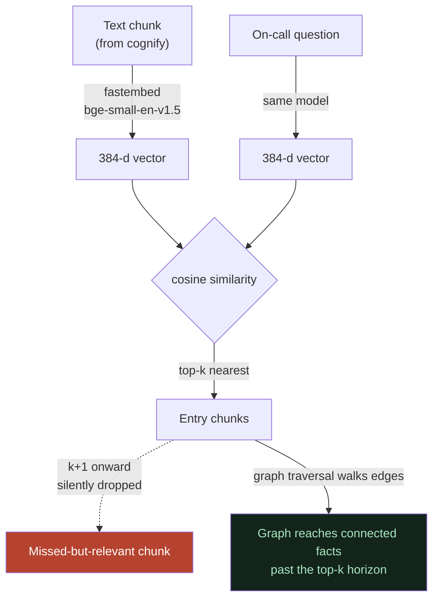

# 04 — Embeddings & Meaning Space: 384 Dimensions, Cosine, Top-k

**In one line:** Every chunk and every question is turned into a 384-number "meaning fingerprint" by a **local** model (`BAAI/bge-small-en-v1.5` via fastembed, offline, zero API quota); nearest-by-cosine gives the top-k entry chunks — which is why a short sloppy question still finds the right doc, and where the top-k *limit* lives (a too-far-but-relevant chunk gets silently dropped), a gap the graph helps close.

---

## ELI10 — the analogy

Imagine every sentence gets plotted as a **star in the sky**. Sentences that *mean* similar things are placed **close together** as stars — even if they use totally different words. "The login service is slow" and "auth-service latency is high" end up as near-neighbor stars, because they *mean* the same thing.

When you ask a question, your question also becomes a star. The system just looks for the **handful of nearest stars** and grabs those sentences. You don't need to remember exact words — you just need to land in the right *neighborhood of the sky*.

But the sky only hands back the **few closest** stars (say, the nearest 5). If a genuinely useful sentence is sitting a little too far away — the 7th-closest star — it gets **left behind**, even though it would've helped. That's the limit. The good news: once we're holding a few nearby stars, the **graph** can follow the *strings* between stars to reach helpful ones that were just out of similarity range.

---

## The real mechanics

### The model: local fastembed, `BAAI/bge-small-en-v1.5`, 384-d

- Every text chunk produced during `cognify()` is run through this embedding model and stored in **LanceDB** as a **384-dimensional vector** — a list of 384 numbers that encodes the chunk's meaning.
- The same model embeds the **question** at query time, into the same 384-d space.
- It runs **locally and offline** via **fastembed**. This is a deliberate choice: Cognee's *default* is OpenAI `text-embedding-3-small`, which **costs API quota**. We switched to local fastembed on purpose.

**Why that switch mattered in practice:** during development we re-ingested the corpus dozens of times and ran many retrieval experiments. Because embeddings are local, **none of that burned embedding quota** — only the LLM calls (the `cognify()` extraction and the answer completion) cost anything. Local embeddings are what made heavy iteration, `only_context` debugging, and snapshot/restore demo resets effectively free.

### Cosine similarity + top-k

To find the entry chunks for a question:

1. Embed the question → a 384-d vector.
2. Compare it to every stored chunk vector using **cosine similarity** (how close the two "directions" point in 384-d space; closer direction = more similar meaning).
3. Return the **top-k** most-similar chunks. These are the **entry doors** into the corpus.

Those entry chunks are then handed to the graph traversal step, and both are serialized to text for the LLM (see [03-graph-and-vectors-hybrid.md](03-graph-and-vectors-hybrid.md)).

Chunks and the question are embedded by the **same** local model into the same 384-d space; cosine ranks them; only the **top-k** come back as entry chunks. The (k+1)th-nearest — relevant but just outside the window (coral) — is silently dropped. The graph closes part of that gap by walking edges from the entry chunks to connected facts (teal).

### Why it eats short, sloppy questions for breakfast

Keyword search needs your words to *match* the doc's words. Meaning-space search doesn't. So a tired on-call query like:

> "auth slow what do i check"

has barely any literal word overlap with the runbook sentence "when auth-service latency is high, the first thing to check is…" — yet in 384-d meaning space the two land as near neighbors, so the right chunk surfaces anyway. That robustness to phrasing is the whole point of embeddings, and it's why our demo questions don't have to be worded "just so."

This is also why we proved the bare-fragment bug was **not** a phrasing problem: `only_context` showed the vector layer reliably retrieved the right rich chunks regardless of how we worded the question. Retrieval was fine; the *prompt* was making the final answer terse.

---

## The top-k LIMIT (state this honestly)

Top-k has a hard edge: **it returns only the k nearest chunks.** A chunk that is genuinely relevant but ranks just *outside* k — the (k+1)th-nearest — is **silently dropped**. No error, no warning; it simply doesn't enter the context, so the LLM never sees it and **cannot** mention it.

This is a real ceiling on the system, and it's why we say plainly:

- **The prompt cannot conjure a fact retrieval never fetched.** No amount of `TRIAGE_PROMPT` tuning can make the model cite a chunk that top-k left outside the window. We hit this ceiling and correctly **stopped tuning** rather than pretending prompt engineering could fix a retrieval gap.

### How the graph closes (part of) that gap

Here's the elegant bit. Even if a relevant chunk falls outside the vector top-k, it might still be **one edge away** from a chunk that *did* make the cut. The graph traversal starts from the entry chunks and **walks the edges** to connected nodes — pulling in connected facts that pure similarity ranking would have missed.

Concretely: an auth-service question reliably retrieves auth chunks via vectors, and then the graph hops along `payments-service --[requires/calls]--> auth-service` to surface **payments-service** — which a similarity search on the auth question alone might not have ranked high enough to include. That's the post-forget answer naming payments-service. **Vectors find what's relevant; the graph finds what's connected to it** — and "connected" can reach past the top-k horizon.

**Honest caveat:** the graph helps *when the relevant fact is connected by an edge* to an entry node. If a relevant chunk is both outside top-k *and* not connected by any traversed edge, it's still missed. The graph narrows the gap; it doesn't erase it.

---

## Where this lives in the app

- The embedding model and stores are configured in **`.env`**: embeddings = local fastembed `bge-small`, vectors = **LanceDB**, graph = Kùzu, relational = SQLite, all under `/Users/vinayak/.cognee-incident-detective/`.
- Embedding happens at **build time** inside `cognify()` (during `setup.py`) for chunks, and at **query time** for the question inside `incident_brain.ask()` → `cognee.search(...)`.
- Because embeddings are local, the **snapshot/restore** demo reset (`snapshot_golden.py` / `reset_demo.py`) and all `only_context` inspection cost **zero quota** — central to a deterministic, quota-safe demo.

---

## Quick myth-check

- **"Embeddings understand my question like a human."** No — they place it near similar-meaning text. That's powerful but it's geometry, not comprehension. The *LLM* does the reasoning later.
- **"Bigger top-k always = better."** No — too large pulls in noise that can distract the LLM; too small drops relevant chunks. It's a tradeoff, and the graph layer is part of how we tolerate a modest k.
- **"Local embeddings are lower quality."** For this corpus, `bge-small` retrieves the right chunks reliably (verified via `only_context`). The tradeoff we *accepted* was model size vs. zero quota and full offline operation — a good trade for a self-hosted hackathon demo.

---

## Why it matters

- **Robust to phrasing** = the live demo doesn't depend on magic wording. Type a sloppy on-call question, get the right doc.
- **Zero embedding quota** = we can reset and re-run the demo all day deterministically, and we could iterate hundreds of times in dev without cost. That's a concrete self-hosted-track win.
- **We name the top-k limit out loud** and explain how the graph mitigates it. Stating a real limitation *and* its mitigation is exactly the kind of honesty that earns trust — and it ties the vector and graph halves into one coherent story.

---

## Related

- [00-overview-the-pipeline.md](00-overview-the-pipeline.md) — where embeddings sit in the full flow
- [01-ingest-messy-docs-to-graph.md](01-ingest-messy-docs-to-graph.md) — chunks get embedded during this pass
- [02-entities-and-relationships.md](02-entities-and-relationships.md) — the connected nodes the graph reaches past the top-k horizon
- [03-graph-and-vectors-hybrid.md](03-graph-and-vectors-hybrid.md) — how vector entry doors + graph traversal combine into one answer
