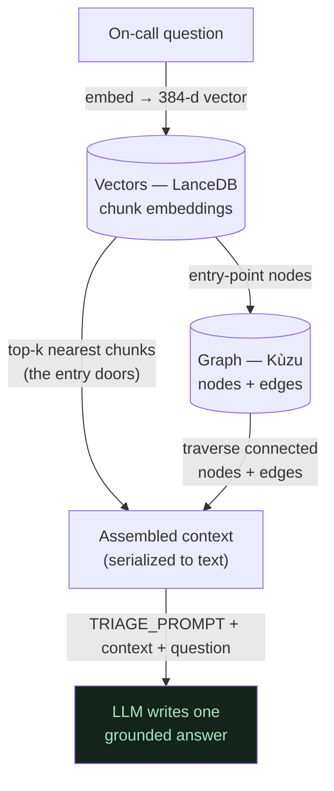

# 05 — Retrieval: GRAPH_COMPLETION ("both, in order")

**In one line:** When you ask a question, Lethe uses vectors to find the *right door*, the graph to *walk the connected rooms*, then the LLM to *write one answer* — all in a single `SearchType.GRAPH_COMPLETION` call.

## ELI10

Imagine a library where you're looking for "what to check when login is slow."

1. First, a smart librarian (the **vector search**) sniffs out the *one shelf* that's about your topic — even if you didn't use the exact words on the spine. That shelf is your **door** into the library.
2. Then you follow the **strings tied between books** (the **graph**): this book about auth-service is tied to a book about payments-service, which is tied to a book about the session store. You collect every book the strings lead you to.
3. Finally, a writer (the **LLM**) reads everything you gathered and writes you *one clean paragraph* instead of handing you a pile of books.

Vectors find what's **relevant**. The graph finds what's **connected to it**. The LLM turns the pile into a sentence.

## The flow at a glance



## The real mechanics

We use exactly one retrieval mode. From `incident_brain.py`:

```python
r = await cognee.search(
    query_text=query,
    query_type=SearchType.GRAPH_COMPLETION,
    system_prompt=TRIAGE_PROMPT,
)
```

`GRAPH_COMPLETION` runs three stages **in order**:

### Stage 1 — Vectors find the door (LanceDB)

The question is embedded into a 384-dimensional vector using the **local** `BAAI/bge-small-en-v1.5` fastembed model (offline, zero API quota). Cognee compares that vector against the stored **chunk embeddings** in LanceDB by cosine similarity and returns the top-k nearest chunks — the chunks whose *meaning* is closest to the question, not whose words match.

This is why "If auth-service latency is high, what should I check?" can land on the right runbook even though the runbook never says the word "latency" in the same shape as the question. Closeness is measured in **meaning space**, not keyword space.

These top-k chunks are the **entry points** — the doors.

### Stage 2 — The graph walks the rooms (Kùzu)

From those entry-point nodes, cognee traverses the **knowledge graph** stored in Kùzu, pulling in connected nodes and the edges between them. Because cognify did **entity resolution** (the same entity mentioned in different docs becomes *one node*), a walk that starts at `auth-service` can reach facts that were originally written in *different documents*: the payments-service doc ("payments-service calls auth-service"), the auth-service doc ("reads session state from the primary session store"), and so on.

This is the structural superpower plain RAG doesn't have: RAG would only return the chunk it matched. The graph returns the chunk **plus what it's wired to**.

### Stage 3 — The LLM writes one answer

Both the vector chunks **and** the graph nodes/edges are serialized to plain **text**, concatenated together with the system prompt and the question, and handed to the completion LLM (OpenRouter `llama-3.3-70b-instruct`, temperature 0). The LLM writes **one** synthesized answer.

> There is **no numeric fusion** of vector scores and graph scores. The "merge" is literally text concatenation, and the **LLM is the combiner**. (See [06-the-llm-is-the-combiner.md](06-the-llm-is-the-combiner.md).)

## When does the graph actually help?

Be honest here — this is a small corpus (18 docs), and we measured it.

| Question type | Does the graph beat plain vectors? |
| --- | --- |
| Simple lookup ("What is the api-gateway?") | **No meaningful edge.** The matched chunk already contains the answer. graph ≈ RAG. |
| Relationship / multi-hop ("If auth-service is slow, what's affected downstream?") | **Yes.** The answer lives across multiple docs wired by edges; the walk assembles them. |
| Blast-radius ("what depends on auth-service?") | **Yes.** That's a graph traversal by definition. |

The graph's advantage **grows with scale and with relationship questions**. At our demo size, for simple name lookups, the graph adds little over vectors — and we say so. That honesty is part of the story (see [../02-cognee-deep-dive/why-cognee-not-just-rag.md](../02-cognee-deep-dive/why-cognee-not-just-rag.md) if present in your tree).

## `only_context` — see the door and the rooms without paying the writer

`cognee.search(..., only_context=True)` returns the **assembled context** (the serialized chunks + graph) **without** running the completion LLM. It's cheap (embeddings are local, so effectively free) and it's how we *proved* retrieval was always rich even when the final answer looked terse.

The **real captured format** of that context:

- **Nodes** render as a header plus the original text fenced between markers:

  ```
  Node: auth-service
  ...
  __node_content_start__
  auth-service validates login tokens; it is required by payments-service and reads session state from the primary session store.
  __node_content_end__
  ```

- **Relationships** render as plain triples:

  ```
  payments-team --[owns]---> payments-service
  payments-service --[calls]---> auth-service
  ```

- **Tag lists** appear inline like:

  ```
  [team, ownership, api-gateway]
  ```

This is the **raw graph showing through**. The user must never see this format — the `TRIAGE_PROMPT` explicitly forbids the LLM from exposing nodes/edges/tags. When a `--[owns]--->` triple once leaked into a user-facing answer, that was the context format bleeding through the writer; fixing the prompt fixed it. (Full story in [06-the-llm-is-the-combiner.md](06-the-llm-is-the-combiner.md).)

`only_context` is also a debugging hero: it lets us check the **structural** layer independently of the LLM. We used it to verify the forget hero left **zero legacy-cache residue** across five different phrasings (see [07-the-forget-hero.md](07-the-forget-hero.md)).

## Why it matters (demo / judging)

- **It's genuinely hybrid.** "Vectors find what's relevant; the graph finds what's connected" is the heart of *Best Use of Cognee* — most RAG demos only do the vector half.
- **It's honest.** We don't claim the graph wins every query at this size. We claim it wins on **relationship and multi-hop** questions, and we can show `only_context` to prove the retrieval is real.
- **It's cheap to inspect.** `only_context` + local embeddings means we can demonstrate "what the brain retrieved" live, with no quota burn.

## Related

- [01-ingest-messy-docs-to-graph.md](01-ingest-messy-docs-to-graph.md) — how the graph + vectors were built in the first place
- [06-the-llm-is-the-combiner.md](06-the-llm-is-the-combiner.md) — no numeric fusion; the prompt is the steering wheel
- [07-the-forget-hero.md](07-the-forget-hero.md) — verified with `only_context` (0 residue)
- [08-the-same-question-flip.md](08-the-same-question-flip.md) — the before/after money shot built on this retrieval
