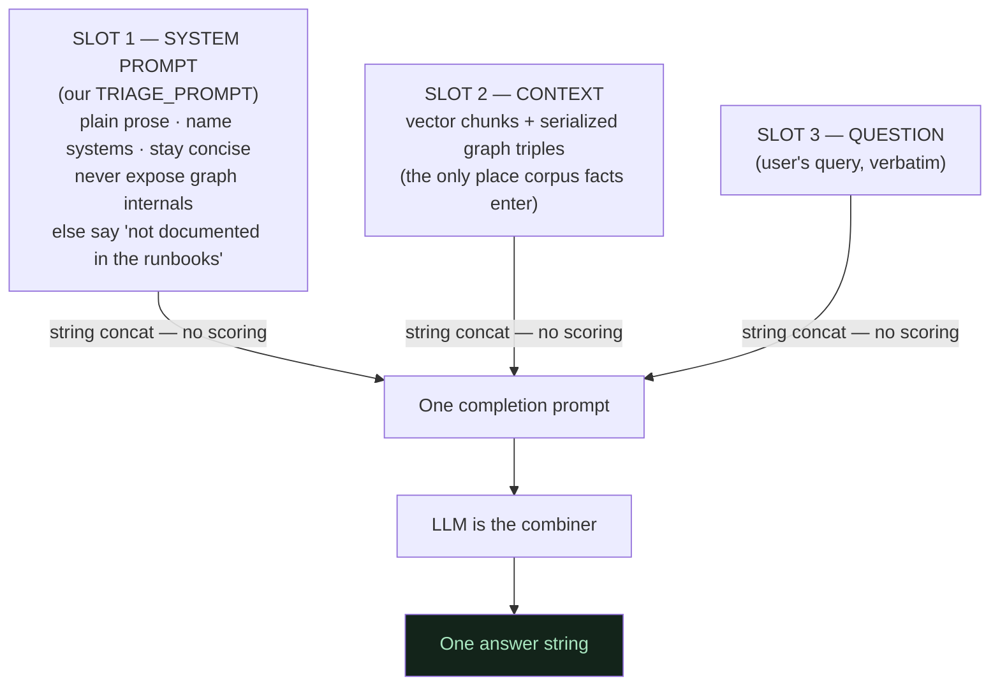

# 06 — The LLM Is the Combiner (there is no numeric fusion)

**In one line:** Cognee doesn't math-blend vector scores with graph scores — it turns the graph triples into text, staples them next to the vector chunks, the system prompt, and your question, and lets the LLM write the answer; so the **prompt is the only steering wheel**.

## ELI10

Picture three piles of sticky notes dumped on one desk:

- Pile A: **instructions** — "answer like a helpful runbook, in plain English, don't show your scratch work."
- Pile B: **facts the librarian found** — some came from the topic shelf (vectors), some came from following strings between books (graph).
- Pile C: **the actual question.**

A writer reads *all three piles at once* and writes you one paragraph. Nobody added up numbers or "averaged" the piles. The writer just **read them and synthesized**. That writer is the LLM. If the answers come out wrong-shaped, you don't fix the librarian — you **rewrite Pile A**.

## The real mechanics: no fusion, just text

A common assumption about hybrid graph+vector systems is that there's a clever scoring formula — `0.6 * vector_score + 0.4 * graph_score` or similar — that ranks and fuses results numerically.

**That is not what happens here.** In `GRAPH_COMPLETION`:

1. Vector search returns top-k chunks (text).
2. Graph traversal returns connected nodes + edges, which cognee **serializes to text** — node bodies fenced in `__node_content_start__ ... __node_content_end__`, edges as triples like `payments-team --[owns]---> payments-service`.
3. All of that is **concatenated** into one big context blob.
4. The blob, plus the system prompt, plus the question, becomes **one completion prompt** sent to the LLM.

The "merge" is **string concatenation**. The intelligence that combines a vector chunk with a graph edge into a coherent sentence is the **LLM itself**. There is no numeric fusion step anywhere in the path.

## The 3-slot prompt anatomy

Every answer is the LLM reading exactly three things — concatenated, **never numerically fused**:

Only **Slot 2** carries corpus facts. **Slot 1** is the only thing we control about *style and behavior*. **Slot 3** is the user's. The three slots are stapled together as **text** — there is no `0.6 * vector + 0.4 * graph` step anywhere.

### Cognee's default Slot 1 (the bug)

Cognee ships a default completion prompt, `answer_simple_question.txt`, which is literally:

> "Answer the question using the provided context. Be as brief as possible."

That "be as brief as possible" instruction caused the **fragment bug**: on under-specified questions, the LLM obeyed the brevity order and returned a bare word like `legacy-cache` instead of a sentence. The retrieval was *always* rich (`only_context` proved it — see [05-retrieval-graph-completion.md](05-retrieval-graph-completion.md)); the **Slot 1 instruction** was the cause.

### Our Slot 1 (the fix)

We replace it with `TRIAGE_PROMPT`, passed as `system_prompt=` to `cognee.search()` inside `ask()`. It tells the LLM to:

- answer in plain prose like a runbook,
- name the specific systems and actions,
- stay concise,
- **never** expose graph internals (no nodes, edges, or tags),
- and if the context lacks the specific answer, say it's **"not documented in the runbooks."**

That last clause is load-bearing for the forget hero: it pushes the model to *admit absence* instead of inventing, which is exactly what a freshly-forgotten system should trigger (see [07-the-forget-hero.md](07-the-forget-hero.md)).

## Why the `--[owns]--->` leak was the mechanism showing through

Early on, "Who owns the payments-service?" sometimes answered with the **raw triple** `payments-service --[owns]--> payments-team` syntax.

That wasn't a glitch — it was **proof of the architecture**. The graph really is serialized into the prompt as `A --[rel]---> B` triples (Slot 2). The LLM, with no instruction to hide them, just **copied the format straight through**. The leak was the graph's internal representation becoming visible in the output.

The fix was a **Slot 1** change: forbid exposing graph internals. After that, the same question returned clean prose: **"The payments-team owns the payments-service."** Same retrieval, same question — different prompt.

This is the single clearest demonstration that **the prompt is the steering wheel** and the LLM is the combiner: change *only* Slot 1, and a raw-triple leak becomes natural language.

## The prompt is the only steering wheel — and it has a ceiling

We ran **three controlled experiments**, holding retrieval constant and varying **only the prompt**:

| Experiment | Default prompt | With TRIAGE_PROMPT |
| --- | --- | --- |
| Under-specified Q | terse fragment | fluent sentence |
| Ownership Q | leaked `--[owns]--->` | clean plain language |
| Off-corpus Q | invents an answer | admits "not documented" |

Three wins, one variable. That's strong evidence the prompt is the **high-leverage knob** — *because* the LLM is the combiner, the instructions to the combiner dominate the output shape.

**But the steering wheel has a ceiling:**

- It **cannot conjure a fact the retrieval never fetched.** If the vector top-k didn't pull a chunk, no prompt can make the LLM cite it. The prompt steers *how* the LLM uses context, not *what* context exists.
- It **cannot fully kill hallucination.** Context is **influence, not law** — the LLM can still reach into its parametric (training) priors. We hit this on off-corpus over-confidence (e.g. "what's the deploy process for search-index?" — it points at the runbook instead of admitting the steps aren't documented) and **correctly stopped tuning** rather than chasing diminishing returns.

Knowing where the wheel stops working is as important as knowing it works.

## Why it matters

- **It explains the whole system in one sentence:** "the LLM is the combiner; the prompt is the steering wheel." Readers immediately understand why a *prompt* change can flip behavior so dramatically.
- **The leak story is memorable and honest:** a raw `--[owns]--->` appearing in output is a clean, true window into the architecture, not a bug we're hiding.
- **It sets up the forget hero:** because context is influence not law, "the graph is clean" alone isn't proof — which is exactly why we verified forget on **two** layers.

## Related

- [05-retrieval-graph-completion.md](05-retrieval-graph-completion.md) — how the context blob is assembled (vectors + graph)
- [07-the-forget-hero.md](07-the-forget-hero.md) — why "context is influence, not law" forced two-layer verification
- [08-the-same-question-flip.md](08-the-same-question-flip.md) — the controlled experiment where only the corpus changes
- [01-ingest-messy-docs-to-graph.md](01-ingest-messy-docs-to-graph.md) — where the graph triples come from
