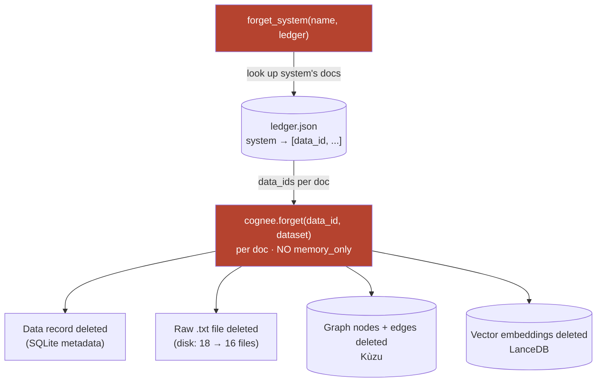

# 07 — The Forget Hero (the one leg the starter lacks)

**In one line:** `forget` is a *hard delete* — it removes a decommissioned system's data record, its raw file on disk, and its derived graph nodes/edges + vector embeddings — so Lethe never gives stale advice; and because deleting from the corpus is *not* the same as deleting from the model's brain, we verified it **two ways**.

## The thesis this file defends

Everyone is building AI that remembers **more**. The real on-call problem is AI that remembers the **wrong / stale** thing. When you tear down `legacy-cache`, an assistant that still says "flush the legacy-cache" is *worse than no assistant* — it sends the next engineer chasing a system that no longer exists.

So our hero capability is **forget**. It's the one leg the official `companybrain` starter lacks; even Cognee's own integrations shelf ships no forget UX. Remember + forget is the headline; "learns/improves" is only a weak supporting leg.

## ELI10

Your brain has a whiteboard of notes about every system. One day, `legacy-cache` gets unplugged forever.

A bad assistant keeps the note and keeps telling people to use it. A *good* assistant takes an eraser and **wipes the note completely** — not just covers it with a sticky that says "ignore this," but actually erases the ink, throws away the original sheet of paper it was copied from, and forgets the connections it drew to other notes.

After erasing, if you ask "what's legacy-cache?", the honest answer is **"I don't have a note about that."** That's the goal.

## What `forget` actually removes (the chain)

From `incident_brain.py`:

```python
async def forget_system(name, ledger):
    """Decommission a system: forget every document tagged to it."""
    ...
    await cognee.forget(data_id=uid, dataset="main_dataset")
```

`forget_system(name, ledger)`:

1. Looks up the system's document `data_id`s in **`ledger.json`** (a simple `system -> [data_id, ...]` map written during ingest).
2. Calls `cognee.forget(data_id=uid, dataset="main_dataset")` for **each** document — crucially **without** `memory_only`.

In cognee 1.1.3 source, that routes `_forget_data_item -> delete_data`, which **hard-deletes**, for each document:

- the **data record** (relational metadata in SQLite),
- the **raw file** on disk (the original `.txt`),
- the **derived graph nodes and edges** (Kùzu),
- the **vector embeddings** (LanceDB).

So forgetting `legacy-cache` (2 docs: the runbook + the post-mortem) tears out *every layer* those docs contributed to.



## Hard delete vs cognee's `memory_only` option

Cognee gives you a choice:

| Mode | Graph + vectors | Raw files on disk | We use it? |
| --- | --- | --- | --- |
| `forget(data_id=...)` (default, what we call) | **deleted** | **deleted** | ✅ yes |
| `forget(data_id=..., memory_only=True)` | deleted | **kept** | ❌ no |

`memory_only=True` would scrub the brain but leave the original paper in the filing cabinet. We deliberately use the **full hard delete** because a *decommissioned* system should leave no recoverable trace — the demo claim is "it's gone," and we mean it literally.

## Verified — the structural layer

Two pieces of hard evidence that the structural layers really emptied out:

1. **Disk:** the data directory dropped from **18 `.txt` files to 16** after forgetting legacy-cache's 2 docs. The raw files physically disappeared. (This is the visible proof that it's a hard delete, not `memory_only`.)
2. **Context:** `cognee.search(..., only_context=True)` showed **zero legacy-cache residue across five different phrasings**. No `Node: legacy-cache`, no `__node_content_start__` body mentioning it, no `--[...]--->` edge touching it. The graph and vectors are genuinely clean. (See [05-retrieval-graph-completion.md](05-retrieval-graph-completion.md) for what `only_context` returns.)

## The crucial caveat: corpus ≠ the model's brain

Here is the honest, important part most demos skip.

**`forget` removes data from the CORPUS — not from the model's parametric / training knowledge.**

The retrieved context is **influence, not a hard constraint** (see [06-the-llm-is-the-combiner.md](06-the-llm-is-the-combiner.md)). Even with a perfectly clean graph, the LLM *could* still reach into its training priors and mention something it was never re-fed. There are two failure modes for any LLM:

- **confabulation** — invent facts to fill a gap (common),
- **flat contradiction** — negate clear context (rare).

So **"the graph is clean" alone is NOT proof it forgot.** A clean corpus + an LLM that hallucinates from priors could *still* recommend the dead system. That's why a single check is not enough.

## Verified — the behavioral layer

To close the gap, we also verified **behaviorally**, by asking real questions through the real HTTP routes after forgetting:

- The hero triage question, run **after forget ×12**, never recommended legacy-cache.
- Direct **name-lookup ×10+** ("What is the legacy-cache?") returned the honest:
  > "The legacy-cache is not documented in the runbooks, so its description and dependencies are unknown."
- **Adversarial phrasings** (trying to coax it back) — legacy-cache never resurfaced.

The honest "not documented in the runbooks" wording is no accident: it's produced by the `TRIAGE_PROMPT` clause that tells the model to admit absence rather than invent. The prompt and the delete work *together* — the delete removes the corpus facts, the prompt stops the model from papering over the hole with priors.

## The before / after, in one place

Same question — "If auth-service latency is high, what should I check?" — temp 0, golden graph:

- **BEFORE forget:** "...check the **legacy-cache** by flushing and resizing the legacy-cache cluster to recover, as it sits in front of the auth-service session reads."
- **AFTER forget:** "...check the **session-store connection pool and its hit rate**, as the auth-service reads session state from it, and also verify the **payments-service**, which requires and calls the auth-service to validate login tokens."

The dead system vanishes and the answer reroutes to the surviving, correct path. Full analysis of *why this flip is a controlled experiment* is in [08-the-same-question-flip.md](08-the-same-question-flip.md).

## Why it matters

- **It's the differentiator.** Remember is table stakes; **forget** is the leg the starter and the integrations shelf both lack. It directly serves the thesis: *static memory rots.*
- **It's a real hard delete, and we can show it on disk** (18 → 16 files) — not a soft "exclude" flag dressed up as deletion.
- **The two-layer verification is the credibility.** We don't claim "the graph is clean, therefore it forgot." We prove **structural** (0 residue) *and* **behavioral** (never resurfaces) — precisely because we understand that context is influence, not law.

## Honest limits

- Forget can't reach into the model's training weights — only the corpus. We mitigate, not eliminate, parametric leakage, and we verify behaviorally because of it.
- Off-corpus over-confidence about *surviving* systems is a separate, documented LLM limit (see [06-the-llm-is-the-combiner.md](06-the-llm-is-the-combiner.md)) — not a forget failure.

## Related

- [06-the-llm-is-the-combiner.md](06-the-llm-is-the-combiner.md) — why "context is influence, not law" forced two-layer verification
- [05-retrieval-graph-completion.md](05-retrieval-graph-completion.md) — `only_context` (the structural check tool)
- [08-the-same-question-flip.md](08-the-same-question-flip.md) — the before/after as a controlled experiment
- [01-ingest-messy-docs-to-graph.md](01-ingest-messy-docs-to-graph.md) — what got built (and thus what gets torn down)
