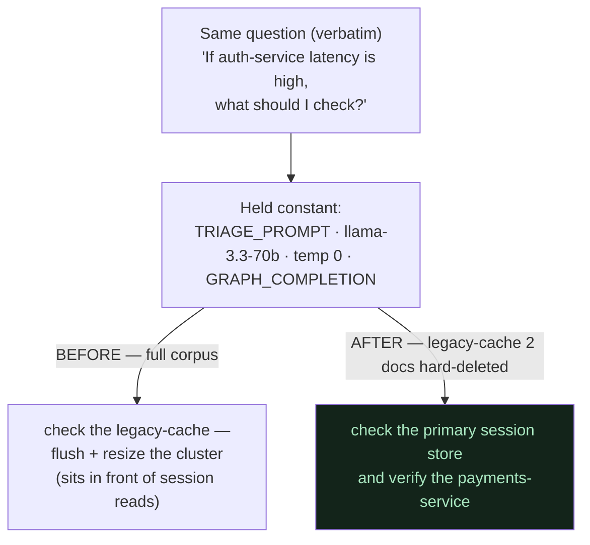

# 08 — The Same-Question Flip (the money shot)

**In one line:** Ask *the exact same question* before and after forgetting `legacy-cache`, and the answer reroutes from the dead system to the correct surviving path — a controlled experiment where **only the corpus changed**, which is the single most convincing thing to show a judge.

## ELI10

You ask your friend the *same* question on Monday and on Tuesday — word for word. On Monday they say "check the legacy-cache." On Tuesday they say "check the primary session store and the payments-service." Nothing about *you* or *the question* changed. The only thing that changed is **what your friend knows** — between Monday and Tuesday, they learned the legacy-cache got torn down.

If only one thing changed and the answer flipped, you've *proved* that one thing caused the flip. That's a controlled experiment, and it's why "same question twice" is so powerful.

## Why this is a controlled experiment, not a demo trick

A controlled experiment isolates **one variable**. In the same-question flip, everything is held constant except the corpus:

| Held constant | The one thing that changed |
| --- | --- |
| The **question** (verbatim, identical string) | The **corpus** — legacy-cache's 2 docs hard-deleted |
| The **system prompt** (`TRIAGE_PROMPT`, unchanged) | |
| The **model** (`llama-3.3-70b-instruct`) | |
| **Temperature 0** (deterministic decoding) | |
| The **retrieval mode** (`GRAPH_COMPLETION`) | |

Because the question, the prompt, the model, and the temperature are all fixed, the *only* explanation for a different answer is the **corpus change** — i.e. the forget. That's what turns a cute demo into evidence. (Contrast with the prompt experiments in [06-the-llm-is-the-combiner.md](06-the-llm-is-the-combiner.md), which hold the *corpus* constant and vary the *prompt* — same discipline, opposite variable.)

## The money shot (verbatim, temp 0, golden graph)

**Question (both runs, identical):**
> "If auth-service latency is high, what should I check?"

**BEFORE forget:**
> "To troubleshoot high auth-service latency, check the **legacy-cache** by flushing and resizing the legacy-cache cluster to recover, as it sits in front of the auth-service session reads."

**AFTER forget (`legacy-cache` decommissioned):**
> "To troubleshoot high auth-service latency, check the **session-store connection pool and its hit rate**, as the auth-service reads session state from it, and also verify the **payments-service**, which requires and calls the auth-service to validate login tokens."

And the direct name lookup, after forget:
> "The legacy-cache is **not documented in the runbooks**, so its description and dependencies are unknown."

The dead system doesn't just get suppressed — the answer **reroutes** to the genuinely-correct surviving path (primary session store, payments-service), assembled by graph traversal across multiple docs.

## Why it flips *reliably* (not by luck)

Two things have to be true for the flip to be trustworthy, and both are **verified**:

### 1. The corpus genuinely changed

`forget` is a hard delete (see [07-the-forget-hero.md](07-the-forget-hero.md)): raw files on disk dropped **18 → 16**, and `only_context` showed **zero legacy-cache residue** across five phrasings. The legacy-cache facts are *gone* from both the graph and the vectors — so retrieval simply can't fetch them anymore. There's nothing in the door, and nothing connected through the rooms. (See [05-retrieval-graph-completion.md](05-retrieval-graph-completion.md).)

### 2. The model grounds on the new corpus

This is the subtle, honest half. A clean corpus isn't *automatically* enough, because context is **influence, not law** — the LLM could in principle still recommend legacy-cache from its training priors (confabulation). So we verified the model actually grounds on what's left:

- the hero question **after forget ×12** never brought legacy-cache back,
- name-lookup **×10+** consistently returned the honest "not documented" answer,
- **adversarial phrasings** couldn't coax it back.

The `TRIAGE_PROMPT` clause ("if the context lacks the specific answer, say it's *not documented in the runbooks*") is what keeps the model from filling the hole with priors. Delete removes the facts; the prompt stops the cover-up. Together they make the flip **repeatable**, not a one-time fluke.

Temperature 0 helps here too: decoding is deterministic, so the same question + same corpus gives the same answer every time — which is exactly what you want when you're *demonstrating* a flip rather than gambling on one.

## Running it for a demo (don't shoot yourself in the foot)

A **single forget mutates the persisted graph**. If you run the AFTER state and then try to run BEFORE again, legacy-cache is already gone. So:

- **Always reset the golden snapshot before a demo run.** Use `reset_demo.py` to restore `golden_snapshot/` — it's deterministic, instant, and **zero quota** (no re-cognify). Never re-run `setup.py` mid-demo and never gamble on a rebuild loop.
- Drive the flip through the **real HTTP routes** (`/ask`, `/forget`) — the same path the demo UI uses — so what the judge sees is what actually runs.
- **Read the actual answer strings.** Never substring-score them ("does it contain the word legacy-cache?") — that's the same trap as the fragment bug. Read the sentence.

## Why it matters (demo / judging)

- **It's the single most convincing 30 seconds.** Same question, two answers, one cause. A judge needs no graph-theory background to feel it.
- **It's the thesis made visible:** static memory would still say "flush the legacy-cache." Ours *forgets* and reroutes — *AI that forgets the stale thing.*
- **It's defensible.** Because it's a real controlled experiment (one variable) backed by structural + behavioral verification, it survives a skeptical "are you sure it didn't just get lucky?" — the answer is "we ran it 12+ times at temp 0 with the facts physically deleted from disk."

## Related

- [07-the-forget-hero.md](07-the-forget-hero.md) — what forget removes, and the two-layer verification behind the flip
- [06-the-llm-is-the-combiner.md](06-the-llm-is-the-combiner.md) — the *prompt-held-constant* sibling experiment; why context is influence not law
- [05-retrieval-graph-completion.md](05-retrieval-graph-completion.md) — how retrieval assembles the rerouted answer
