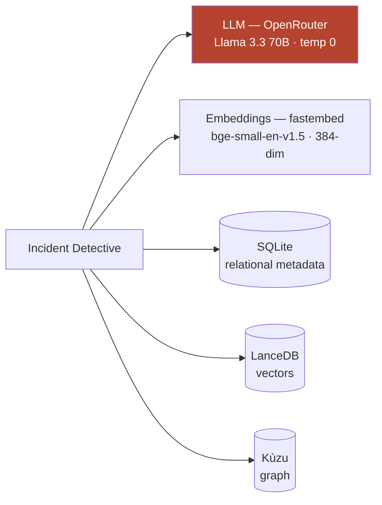

# Config and the Self-Hosted Stack

**In one line:** Everything except the language model runs locally on the laptop — local embeddings, a local SQLite database, a local vector store (LanceDB), and a local graph store (Kùzu) — so "self-hosted / open-source" is an honest claim, and the one remote piece (the LLM) could be swapped for a local model to run fully offline.

## ELI10 (a kitchen that's almost entirely yours)

Imagine a kitchen where you own the fridge, the pantry, the cutting board, and the recipe box — all sitting right there on your counter. The only thing you don't own is a fancy chef you phone up to plate the final dish. Everything *about your food* stays in your kitchen; you just call the chef at the end to write up the answer. And if you ever want, you can hire a chef who lives in your house instead of calling out — then nothing ever leaves your kitchen at all.

In Incident Detective, the fridge/pantry/cutting board/recipe box are the **local stores and local embeddings**; the phoned-in chef is the **LLM**.

## The real stack (from `.env`)

One piece is remote; everything that holds your data runs on the laptop:

The coral box is the only thing that leaves the machine; the four data stores are all local files under the data dir. Cognee is configured through environment variables. Here's each layer and where it runs:

| Layer | Choice | Runs where | Why |
| --- | --- | --- | --- |
| **LLM** | `custom` provider → OpenRouter `openrouter/meta-llama/llama-3.3-70b-instruct`, **temperature 0** | Remote API | The only piece that leaves the machine; temp 0 = deterministic answers for a reliable demo |
| **Embeddings** | local **fastembed** `BAAI/bge-small-en-v1.5`, **384-dim** | Local (offline) | Zero API quota; runs without network |
| **Relational** | SQLite | Local file | Data records / metadata |
| **Vector** | LanceDB | Local files | Chunk embeddings for semantic recall |
| **Graph** | Kùzu | Local files | Nodes + edges for traversal |
| **Data dir** | `/Users/vinayak/.cognee-incident-detective/` | Local | Where all of the above persist |

Backup LLM backends are configured too — a **Groq key pool**, **NVIDIA NIM**, and **Cerebras** — so a single throttled provider doesn't sink a demo.

### The LLM: `custom` provider, temperature 0

We use Cognee's `custom` LLM provider pointed at **OpenRouter** running **Llama 3.3 70B Instruct**. Two deliberate choices:

- **Temperature 0** makes the completion as deterministic as the backend allows — the same question gives the same answer, which is what you want when demoing a before/after-forget comparison.
- It's an **open-weights model** (Llama), which keeps the whole story open-source-friendly even though this particular call goes over the network.

### Embeddings are LOCAL — and that's a big deal

Cognee's *default* embedding model is OpenAI `text-embedding-3-small`, which **costs API quota** on every chunk. We deliberately switched to **local fastembed `bge-small-en-v1.5` (384-dimensional)**. Consequences we actually observed:

- **Embeddings run offline and cost zero quota.** This is why **dozens of re-ingests during testing never burned embedding quota** — only the LLM calls (cognify extraction + the answer step) cost anything.
- It makes the cheap verification trick (`only_context`, which uses embeddings but skips the answer LLM) **effectively free** to run as many times as we want. See [the-cognee-api-we-use.md](the-cognee-api-we-use.md).

> **Detail worth knowing:** 384 dimensions is the size of the "meaning space" each chunk and each question is projected into. Vector recall is just finding the nearest chunks to the question in that space (cosine similarity).

### The three local stores, one cognify pass

A single `cognify()` writes into all three:

- **Kùzu (graph):** the nodes and edges — structure and traversal. This is what lets us answer "what's connected to X?" rather than only "what reads like X?"
- **LanceDB (vectors):** the chunk embeddings — semantic recall, the "entry doors" into the graph.
- **SQLite (relational):** the bookkeeping — which doc is which, the `data_id`s that `ledger.json` maps back to system names.

Everything persists under the data dir `/Users/vinayak/.cognee-incident-detective/`, so a build survives restarts. (That persistence is also why a demo reset matters — see below.)

## Why "self-hosted / open-source" is a clean story

For the hackathon's **self-hosted track**, the honest claim is: **everything except the LLM call already runs locally** — local embeddings, local SQLite, local LanceDB, local Kùzu, all in a local data dir. The graph, the vectors, and the raw documents never leave the machine.

The **one** remote dependency is the LLM, and even that is an **open-weights** model (Llama 3.3 70B) reached through a swappable `custom` provider. Because the provider is pluggable, you could point it at a **local LLM** (e.g. an Ollama-served Llama) and the system would run **fully offline** with no behavioral change to the architecture — same `add` / `cognify` / `search` / `forget` calls, same stores. We don't claim we're running fully offline *today*; we claim the design makes it a one-config-line change, which is a clean and defensible self-hosted story.

> **No overclaiming:** as configured for the demo, the LLM call does go to OpenRouter. The "fully offline" capability is **by design / swappable**, not the current running state.

## Operational notes that touch config

- **No cognify at serve time.** `app.py` (FastAPI on port 8077) only **loads `ledger.json`** at startup — instant, no LLM cost. The expensive `cognify()` happens once in the cold `setup.py` build (~1 min).
- **`CACHING=false`** is set in code before importing Cognee so a post-forget query reflects the live, now-clean graph instead of a stale cached answer. (Covered in [the-cognee-api-we-use.md](the-cognee-api-we-use.md).)
- **Demo reset = snapshot/restore, not rebuild.** `snapshot_golden.py` captures a clean build into `golden_snapshot/`; `reset_demo.py` restores it. This is **instant, zero quota, and deterministic** — used *instead of* re-running `setup.py`. It matters because the local stores are persistent: a single forget mutates the on-disk graph, so we always restore the golden snapshot before a demo run.

## Why it matters (demo / judging)

This config is what makes the project genuinely **self-hosted and quota-light**: local embeddings meant we could iterate dozens of times for free, local stores mean the data and graph live on the machine, and a swappable open-weights LLM means "fully offline" is a realistic next step rather than a fantasy. For a judge weighing the self-hosted track, the line is simple and true: *all the memory lives locally; only the final wording is outsourced, and even that can be brought in-house.*

## Related

- [what-is-cognee.md](what-is-cognee.md) — what these stores collectively become (a second brain)
- [the-cognee-api-we-use.md](the-cognee-api-we-use.md) — the calls that read/write this stack; `CACHING=false`
- [why-cognee-not-just-rag.md](why-cognee-not-just-rag.md) — why the hybrid graph + vector stores beat flat RAG
