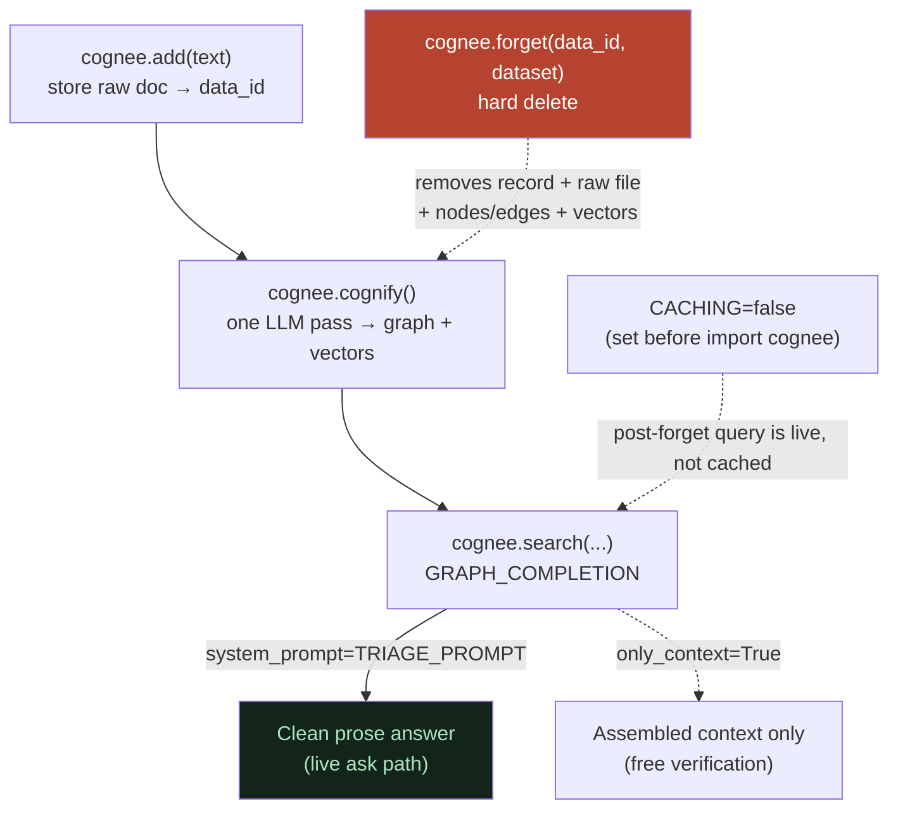

# The Cognee API We Use

**In one line:** Just five calls — `add`, `cognify`, `search`, `forget`, and the `only_context` flag — plus turning the response cache off, are the entire surface of how Lethe talks to Cognee.

## ELI10 (a librarian with four buttons)

Think of Cognee as a librarian with a tiny control panel:

- **ADD** — "here's a new book, shelve it."
- **COGNIFY** — "now actually *read* everything you've shelved and draw me the map of who's connected to whom."
- **SEARCH** — "answer my question using the books and the map."
- **FORGET** — "this book is wrong now; shred it, erase it from the map, and forget it ever existed."

There's also a peek switch on SEARCH (**only_context**): "don't write me an answer, just show me which pages and map-pieces you *would* have used." And we taped over the librarian's "give the same answer as last time" shortcut (**CACHING off**) so we always see fresh answers — important the moment after we shred a book.

## The call flow at a glance



## The real calls (with our exact usage)

All four live in `incident_brain.py`. Cognee's API is async, so each is `await`ed.

### `cognee.add(text)` — remember the raw doc

```python
r = await cognee.add(text)
info = r if isinstance(r, list) else getattr(r, "data", None)
did = info[0].get("data_id") if info and isinstance(info[0], dict) else None
```

Stores the raw document — **no schema, no tags**. It returns metadata including a **`data_id`**, which we capture. We call `add` once per wiki doc inside `ingest()` and record `system → [data_id, ...]` into **`ledger.json`**. That ledger is what makes targeted forgetting possible later: it's the only thing that maps a human name like "legacy-cache" back to the underlying data ids.

### `cognee.cognify()` — build the graph + vectors

```python
await cognee.cognify()
```

Runs **one LLM extraction pass** over all added text. Using Cognee's `generate_graph_prompt.txt`, it extracts typed nodes and snake_case edges, merges duplicate entities across docs (coreference resolution), and writes into **both** stores: the graph (Kùzu) and the vector index (LanceDB), with relational metadata in SQLite. Default shapes: `Node{id, name, type, description}`, `Edge{source_node_id, target_node_id, relationship_name, description}`.

> **Cost note:** cognify is the call that spends LLM quota (the extraction is an LLM job). Embeddings are **local** (fastembed), so they cost nothing. This is why we run cognify in a cold `setup.py` build and *not* at server startup — `app.py` only loads `ledger.json`, which is instant. See [config-and-the-self-hosted-stack.md](config-and-the-self-hosted-stack.md).

### `cognee.search(...)` — recall and answer

```python
r = await cognee.search(
    query_text=query,
    query_type=SearchType.GRAPH_COMPLETION,
    system_prompt=TRIAGE_PROMPT,
)
```

We use `SearchType.GRAPH_COMPLETION`. It (1) embeds the question and vector-searches LanceDB for the top-k nearest chunks (entry doors), (2) traverses the Kùzu graph out from those, (3) serializes both to text, concatenates them, and asks the completion LLM to write **one** answer. There is **no numeric fusion** — the LLM is the combiner.

Two parameters matter a lot:

#### `system_prompt=TRIAGE_PROMPT` — our high-leverage knob

Cognee's **default** completion prompt (`answer_simple_question.txt`) is literally *"Answer the question using the provided context. Be as brief as possible."* That "be as brief as possible" caused the **bare-fragment bug**: some demo questions returned a single word like `legacy-cache` instead of a sentence. Retrieval was always rich (we proved it with `only_context`) — the *prompt* was the problem.

Our fix is **`TRIAGE_PROMPT`**, passed as `system_prompt=`. It instructs the model to: answer in plain prose like a runbook, name the specific systems and actions, stay concise, **never expose graph internals** (no nodes/edges/tags/`--[owns]-->` syntax), and — if the context lacks the specific answer — say it is **"not documented in the runbooks."** That last clause both curbs hallucination and *preserves the forget hero*: a forgotten system correctly comes back as "not documented" rather than being confabulated.

We confirmed the prompt is the high-leverage variable with three controlled experiments — **retrieval held constant, prompt the only change**: terse → fluent; leaked `--[owns]-->` → clean language; invents facts → admits "not documented."

> **Honest ceiling:** the prompt cannot conjure a fact retrieval never fetched (vector top-k limit), and cannot *fully* kill hallucination. We hit that ceiling on over-confident off-corpus questions and correctly **stopped tuning** rather than chasing diminishing returns.

#### `only_context=True` — see the context without paying the LLM

```python
# (verification usage, not the live answer path)
await cognee.search(query_text=q, query_type=SearchType.GRAPH_COMPLETION, only_context=True)
```

Returns the **assembled context** (the concatenated vector + graph text) **without** running the completion LLM — cheap, and since embeddings are local, effectively free. This is our verification microscope. The real captured format looks like:

```text
Node: auth-service ... __node_content_start__ <original runbook text> __node_content_end__
payments-team --[owns]---> payments-service
[team, ownership, api-gateway]
```

`only_context` is how we **proved retrieval was always rich** during the fragment-bug hunt, and how we proved forget worked structurally (**0 legacy-cache residue across 5 phrasings** after delete).

### `cognee.forget(...)` — the hard delete

```python
await cognee.forget(data_id=uid, dataset="main_dataset")
```

Called per data id inside `forget_system(name, ledger)`: we look up the system's `data_id`s in `ledger.json` and forget each — **without** `memory_only`. In Cognee's source this routes `_forget_data_item → delete_data`, which **hard-deletes**: the data record, the **raw `.txt` file on disk** (verified 18 → 16 after forgetting legacy-cache's 2 docs), **and** the derived graph nodes/edges + vector embeddings.

```python
# what we do NOT call:
await cognee.forget(data_id=uid, dataset="main_dataset", memory_only=True)  # keeps raw files — not used
```

`memory_only=True` would delete graph + vectors but **keep the raw files**. We deliberately use the **full** delete so the data is gone everywhere — the strongest possible "forget."

> **Influence, not law:** forget removes data from the **corpus**, not from the model's training knowledge. So we verified forget **both** structurally (`only_context` shows nothing) **and** behaviorally (the system never resurfaces in answers across many phrasings). See [why-cognee-not-just-rag.md](why-cognee-not-just-rag.md).

## `CACHING=false` — and why it's set before the import

```python
os.environ["CACHING"] = "false"  # so a post-forget re-query reflects the change live (no stale cache)
```

This is the **first** meaningful line in `incident_brain.py`, set **before `import cognee`**, because Cognee reads the setting at import time. With caching on, asking the *same* question right after a forget could return a **cached pre-forget answer**, masking the whole demo. Turning caching off guarantees the post-forget query is computed fresh against the now-clean graph. (Embeddings are local, so the cost of skipping the cache is negligible.)

## Quick reference

| Call | What it does | Our usage |
| --- | --- | --- |
| `cognee.add(text)` | Store raw doc, return `data_id` | Per wiki doc in `ingest()`; ids → `ledger.json` |
| `cognee.cognify()` | One LLM pass → graph (Kùzu) + vectors (LanceDB) | Cold build only (`setup.py`); never at serve time |
| `cognee.search(..., GRAPH_COMPLETION, system_prompt=TRIAGE_PROMPT)` | Vector + graph retrieval → one LLM answer | Live `ask()` path |
| `cognee.search(..., only_context=True)` | Return assembled context, skip the LLM | Verification microscope (free, local embeds) |
| `cognee.forget(data_id, dataset="main_dataset")` | Hard delete: record + raw file + graph + vectors | `forget_system()`; the hero beat |
| `CACHING=false` (env, pre-import) | No response cache | So post-forget queries are live |

## Why it matters (demo / judging)

This file is the proof that our "magic" is a small, legible set of real Cognee calls — not hand-waving. The judge can see exactly where remember (`add`/`cognify`), recall (`search`), and forget (`forget`) live, why we override the default prompt, why we can verify retrieval cheaply (`only_context`), and why caching is off so the live forget demo can't be faked by a stale cache.

## Related

- [what-is-cognee.md](what-is-cognee.md) — the lifecycle these calls implement
- [why-cognee-not-just-rag.md](why-cognee-not-just-rag.md) — why forget is the differentiator we verify twice
- [config-and-the-self-hosted-stack.md](config-and-the-self-hosted-stack.md) — the LLM + local stores these calls run against
