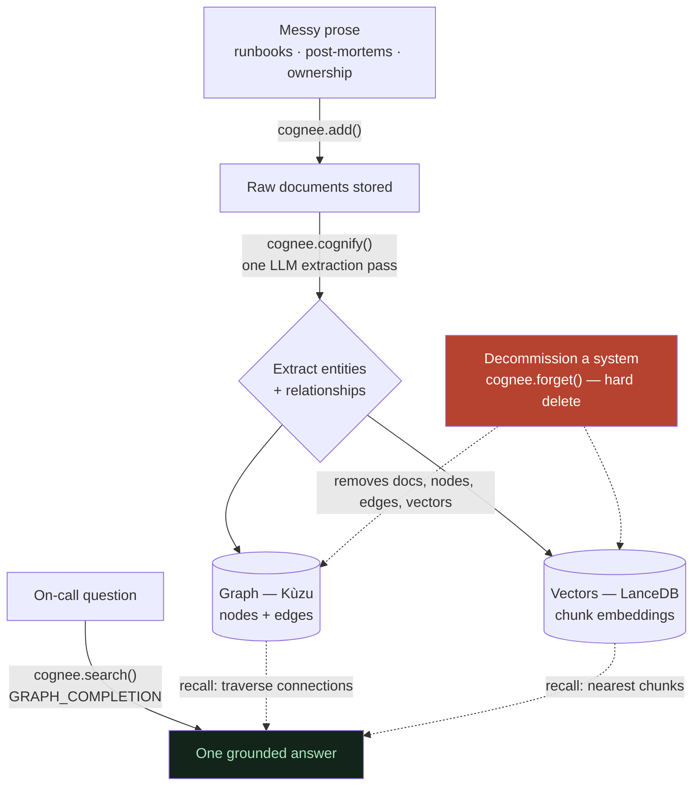

# What is Cognee?

**In one line:** Cognee is a memory layer that reads your plain writing and quietly builds a searchable "second brain" — a graph of facts plus a meaning-based index — that an AI can later *remember*, *recall*, and crucially *forget*.

## ELI10 (the playground analogy)

Imagine you tell a friend a bunch of stories about your school: "Mr. Lee teaches math," "math class is in Room 5," "the fire drill is during math." Your friend doesn't just memorize the sentences word-for-word. They build a little **map in their head**: a dot for *Mr. Lee*, a dot for *math*, a dot for *Room 5*, with arrows connecting them ("teaches", "is in"). Now when you ask "where do I find Mr. Lee?", your friend follows the arrows: Mr. Lee → teaches → math → is in → Room 5. They never had a sentence that said "Mr. Lee is in Room 5," but they figured it out by connecting dots.

That map-building friend is **Cognee**. You hand it ordinary writing; it builds the map of dots and arrows *automatically*, and it also keeps a second "this-feels-similar" index so it can find the right stories even when you use different words. And — the part most memory helpers can't do — if Mr. Lee leaves the school, your friend can **erase his dot and every arrow touching it**, so they never accidentally send you to his old room again.

## The real mechanics (as used in this project)

Cognee is an open-source memory framework. In **Incident Detective**, we feed it 18 short on-call runbooks and post-mortems written as plain prose — no tables, no tags, no schema. From that prose Cognee builds two stores at once, and we query them together.

The whole lifecycle is just three beats — **remember**, **recall**, **forget** — over one graph + vector "second brain":



### 1. Remember (ingest)

Two calls do the remembering:

- `cognee.add(text)` — stores the **raw document**. No schema, no tagging. Just "here is some writing, keep it."
- `cognee.cognify()` — runs **one LLM extraction pass** over the text chunks. Using Cognee's built-in prompt (`generate_graph_prompt.txt`), the LLM is told to act like a "top-tier algorithm": pull out **entities as typed nodes** with human-readable names, pull out **relationships as snake_case edges**, do **coreference resolution** (merge the same entity mentioned in different docs into ONE node), and add **no outside knowledge**.

The result is a `KnowledgeGraph` of `Node`s and `Edge`s. The exact default shapes (from `cognee.shared.data_models`):

```text
Node { id, name, type, description }
Edge { source_node_id, target_node_id, relationship_name, description }
```

Cognify writes into **two stores from that single pass**:

- **Graph store** = Kùzu — the nodes and edges, for *structure and traversal*. Example edge from our corpus: `payments-team --[owns]---> payments-service`.
- **Vector store** = LanceDB — embeddings of the text chunks, for *semantic recall* (finding things by meaning, not exact words).

Relational metadata (which doc is which, data ids) lives in **SQLite**. This **graph + vector hybrid built from one pass** is the heart of why we picked Cognee.

> **Verified detail:** entity resolution really merges across docs. "auth-service" appears in the auth runbook, the payments runbook, and the legacy-cache runbook — Cognee collapses those mentions into a single `auth-service` node. That's exactly why a question like "what's in the auth read path?" can pull facts from several documents into one answer.

### 2. Recall (search)

We use `SearchType.GRAPH_COMPLETION`. One question runs three stages:

1. **Embed the question → vector search in LanceDB.** Returns the top-k chunks nearest in 384-dimensional "meaning space" (cosine similarity). These are the **entry doors** — the most relevant starting points.
2. **Graph traversal from those entry points.** From each entry node, Cognee pulls connected nodes and edges out of Kùzu — the *neighborhood* of related facts.
3. **Both are serialized to plain TEXT, concatenated, and handed to the completion LLM**, which writes one answer.

A slogan worth keeping: **"vectors find what's relevant; the graph finds what's connected to it."** Important honesty note: there is **no numeric score fusion** between the two stores. The "merge" is literally concatenating two blobs of text; the **LLM is the combiner**. (See [the-cognee-api-we-use.md](the-cognee-api-we-use.md) for the exact call and the `only_context` trick.)

### 3. Forget (the hero)

This is the leg most memory tools lack, and the one the official "companybrain" starter doesn't have. `cognee.forget(data_id=..., dataset=...)` does a **hard delete**: it removes the data record, the raw file on disk, AND the derived graph nodes/edges and vector embeddings for that document.

In our app, `forget_system(name, ledger)` looks up the system's document `data_id`s in `ledger.json` and calls forget for each. We verified the effect two ways:

- **Structural:** after forgetting the legacy-cache (its 2 docs), the raw `.txt` files dropped from 18 to 16 on disk, and inspecting the assembled context (`only_context`) showed **0 legacy-cache residue across 5 different phrasings**.
- **Behavioral:** the same troubleshooting question that *used* to recommend the legacy-cache now recommends the session-store connection pool and its hit rate instead, and "what is the legacy-cache?" answers "not documented in the runbooks."

> **Honest limit (do not overclaim):** forget removes data from the **corpus**, not from the LLM's training knowledge. A clean graph is necessary but not *sufficient* proof — the model could still reach into its own priors. That's exactly why we checked both the structure AND the behavior. (More in [why-cognee-not-just-rag.md](why-cognee-not-just-rag.md).)

### 4. Improve (the weak fourth leg)

Cognee can also *learn/improve* memory over time. In our project this is a **weak supporting leg only** — we headline *remember + forget*. We mention it for completeness, not as a hero claim.

## What makes Cognee different

- **It turns messy prose into a graph with no schema and no tagging.** You don't define entity types up front; the extraction prompt *infers* them from the writing.
- **Hybrid by default:** every cognify pass populates both a graph and a vector index, and search queries both together.
- **Forget is a real, hard delete** — graph + vectors + raw file — not a soft "exclude from results" flag. (Cognee *does* offer `memory_only=True`, which keeps the raw file; we deliberately use the full delete.)

## Why it matters (demo / judging)

Most hackathon "memory" projects show an AI that remembers **more**. Our thesis is that the harder, realer problem is an AI that remembers the **wrong or stale thing**. Cognee is the one framework that gives us all three legs — remember, recall, **forget** — out of one prose-to-graph pipeline, which is why "Incident Detective" can demo a system that *un-learns* a decommissioned service and stops giving stale advice. The graph + vector hybrid, built automatically from plain runbooks, is the core of our "Best Use of Cognee" story.

## Related

- [why-cognee-not-just-rag.md](why-cognee-not-just-rag.md) — why this beats plain RAG and a hand-built knowledge graph
- [the-cognee-api-we-use.md](the-cognee-api-we-use.md) — the exact `add` / `cognify` / `search` / `forget` calls
- [config-and-the-self-hosted-stack.md](config-and-the-self-hosted-stack.md) — the local stack that runs it
