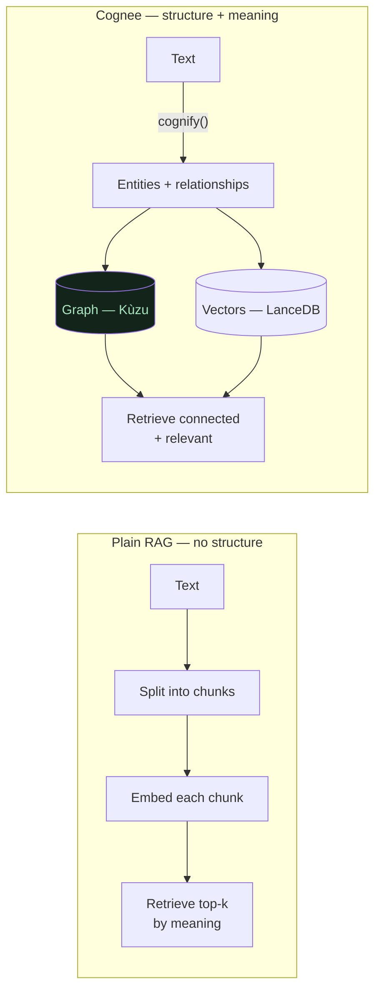

# Why Cognee, Not Just RAG?

**In one line:** Plain RAG only remembers chunks of text by their *meaning*; a hand-built knowledge graph needs you to design a *schema* first; Cognee *infers the structure from your prose* and then queries the graph AND the vectors together — and uniquely lets you truly *forget*.

## ELI10 (three ways to remember a recipe book)

You have a messy recipe book and want a helper that can answer questions about it.

- **Plain RAG** is a helper who tears the book into index cards and sorts them by *vibe* — "these cards feel about chocolate." Ask a question and they hand you the few cards that feel closest. Fast and useful, but they never noticed that "the cake" on one card is the same "cake" the frosting card talks about. No map of how things connect.
- **A traditional knowledge graph** is a helper who *will* draw you a beautiful connected map — but first you have to give them a blank form: "every recipe must have a Name, Ingredients, Steps, Time." If your book doesn't fit the form, tough luck. Building the form is the slow, annoying part.
- **Cognee** is a helper who reads the messy book and **draws the map for you, without any form** — figuring out the dots and arrows from the writing itself — *and* keeps the by-vibe index too. Ask a question and they grab the vibe-closest cards *and* follow the arrows out from them. And if a recipe gets removed, they erase its dot, its arrows, and its card — all of it.

## The real mechanics

The difference is structural — plain RAG flattens prose into chunks; Cognee also infers a graph on top:

### Plain RAG = embed chunks, no structure

Classic Retrieval-Augmented Generation: split documents into chunks, embed each chunk into a vector, store the vectors. At query time, embed the question and return the top-k nearest chunks by cosine similarity, then let an LLM answer over them.

This is genuinely useful, but it is **flat**. There is no notion that the "auth-service" mentioned in one chunk is the *same* entity as in another, and no way to ask "what is *connected* to auth-service?" beyond "what *reads similarly* to auth-service?" Relationships and multi-hop reasoning are not represented — they only emerge if the right chunks happen to land in the same top-k.

### Traditional knowledge graph = needs a schema up front

A hand-built KG gives you exactly the structure RAG lacks — typed nodes, typed edges, real traversal. But you pay for it in advance: you must **define the schema** (which entity types, which relationship types) and then **populate it**, usually with bespoke extraction code or manual tagging. For 18 evolving runbooks written by on-call engineers in plain English, that up-front modeling is a poor fit — the writing doesn't follow a fixed shape.

### Cognee = infers structure from prose + hybrid retrieval

Cognee's genuine magic: **`cognify()` runs one LLM extraction pass that infers the graph from the prose itself.** No schema, no tagging. The built-in `generate_graph_prompt.txt` instructs the model to extract entities as typed nodes, relationships as snake_case edges, merge duplicate entities across documents (coreference resolution), and add no outside knowledge. The default node/edge shapes are simply `Node{id, name, type, description}` and `Edge{source_node_id, target_node_id, relationship_name, description}`.

Then retrieval is **hybrid**: vector search (LanceDB) finds the relevant entry chunks, graph traversal (Kùzu) pulls what's *connected* to them, and both are concatenated into the answer prompt. **Vectors find what's relevant; the graph finds what's connected to it.**

So Cognee sits exactly between the other two: it gives you the *structure* of a knowledge graph **without** making you design a schema, and it keeps the *meaning-search* of RAG too.

## The honest graph-vs-RAG story (no overclaiming)

It would be easy to claim "the graph crushes RAG." That is **not** what we found, and pretending otherwise would be dishonest in a public demo. The honest version:

- **At our small corpus (18 short docs), the graph layer adds little over vectors for simple lookups.** For a question like "who owns the payments-service?", plain vector recall already pulls the right chunk; **graph ≈ RAG** here. The graph's advantage is real but **grows with scale** and shows up most on **relationship / multi-hop questions** — exactly the cases where "what connects to X?" beats "what reads like X?"
- This means the graph is not a magic win at demo scale. We say so plainly. That honesty is the spine of our blog post.

### We tested 3 Cognee differentiators vs RAG — only one held cleanly

At temperature 0, we probed three things Cognee can do that plain RAG can't, to see which actually delivered at our scale:

1. **Multi-hop / relationship traversal** — helps in principle, but at 18 docs the vectors mostly already carried the needed chunks. *Marginal at this scale.*
2. **Entity resolution across docs** — real and visible (one `auth-service` node), but again the small corpus muted its standalone payoff.
3. **Forget (hard delete of a system's memory)** — **held cleanly and decisively.** This is the differentiator we build the demo on.

So the honest scoreboard: of the three, **only FORGET held cleanly** as a sharp, demonstrable edge over RAG at our scale. We lead with the leg that's genuinely strong rather than overselling the other two.

### Forget is the differentiator — verified two ways

Because the retrieved context is **influence, not law** (the LLM can still confabulate or lean on training priors), a clean graph alone is *not* proof of forgetting. So we verified both layers:

- **Structural:** after `forget`, the raw files dropped 18 → 16 on disk, and the assembled context (`only_context`) showed **0 legacy-cache residue across 5 phrasings**.
- **Behavioral:** the troubleshooting question that once recommended the legacy-cache now recommends the session-store connection pool and its hit rate; "what is the legacy-cache?" → "not documented in the runbooks." Tested across many phrasings; it never resurfaced.

> **The leg the starter lacks:** Cognee's own official "companybrain" starter does **not** ship a forget UX, and Cognee's integrations shelf ships none either. Forget is the one leg we add — and the one that most cleanly distinguishes a real *memory* system from a pile of embeddings.

## Why it matters

A skeptical reader will (rightly) ask "isn't this just RAG?" Our answer is specific and honest: Cognee infers a graph from raw prose with **zero schema**, queries graph + vectors **together**, and — the part RAG fundamentally cannot do — performs a **true forget** that removes a system from memory at every layer. We don't claim the graph beats RAG at every turn; we claim it gives us *forget*, and forget is the whole point of an AI that must not give stale on-call advice.

## Related

- [what-is-cognee.md](what-is-cognee.md) — the remember / recall / forget lifecycle
- [the-cognee-api-we-use.md](the-cognee-api-we-use.md) — the exact calls, including `only_context` for verification
- [config-and-the-self-hosted-stack.md](config-and-the-self-hosted-stack.md) — the local graph + vector stores that make this hybrid real
