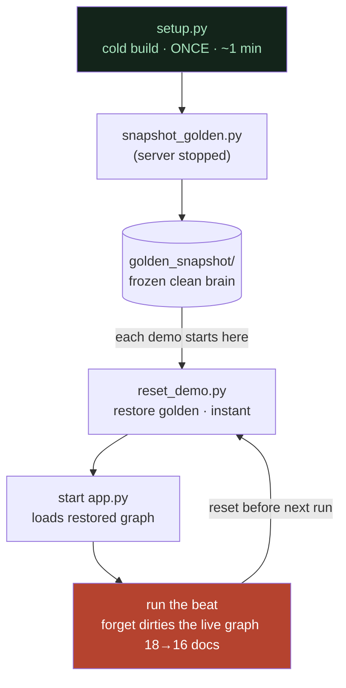

# Determinism and the Golden Snapshot

**In one line:** The graph build is *non-deterministic*, but that turned out not to matter for answer quality — so instead of rebuilding (slow, quota-burning, variable) we reset every demo by restoring a frozen "golden snapshot" (instant, zero quota, byte-identical).

## ELI10

Say you bake a cake the same way twice, but the swirls of frosting come out a little different each time. The *swirls* are non-deterministic — they're never identical. But the cake still tastes the same. So if you're worried about the *taste*, fussing over the swirls is a waste of time. That was our "red herring" — we chased the swirls when the taste was fine.

And for the demo, we don't re-bake at all. We took **one photo of a perfect cake** and we just put that exact cake back on the table before every showing. Same cake, every time, in one second. That photo is the **golden snapshot**.

## What "non-deterministic build" means here

When `setup.py` runs `cognee.cognify()`, it makes a real LLM call to extract entities and relationships from the prose. LLM extraction is **not bit-for-bit reproducible** across runs:

- Node names, descriptions, and the exact set of edges can vary slightly between builds.
- Coreference resolution (merging the same entity across docs into one node) can land a little differently.

So two cold builds from the *identical* 18-doc corpus can produce *slightly different graphs*. That's just the nature of an LLM doing the extraction.

## The red herring: "is the build non-deterministic?" was the WRONG question

Early on, when the same demo question sometimes returned a bare fragment (`legacy-cache`) and sometimes a full sentence, we briefly suspected the **build** was the culprit — that a "bad" cognify run produced a worse graph. We went looking for build non-determinism.

That was a **red herring.** Here's the chain of reasoning that killed it:

1. We ran `only_context=True`, which returns the assembled retrieval context *without* running the answer LLM. The context was **always rich** — the right nodes, edges, and chunks were present every time, across builds.
2. So retrieval (and therefore the build feeding it) was fine. The fragment vs. sentence difference was happening *after* retrieval, in the answer-writing step.
3. The actual root cause was cognee's **default "be as brief as possible" prompt** going terse on under-specified questions — fixed with the `TRIAGE_PROMPT` (see [the-triage-prompt-and-prompt-leverage.md](the-triage-prompt-and-prompt-leverage.md)).

The conclusion, stated precisely and honestly:

> **The build IS non-deterministic, but the build does NOT affect answer quality.** Answer quality is governed by retrieval (which was always rich) and the answer prompt (which was the real lever). The non-determinism is real; it's just irrelevant to the thing we cared about.

This is an important distinction to keep straight: we are **not** claiming the build is deterministic. We're claiming its non-determinism doesn't matter for what we're demonstrating. Those are different statements, and conflating them would be an overclaim.

## The consequence: any clean build makes a fine golden

Because the build doesn't affect answer quality, we don't need a "perfect" or "canonical" build. **Any clean build is a perfectly good golden snapshot.** This is what makes the snapshot strategy valid — we're not freezing *the one true graph*, we're freezing *a known-good graph* and reusing it so the demo is stable.

## The demo-reset cycle

The cold build happens once; then every demo run is a cheap restore-run-restore loop. The build itself is a **red herring for answer quality** — any clean build makes a fine golden.

## The golden snapshot: a deterministic, zero-quota reset

Two scripts implement this:

- **`snapshot_golden.py`** — captures the current clean data directory (Kùzu graph + LanceDB vectors + SQLite relational store + `ledger.json`) into `golden_snapshot/`. **Run it with the server stopped** so nothing is being written mid-snapshot.
- **`reset_demo.py`** — restores `golden_snapshot/` over the live data directory. This is the reset.

Why restore-from-snapshot beats rebuild for demo resets:

| Property | Restore snapshot (`reset_demo.py`) | Rebuild (`setup.py`) |
| --- | --- | --- |
| **Speed** | Instant (a file copy) | ~1 minute (runs `cognify()`) |
| **LLM quota** | Zero | Burns quota on the extraction call |
| **Determinism** | Byte-identical every time | Slightly different graph each run |
| **Demo safety** | Predictable, repeatable | A bad/throttled run could stall the demo |

So the rule is: **reset the demo with `reset_demo.py`, never with `setup.py`.** `setup.py` is only for genuine cold builds (first time, or when the corpus actually changes).

## ALWAYS reset golden before a demo run — because a single `forget` mutates persisted state

This is the operational rule that's easy to forget and expensive to get wrong:

> **A single `forget` permanently changes the persisted graph on disk. So you MUST restore golden before each demo run.**

Why: the hero beat *forgets* legacy-cache. `forget_system()` does a **hard delete** — the raw `.txt` files vanish (verified: 18 docs → 16), and the derived graph nodes/edges and vector embeddings go with them. That change is written to the live data directory; it does not bounce back on its own.

So if you run the demo, forget legacy-cache, and then run the demo *again* without resetting, the second run starts with legacy-cache *already gone* — the dramatic "before" state is destroyed, and the forget beat has nothing left to forget. Restoring golden with `reset_demo.py` puts the full 18-doc brain back, so every demo starts from the same pristine "before".

Practical pre-demo checklist:

1. Stop the server.
2. `reset_demo.py` — restore the golden snapshot.
3. Start the server (instant; it just loads the restored graph).
4. Confirm `/health` is up, then run the demo.

## Never gamble on rebuild loops

A hard-won process lesson worth its own warning:

- **Don't build "rebuild until it's good" loops.** Since the build doesn't determine answer quality, looping rebuilds chasing a "better" graph is chasing noise — and every iteration burns LLM quota.
- **A real incident:** an automated "is it good yet?" loop once hung for roughly 20 minutes against a throttled LLM backend, getting nowhere. The build was never the problem, so the loop could never "win".
- **The discipline:** if answers are off, look at **retrieval** (`only_context`) and the **prompt**, not the build. Reset with the snapshot. Don't gamble compute on re-rolling the dice.

## Why it matters

- **Reliability under pressure.** A live demo that resets in one second to a known-good state — zero quota, deterministic — is dramatically safer than one that re-bakes for a minute and might come out wrong or get rate-limited mid-show.
- **It shows scientific honesty.** We name the red herring out loud: "we suspected the build, we were wrong, here's how we proved it." We distinguish "the build is non-deterministic" (true) from "non-determinism hurts answers" (false). Readers trust people who separate those cleanly.
- **It demonstrates real debugging maturity.** Killing a plausible-but-wrong hypothesis with a clean test (`only_context`), and refusing to throw compute at a problem the build can't cause, is exactly the engineering judgment the rules of this project are built around.

## Related

- [the-whole-stack.md](the-whole-stack.md) — `setup.py`, `snapshot_golden.py`, `reset_demo.py`, and the build/serve split
- [the-triage-prompt-and-prompt-leverage.md](the-triage-prompt-and-prompt-leverage.md) — the prompt that actually controls answer quality (not the build)
- [../05-the-research-story/](../05-the-research-story/) — the full saga, including the fragment-bug investigation
- [../02-cognee-deep-dive/](../02-cognee-deep-dive/) — what `cognify` and `forget` do to the persisted stores
