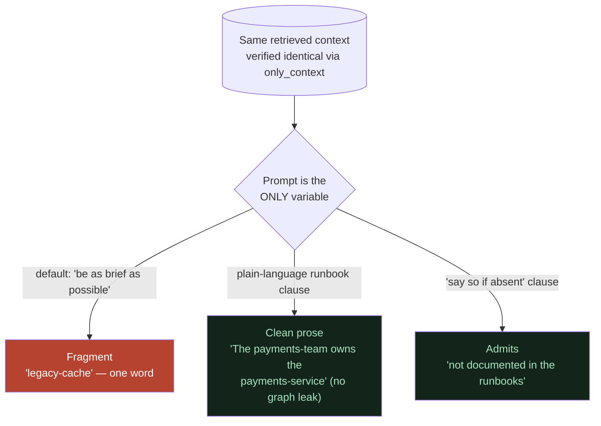

# The Triage Prompt and Prompt Leverage

**In one line:** One short system prompt — the `TRIAGE_PROMPT` — is the single highest-leverage knob in the whole project, because in this architecture the LLM *is* the combiner, so changing how it's told to behave changes every answer.

## ELI10

Imagine you have a very smart but very lazy friend. You hand him a stack of notes and ask "what should I check?" and he just mumbles one word: "cache." Technically correct. Totally useless.

Now imagine you give that same friend the SAME notes, but first you say:

> "You're an on-call engineer. Explain it like a runbook: say what to check and *why*, in full sentences. Don't read the notes out loud — just answer. And if the notes don't actually say, admit you don't know instead of making something up."

Same notes. Same friend. But now he gives a clear, useful, honest answer.

That little instruction you gave him *first* is the `TRIAGE_PROMPT`. We didn't change the notes (the retrieved context). We changed **who the friend is being** when he reads them.

## The key idea: retrieval vs. prompt

These are two completely different knobs, and confusing them wastes days:

> **Retrieval changes what the model KNOWS. The prompt changes who the model IS.**

- **Retrieval** (vector search + graph traversal) decides *which facts* land in front of the LLM. If a fact was never fetched, no prompt on Earth can make the model say it (truthfully).
- **The prompt** decides *what the model does* with the facts it got: full sentences vs. fragments, plain prose vs. raw graph syntax, honest "not documented" vs. confident invention.

In this project, retrieval was **already rich** — we proved it with `only_context=True`, which returns the assembled context without running the answer LLM. The context always contained the right nodes, edges, and chunks. The problem was never *what the model knew*. It was *who the model was being*. That's why a prompt fix, not a retrieval fix, solved everything.

This works because of the architecture: cognee's `GRAPH_COMPLETION` does **no numeric fusion**. It embeds the question, pulls the nearest chunks from LanceDB and the connected nodes/edges from Kùzu, serializes *both to plain text*, concatenates them, and hands the whole thing to the LLM with a prompt. **The LLM is the combiner.** So the prompt isn't a cosmetic wrapper — it's the control surface for the one component that actually writes the answer.

## The full TRIAGE_PROMPT (verbatim from `incident_brain.py`)

```python
TRIAGE_PROMPT = (
    "You are an on-call incident-triage assistant. Using ONLY the provided context, answer the engineer in "
    "plain prose like a runbook: say what to check and why, naming the specific systems or actions, in a few "
    "concise sentences. Write only the answer — do not describe, quote, or point to the underlying data (no "
    "nodes, edges, relationships, tags, chunks, documents, or identifiers). If the context does not actually "
    "contain the specific information asked for, say plainly that it is not documented in the runbooks; do "
    "not substitute related facts or invent steps. Never answer with only a name or a fragment."
)
```

It's passed straight into cognee's search call:

```python
r = await cognee.search(query_text=query, query_type=SearchType.GRAPH_COMPLETION, system_prompt=TRIAGE_PROMPT)
```

This **replaces** cognee's default `GRAPH_COMPLETION` prompt, which is literally `answer_simple_question.txt`: *"Answer the question using the provided context. Be as brief as possible."* That "be as brief as possible" is the entire root cause of the original bug — under-specified questions collapsed to a single word.

## Clause-by-clause: what each part is doing

Every sentence in the prompt is earning its place. Here's the breakdown:

| Clause | Purpose |
| --- | --- |
| **"You are an on-call incident-triage assistant."** | Sets the *persona*. The model writes like a runbook, not like a chatbot. This is the "who it IS" lever. |
| **"Using ONLY the provided context..."** | Anchors the answer to retrieved facts. It nudges toward faithfulness (it doesn't *guarantee* it — see the ceiling below — but it pushes hard). |
| **"...answer the engineer in plain prose like a runbook: say what to check and why, naming the specific systems or actions, in a few concise sentences."** | Defines the *shape* of a good answer: full sentences, names the systems, gives the *why*, stays concise. This directly counters the "be as brief as possible" default that caused fragments. |
| **"Write only the answer — do not describe, quote, or point to the underlying data (no nodes, edges, relationships, tags, chunks, documents, or identifiers)."** | Stops the model from leaking graph internals. Before this clause, "Who owns the payments-service?" would spit raw triple syntax like `payments-team --[owns]---> payments-service`. This clause makes it say "The payments-team owns the payments-service." |
| **"If the context does not actually contain the specific information asked for, say plainly that it is not documented in the runbooks; do not substitute related facts or invent steps."** | **This is the clause that protects the forget hero.** After we forget legacy-cache, asking "What is the legacy-cache?" must return "not documented in the runbooks" — NOT a hallucinated description. Drop this clause and the demo's whole thesis (it forgot, and it *knows* it forgot) falls apart. |
| **"Never answer with only a name or a fragment."** | A direct backstop against the original fragment bug — even if everything else fails, no bare-word answers. |

## The three controlled experiments

We ran three experiments where **retrieval was held constant** (the assembled context, verified via `only_context`, was identical) and **the prompt was the ONLY variable**. This is the proof that the prompt is the high-leverage knob — because the LLM is the combiner, swapping its instructions swaps the answer while the facts stay put.



### Experiment 1 — terse → fluent

- **Question:** "If auth-service latency is high, what should I check?"
- **Default prompt ("be as brief as possible"):** returned a bare fragment like `legacy-cache` — a single word, useless on-call.
- **TRIAGE_PROMPT:** *"To troubleshoot high auth-service latency, check the legacy-cache by flushing and resizing the legacy-cache cluster to recover, as it sits in front of the auth-service session reads."*
- **Conclusion:** Same facts retrieved both times. The prompt alone turned a fragment into an actionable runbook answer.

### Experiment 2 — leak → clean

- **Question:** "Who owns the payments-service?"
- **Before the "no internals" clause:** leaked raw graph syntax, e.g. `payments-team --[owns]---> payments-service`.
- **After:** *"The payments-team owns the payments-service."*
- **Conclusion:** The retrieved triple was identical; the prompt decided whether the user saw machine syntax or plain English.

### Experiment 3 — invents → admits

- **Question (after forgetting legacy-cache):** "What is the legacy-cache?"
- **Without the "say so plainly" clause:** the model tends to *invent* a description to fill the gap (confabulation).
- **With it:** *"The legacy-cache is not documented in the runbooks, so its description and dependencies are unknown."*
- **Conclusion:** The clause converts an invented answer into an honest one — which is exactly what makes the forget hero *demonstrable* rather than just claimed.

Together these three show the prompt moving along three different axes — fluency, cleanliness, honesty — all while the retrieval stayed fixed. That's a clean, repeatable demonstration of prompt leverage.

## The leverage CEILING — what the prompt CANNOT do

This is the honest part, and it matters as much as the wins. Prompt leverage is powerful but **bounded**. We hit the ceiling and correctly *stopped tuning*.

1. **A prompt cannot conjure a fact retrieval never fetched.** If vector top-k didn't pull the relevant chunk, the model has no honest way to produce it. The prompt governs *behavior over the retrieved set*, not the set itself. To add a missing fact you must fix *retrieval* (or the corpus), not the prompt.

2. **A prompt cannot FULLY kill hallucination.** The retrieved context is **influence, not law** — it shapes the answer but doesn't hard-constrain it. The model can still confabulate (invent to fill gaps — common) or, rarely, flatly contradict clear context. The "use ONLY the context / say it's not documented" clauses *reduce* this a lot but cannot reduce it to zero, because the model still has its own parametric knowledge to reach into.

3. **The specific residual we documented:** off-corpus questions about a *facet* of a system that *does* have a runbook (e.g. "what's the deploy process for search-index?") can be over-confident — the model points at the search-index runbook instead of admitting that *that specific sub-question* isn't answered there. This is an LLM inference limit (it can't reliably tell "I have a doc about X" apart from "this doc answers this exact sub-question"). It is **not prompt-fixable**, it's documented as a known residual, and the demo is hero-driven so it doesn't depend on this edge case.

Recognizing the ceiling is itself a result: we stopped throwing prompt revisions at a problem the prompt structurally can't solve, instead of looping forever.

## A connected, hard-won lesson: don't substring-score answers

A trap we fell into: trying to *measure* answer quality with a string check (e.g. "does the answer contain a period / more than one word?"). That's the same lazy mistake the model itself makes when it answers with a fragment — judging strings by their shape instead of their meaning. The only reliable check was **reading the actual answer strings** with human eyes, through the real HTTP routes. A grep-based "is it fluent yet" gate gives false passes.

## Why it matters (demo / judging)

- **It's the cleanest evidence in the project that you understand the architecture.** "The LLM is the combiner, so the prompt is the control surface" is a precise, true, non-obvious claim — and we can show three controlled experiments backing it.
- **The honesty clause is what makes the forget hero *provable*.** Without it, "it forgot" is just a clean graph; with it, the system actually *says* it forgot. Demo-critical.
- **Stating the ceiling builds trust.** Claiming "perfect, no hallucination" would be an overclaim a sharp judge would catch in 30 seconds. Saying "the prompt is high-leverage but bounded, here's exactly where it stops" is far stronger.

## Related

- [the-whole-stack.md](the-whole-stack.md) — where `TRIAGE_PROMPT` lives and how `ask()` uses it
- [determinism-and-the-golden-snapshot.md](determinism-and-the-golden-snapshot.md) — why the build (not the prompt) was the red herring for answer quality
- [../02-cognee-deep-dive/](../02-cognee-deep-dive/) — how `GRAPH_COMPLETION` assembles context with no numeric fusion
- [../05-the-research-story/](../05-the-research-story/) — the full saga of finding and fixing the fragment bug
