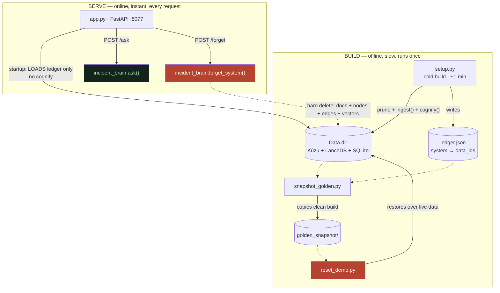

# The Whole Stack — Every File and How It Fits

**In one line:** Incident Detective is a handful of small Python files split into a slow "build the brain" step and an instant "serve the brain" step, with a snapshot for resetting the demo.

## ELI10

Imagine you have a giant LEGO castle. Building it takes an hour. But once it's built, *showing* it to a friend takes one second — you just open the door.

This project works the same way:

- **Building the brain** (reading all the runbooks, turning them into a knowledge graph) is the slow LEGO-building part. We do that ONCE, ahead of time.
- **Answering questions** is the fast "open the door" part. When you ask a question, the castle is already built — it just answers.

And because demos can get messy (someone forgets a system, the brain changes), we keep a **photo of the perfect castle** so we can put it back exactly how it was in one second. That photo is the "golden snapshot".

## The real mechanics

This is a small, deliberate codebase. Every file has one job. Here's the whole map.

### `incident_brain.py` — the core library

This is the heart. Everything else imports from it. It contains:

1. **The WIKI** — the 18 demo incident docs (api-gateway, auth-service, payments-service, legacy-cache runbook, legacy-cache post-mortem, search-index, ownership doc) as plain prose strings. No schema, no tags — just text the way a real on-call engineer would write it.
2. **`ingest()`** — calls `cognee.add(text)` for each doc, then `cognee.cognify()` ONCE to run the single LLM extraction pass that builds the knowledge graph. It returns a **ledger** mapping each system name to the `data_id`s of its documents.
3. **`ask(query)`** — calls `cognee.search(...)` with `SearchType.GRAPH_COMPLETION` and our `system_prompt=TRIAGE_PROMPT`, then returns a clean answer *string* (it digs the `search_result` out of cognee's result object so the caller gets prose, not a Python dump).
4. **`forget_system(name, ledger)`** — looks up that system's `data_id`s in the ledger and calls `cognee.forget(data_id=uid, dataset="main_dataset")` for each one — a HARD delete (raw file + graph nodes/edges + vector embeddings all gone).
5. **`load_ledger()`** — reads `ledger.json` back from disk so the server knows which `data_id`s belong to which system.
6. **`TRIAGE_PROMPT`** — the system prompt that turns terse fragments into real runbook answers. (Full breakdown in [the-triage-prompt-and-prompt-leverage.md](the-triage-prompt-and-prompt-leverage.md).)

#### The one line that everyone forgets: `CACHING=false` *before* importing cognee

At the very top of `incident_brain.py`, **before** `import cognee`, there is:

```python
os.environ["CACHING"] = "false"  # so a post-forget re-query reflects the change live (no stale cache)
```

This is load-bearing and order-sensitive. Here is why:

- cognee can cache the answer to a query. If caching is on, you ask "If auth-service latency is high, what should I check?", get an answer that mentions **legacy-cache**, then *forget* legacy-cache, then ask the SAME question again — and cognee hands you the **cached** answer that *still mentions legacy-cache*. The demo would look broken even though the forget worked perfectly.
- Setting `CACHING=false` forces every query to re-run against the live graph, so the forget shows up immediately.
- It MUST be set before `import cognee`, because cognee reads that environment variable at import time. Set it after, and it's too late — the setting is ignored.

This is exactly the kind of bug that's invisible until a live demo, so it's pinned as a hard rule in the project.

### `setup.py` — the COLD build (slow, ~1 minute)

This is the "build the LEGO castle" script. It:

1. Prunes any old data (`cognee.prune.prune_data()` + `cognee.prune.prune_system(metadata=True)`) so you start clean.
2. Runs `ingest()` — adds all 18 docs and runs the single `cognify()` extraction pass.
3. Writes `ledger.json` to disk.

It takes about a minute because `cognify()` makes a real LLM call to extract entities and relationships from the prose. You run this ONCE, or whenever the corpus actually changes. **You do not run this to reset a demo** — that's what the snapshot is for (see below).

### `app.py` — the FastAPI web server on port 8077

This is the "open the castle door" script. The critical design choice: **startup only LOADS `ledger.json` — it does NOT build anything.** No `cognify()` runs at serve time. So the server starts instantly and is ready to answer immediately, because the graph was already built by `setup.py` and persisted to disk.

Routes:

- **`POST /ask`** — takes a question, calls `incident_brain.ask(query)`, returns the synthesized triage answer string.
- **`POST /forget`** — takes a system name, calls `incident_brain.forget_system(name, ledger)`, hard-deletes that system's docs from the corpus. This is the hero beat made clickable.
- **`GET /health`** — a simple liveness check (used to confirm the server is up before a demo).
- **`GET /`** — serves a single-file dark-themed HTML chat page (the demo UI).

### `snapshot_golden.py` + `reset_demo.py` — the demo reset pair

- **`snapshot_golden.py`** copies a freshly-built clean graph into `golden_snapshot/`. Run it **with the server stopped** so nothing is mid-write.
- **`reset_demo.py`** restores `golden_snapshot/` over the live data directory. This is how you reset the demo: instant, zero LLM quota, fully deterministic.

You reset with `reset_demo.py`, **never** by re-running `setup.py`. Re-running setup burns LLM quota and takes a minute; restoring the snapshot takes a second and gives you a byte-identical clean brain every time. (Full reasoning in [determinism-and-the-golden-snapshot.md](determinism-and-the-golden-snapshot.md).)

### `ledger.json` — the system → documents map

A small JSON file written during ingest. It maps each system name to the list of `data_id`s for its documents, e.g. conceptually:

```
{
  "legacy-cache": ["<uuid-of-runbook>", "<uuid-of-postmortem>"],
  "auth-service": ["<uuid>"],
  ...
}
```

This is what makes `forget` precise. To decommission `legacy-cache`, we look it up in the ledger, find its two `data_id`s, and forget exactly those — no guessing, no name-matching against graph nodes. (Verified: the data dir went from 18 docs to 16 after forgetting legacy-cache's 2 docs.)

### `golden_snapshot/` — the frozen clean brain

A copy of the data directory captured right after a clean build: the Kùzu graph, the LanceDB vectors, the SQLite relational store, and `ledger.json`. `reset_demo.py` restores this. Because the build doesn't affect answer quality (see [determinism-and-the-golden-snapshot.md](determinism-and-the-golden-snapshot.md)), any clean build makes a perfectly good golden.

## The build/serve split — and why it's the right architecture

This is the single most important structural decision in the project:

> **Ingest happens ONLY in `setup.py` (offline, ahead of time). It NEVER happens at serve time.**

Here's the whole file map as two phases — a slow offline BUILD and an instant online SERVE:



Three reasons:

1. **Speed.** `cognify()` takes ~1 minute. If the server ran it at startup or on first query, the demo would hang for a minute. Instead, the server loads a prebuilt graph and is instant.
2. **Reliability.** Running `cognify()` inside a uvicorn worker is fragile (long-running async LLM work inside a web request). Doing the heavy build offline and only *reading* it at serve time keeps the server simple and predictable.
3. **Cost / quota.** `cognify()` is the only step that burns LLM quota for the build. Doing it once offline — and resetting via snapshot instead of rebuilding — means dozens of demo runs cost zero build quota. (Embeddings are local fastembed and free, so they were never the concern; the LLM extraction call is.)

The data directory lives at `/Users/vinayak/.cognee-incident-detective/` (a no-space path on purpose, since spaces in paths trip up some tooling). The three stores inside it — Kùzu (graph), LanceDB (vectors), SQLite (relational metadata) — are the persisted brain that `app.py` loads and `golden_snapshot/` freezes.

## Why it matters (demo / judging)

- **It demonstrates production thinking, not just a notebook.** Separating an expensive offline build from a cheap online serve is exactly how real RAG/graph systems ship. A judge sees that this isn't a one-off script.
- **The instant-start server makes the demo bulletproof.** No waiting, no "let it think" pauses. Ask → answer.
- **The forget hero is wired all the way through** — from `ledger.json` → `forget_system()` → the `/forget` route → a button in the UI — so it's not a buried function, it's a live, clickable capability.
- **`CACHING=false` is the difference between the hero beat working and looking broken on stage.** Knowing *why* it's there (and why it must be set before import) is the kind of detail that separates "I wired up a library" from "I understand the system".

## Related

- [the-triage-prompt-and-prompt-leverage.md](the-triage-prompt-and-prompt-leverage.md) — the prompt inside `ask()` that turns fragments into real answers
- [determinism-and-the-golden-snapshot.md](determinism-and-the-golden-snapshot.md) — why we reset with a snapshot instead of rebuilding
- [../02-cognee-deep-dive/](../02-cognee-deep-dive/) — what `add`, `cognify`, `search`, and `forget` actually do inside cognee
- [../01-how-it-works/](../01-how-it-works/) — the end-to-end flow from question to answer
