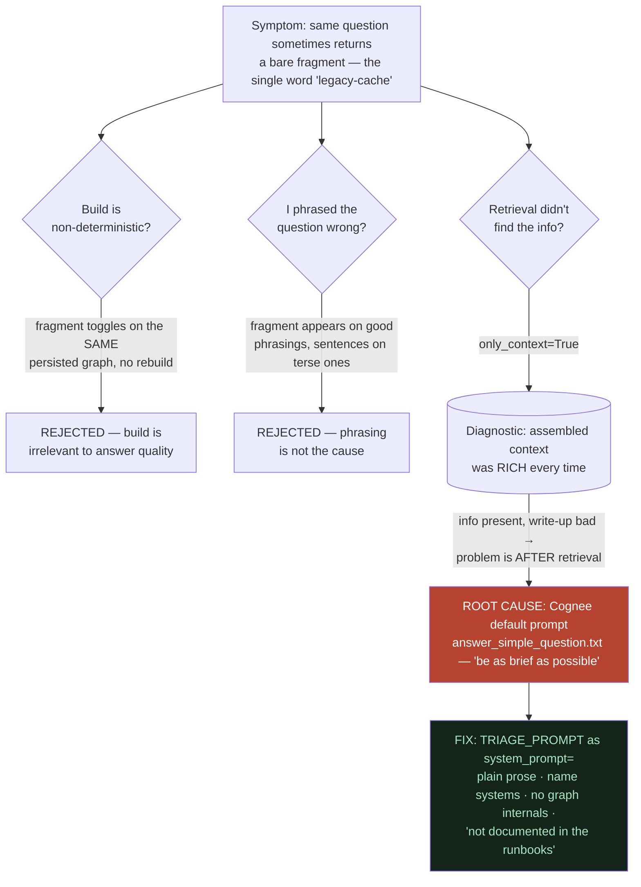

# The Debugging Saga — and the Lessons It Taught

**In one line:** The demo's worst bug looked like a broken *build* or a bad *question*, but the real culprit was Cognee's default "be as brief as possible" prompt — and chasing it taught us to read the real strings, test the real path, verify structure *and* behavior, and know when to stop tuning.

---

## ELI10: the case of the one-word answer

Imagine you ask your robot helper a clear question — "If the auth system is slow, what should I check?" — and most of the time it gives a good sentence. But *sometimes*, for the very same question, it just blurts one word: **"legacy-cache."** No sentence. No advice. Just a word.

That's spooky. So you become a detective. The obvious suspects are:

- "Maybe the robot's *memory* got built wrong this time." (the build)
- "Maybe I asked the question slightly differently." (the phrasing)
- "Maybe it didn't *find* the right info." (the retrieval)

You investigate each suspect. And the twist — like the best detective stories — is that **none of the obvious suspects did it**. The real culprit was a tiny instruction hiding in the tool's settings that said *"answer as briefly as possible."* When the question was a little under-specified, "as briefly as possible" meant... one word. Mystery solved by interrogating the *quiet* suspect everyone ignored.

The rest of this file is the real detective work, with real evidence, and the lessons we walked away with.

---

## The crime scene: the fragment bug

**Symptom:** the same demo question — "If auth-service latency is high, what should I check?" — sometimes returned a full runbook-style sentence and sometimes returned a bare fragment like the single word `legacy-cache`. Intermittent. Maddening. And it landed on the *exact* question that anchors the hero demo.

A bare word on stage would be fatal. We had to find the true cause, not a cause that happened to make it go away once.

The whole hunt, in one picture — symptom, the three suspects we cleared, the diagnostic that broke the case, and the real culprit plus its fix:

---

## Suspect 1: "the build is non-deterministic" (RED HERRING)

First instinct: maybe `cognee.cognify()` builds a slightly different graph each run, so some builds answer well and some don't.

This felt plausible because `cognify()` runs an LLM extraction pass, and LLMs can vary. We briefly believed the build was the problem.

**Why we cleared it:** the fragment appeared and disappeared on the *same* persisted graph, across repeated queries, without rebuilding. If the build were the cause, a fixed graph would give a fixed answer. It didn't. The build is **irrelevant to answer quality** — a finding that later paid off twice (it justified using a snapshot/restore for demo reset, since *any* clean build is a fine golden snapshot).

Lesson seed: *a cause that's upstream and expensive to test is seductive; rule it out with a cheap controlled observation before you reorganize your whole pipeline around it.*

---

## Suspect 2: "I phrased the question wrong" (RED HERRING)

Second instinct: maybe under-specified phrasing confuses retrieval.

We varied phrasings. The fragment still showed up on perfectly reasonable phrasings, and good sentences showed up on terse ones. Phrasing correlated loosely with terseness but didn't *cause* the broken output. Not our culprit.

---

## Suspect 3: "retrieval didn't find the info" (CLEARED by the key diagnostic)

This is where the case broke open, thanks to **`only_context=True`**.

`only_context=True` makes Cognee return the **assembled retrieval context without running the answer LLM**. It's cheap (embeddings are local fastembed, effectively free) and it shows you *exactly* what the model was handed. The captured format is real and inspectable:

- nodes render as `Node: <name> ... __node_content_start__ <original text> __node_content_end__`
- relationships render as triples like `payments-team --[owns]---> payments-service`
- tag lists appear like `[team, ownership, api-gateway]`

When the answer was a useless one-word fragment, we ran the *same* question with `only_context=True` and saw the context was **rich** — full node contents about auth-service, legacy-cache, the session store, real relationship triples. The retrieval was doing its job *every time*, including the times the final answer was garbage.

**That's the smoking gun by elimination:** the information was present and well-retrieved, but the final text was terrible. The problem lives *after* retrieval — in the step that turns context into an answer. That step is the **completion LLM and its prompt**.

> Why this diagnostic matters so much: in a hybrid graph+vector system, "the answer is bad" has at least two very different causes — *didn't fetch the right stuff* vs *fetched it but wrote it up badly*. `only_context` cleanly separates them. Without it we'd have kept blaming retrieval and the build forever.

---

## The real culprit: the default "be brief" prompt

Cognee's default completion prompt is `answer_simple_question.txt`, which says, almost literally:

> "Answer the question using the provided context. **Be as brief as possible.**"

On a fully-specified question, "as brief as possible" produces a tidy sentence. On a slightly under-specified question — where the single most salient retrieved node is `legacy-cache` — "as brief as possible" collapses to the **single most salient token**: `legacy-cache`. The model was *obeying its instructions*. The bug wasn't randomness; it was a prompt doing exactly what it said on under-specified input.

**The fix:** `TRIAGE_PROMPT`, passed as `system_prompt=` into `cognee.search()` inside `incident_brain.ask()`. It instructs the model to:

- answer in **plain prose like a runbook**,
- **name the specific systems and actions**,
- be concise (but not telegraphic),
- **never expose graph internals** (no nodes/edges/tags), and
- if the context lacks the specific answer, say it's **"not documented in the runbooks"** (this both curbs hallucination and *preserves the forget hero* — a forgotten system should read as "not documented," not get confabulated back).

---

## The three controlled experiments

Once we suspected the prompt, we didn't just swap it and declare victory. We ran a clean experiment: **hold retrieval constant, make the prompt the only variable**, and watch the answer move. Three times, three different failure modes fixed:

1. **Terse → fluent.** Default prompt: bare `legacy-cache`. `TRIAGE_PROMPT`: a full runbook sentence naming the system and the action. Same retrieved context both times.

2. **Leaked internals → clean language.** "Who owns the payments-service?" used to spit raw graph syntax like `--[owns]-->` straight into the user's face. After `TRIAGE_PROMPT`: "The payments-team owns the payments-service." Same context; only the prompt changed.

3. **Invents → admits.** For things not in the corpus, the default could confabulate. `TRIAGE_PROMPT` shifts it toward "not documented in the runbooks," e.g. after forget: "The legacy-cache is not documented in the runbooks, so its description and dependencies are unknown." Same context; only the prompt changed.

**Conclusion the experiments earn:** the prompt is the **high-leverage knob** *specifically because the LLM is the combiner* — in `GRAPH_COMPLETION` there is no numeric fusion; vectors find relevant chunks, the graph adds connected nodes, both get serialized to plain text and concatenated, and the **LLM writes the single answer**. When the combiner is a language model, the instruction you give the combiner is the most powerful lever you have.

---

## Proving forget two ways (and why one way isn't enough)

A parallel investigation: when we forget legacy-cache, is it *really* gone, or does it just *look* gone?

The trap here is subtle. Retrieved context is **influence, not law** — the model can (a) confabulate to fill gaps, or (b), rarely, flatly contradict clear context. And critically, `forget` removes data from the **corpus**, not from the model's **training knowledge**. So a clean graph alone does **not** prove the assistant forgot — the model could still answer from priors.

So we proved it on **both** layers:

- **Structural proof:** `only_context=True` across **5 phrasings** → **0 legacy-cache residue**. The data is gone from graph + vectors (and the raw `.txt` files are gone from disk; file count dropped 7 → 5).
- **Behavioral proof:** through the **real HTTP route**, the AFTER question 12×, name-lookups 10×+, adversarial phrasings — legacy-cache **never resurfaced**.

Either proof alone is incomplete: structure-only can't rule out the model reaching into priors; behavior-only can't rule out a lucky-looking surface over a dirty store. Together they're convincing.

---

## The traps we stepped in (so you don't have to)

### The substring trap

At one point we tried to *automate* "is the answer good?" by scoring whether the output *contained* certain substrings (e.g. "is it fluent?", "does it mention the right system?"). This is the same mistake as the original bug in disguise: a grep gate doesn't read meaning. A fluent-looking wrong answer passes; a correct answer phrased unexpectedly fails. **We threw out substring scoring and read the actual strings.** Every answer quote in this folder was read by a human, not matched by a regex.

### The rebuild-loop trap

Tempted by automation again, we briefly ran an auto "rebuild → ask → is it good yet? → rebuild" loop. Two problems: (1) it burns LLM quota on every cognify, and (2) on a throttled backend it once **hung ~20 minutes** waiting on a rate-limited call. And it was chasing the wrong variable anyway — the *build* never affected answer quality. **Never gamble on rebuild loops.** The fix lived in the prompt, not in another build.

### The "forgot to reset golden" trap

A single `forget` **mutates the persisted graph**. If you run the forget demo and then start another test run without restoring, you're now testing against a corpus that's *already* missing legacy-cache — and your "before" state is silently wrong. So: **always reset golden before a demo or test run.** We use `reset_demo.py` to restore `golden_snapshot/` — instant, zero quota, deterministic — instead of re-running `setup.py`. (This is *also* why "the build doesn't affect answer quality" was such a useful finding: it means snapshot/restore is a legitimate reset, not a shortcut.)

### The caching trap (designed-around, not stumbled-into)

`incident_brain.py` sets `os.environ` `CACHING=false` **before importing cognee**. Without it, a post-forget query could return a *cached* pre-forget answer and make forget look broken when it actually worked. We headed this off by design so the hero beat can't be masked by a stale cache.

---

## The transferable lessons

1. **Read the real strings.** Don't substring-score answer quality, and don't trust a glance. The original bug *was* a "looks fine-ish at a glance" failure; a regex "is it fluent" gate is the same trap automated. Humans read the output.

2. **Test through the real path.** Bugs and fixes were confirmed through the actual HTTP routes (`/ask`, `/forget`), not just by calling functions in a notebook. The thing you ship is the thing you must test.

3. **Separate "didn't fetch" from "fetched but wrote it up badly."** `only_context=True` was the single most valuable diagnostic. In any retrieval+LLM system, get a way to inspect the *assembled context* independently of the final answer — it collapses your suspect list instantly.

4. **Verify both structure and behavior.** Because context is influence (not law) and forget doesn't touch the model's priors, a clean store *and* clean behavior across many phrasings together are what prove a claim. One without the other leaves a hole.

5. **Find the high-leverage knob — it's usually the combiner's instruction.** When an LLM is the thing assembling the final answer (no numeric fusion), the prompt is the most powerful lever. We changed *one* prompt and fixed terseness, leaked internals, and confabulation.

6. **Know when to stop tuning.** Prompt leverage has a **ceiling**: it can't conjure a fact retrieval never fetched (vector top-k limit), and it can't fully kill hallucination (the off-corpus over-confidence on a *facet* of a documented system). We hit that ceiling, recognized it as an *inference* limit not a *prompt* limit, documented it honestly, and **stopped** — instead of burning hours and quota tuning against a wall.

7. **Rule out expensive upstream suspects cheaply.** The "non-deterministic build" theory would have reorganized the whole pipeline. A cheap controlled observation (same graph, varying answers) killed it in minutes and freed us to look downstream where the real culprit hid.

---

## Why it matters (demo / judging)

This saga is the spine of the blog and a credibility multiplier in front of judges. It shows we didn't just get a green demo — we **understood our system well enough to find a non-obvious root cause**, prove fixes with controlled experiments, and resist three different automation traps that would have wasted quota and produced false confidence. A judge who hears "the bug looked like the build, looked like the question, but was actually the default prompt — and here's the `only_context` evidence and the three-experiment proof" is hearing an engineer who can be trusted, not a feature list. And the honest ceiling ("we stopped tuning here, on purpose, because it's an inference limit") is exactly the kind of restraint that separates a real project from a demo-ware shell.

---

## Related

- [What we tested and killed](./what-we-tested-and-killed.md) — the bake-off where three of four Cognee differentiators tied with plain RAG and only forget held; the honesty that pairs with this debugging story.
- [../01-how-it-works/05-retrieval-graph-completion.md](../01-how-it-works/05-retrieval-graph-completion.md) — the "no numeric fusion, the LLM is the combiner" mechanic that makes the prompt the high-leverage knob.
- [../03-the-tech-stack/the-triage-prompt-and-prompt-leverage.md](../03-the-tech-stack/the-triage-prompt-and-prompt-leverage.md) — the exact `TRIAGE_PROMPT` that fixed terseness, internal-leaks, and confabulation.
- [../01-how-it-works/07-the-forget-hero.md](../01-how-it-works/07-the-forget-hero.md) — the hard-delete mechanics behind the structural forget proof.
- [../01-how-it-works/07-the-forget-hero.md](../01-how-it-works/07-the-forget-hero.md) — context is influence, not law; the two failure modes that forced the structural-AND-behavioral proof.
- [../04-judge-and-learner-qa/honest-limits-what-we-dont-claim.md](../04-judge-and-learner-qa/honest-limits-what-we-dont-claim.md) — the over-confidence limit where we deliberately stopped tuning.
