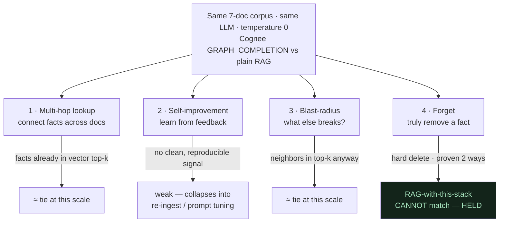

# What We Tested — and What We Killed

**In one line:** We put four Cognee "superpowers" on trial against plain RAG at temperature 0, and only one — **forget** — survived as a clean, demo-provable win, so we built the whole project around that one honest truth.

---

## ELI10: the science-fair version

Imagine you have a fancy new robot helper and a plain old robot helper. Everyone says the fancy one is smarter. Before you brag about it, you should actually race them.

So you set up four little races:

1. **"Connect the dots"** race — can it answer a question that needs two facts joined together?
2. **"Learn from a thumbs-up"** race — if I tell it "good answer!" does it get better next time?
3. **"What else breaks?"** race — if one thing goes down, can it list everything connected to it?
4. **"Truly forget"** race — if I throw away a fact, is it *really* gone, or just hidden?

Here's the honest, grown-up thing almost nobody admits at a science fair: in three of the four races, the fancy robot and the plain robot basically **tied**. Only in the fourth race — *truly forget* — did the fancy robot clearly win.

A lazy kid would brag "my robot won everything!" A good scientist says "it won the one race that mattered, and here's exactly why the other three were ties." This whole document is us being the good scientist.

---

## Why we ran a bake-off at all

The easy hackathon move is to pick a tool, list its feature bullets, and claim every bullet as your project's superpower. That produces demos that fall apart the moment a judge asks "show me."

Our thesis pushed us the other way. The thesis is:

> Everyone builds AI that remembers **more**. The real on-call problem is AI that remembers the **wrong / stale** thing. The hard, rare capability is **forgetting**.

If forgetting is the headline, we had a duty to find out whether the *other* Cognee differentiators were also worth headlining — or whether they were filler. The only way to know was to test them, side by side, against the boring baseline (plain retrieval-augmented generation over the same docs), with everything else held constant.

**Test conditions (held constant across every experiment):**

- Same 7-document corpus in `incident_brain.WIKI` (plain prose, no schema, no tags).
- Same LLM: `openrouter/meta-llama/llama-3.3-70b-instruct`.
- **Temperature 0** — so differences come from *retrieval and structure*, not from the model rolling dice.
- Same retrieval entry: `SearchType.GRAPH_COMPLETION`, with `only_context=True` used to inspect what was actually fetched before the answer LLM ran.

The corpus, for reference (the systems the questions are about):

- `api-gateway` runbook — routes storefront traffic, rate limits, check upstream + recent deploys on 5xx.
- `auth-service` runbook — validates login tokens; required by `payments-service`; reads session state from the **primary session store**.
- `payments-service` runbook — charges customers; calls `auth-service` to validate each login token.
- `legacy-cache` runbook — memcached; "when auth-service latency is high, the first thing to check is the legacy-cache: flush and resize the cluster"; sits in front of `auth-service` session reads.
- `legacy-cache` post-mortem — an eviction storm caused a platform-wide login outage; flushed + resized to recover.
- `search-index` runbook — powers product search; independent of login and payments.
- ownership doc — core-platform owns api-gateway + auth-service; payments-team owns payments-service; discovery-team owns search-index.

`legacy-cache` (the 2 docs) is the system we decommission in the hero beat.

---

## The four contenders

The bake-off in one picture — four Cognee differentiators run against plain RAG over the same 7 docs at temperature 0. Three tied or fell at demo scale; only **forget** held:

### 1. Multi-hop / connect-the-dots lookup — **TIED at demo scale**

**The claim under test:** A knowledge graph should beat plain RAG on questions that need facts from *different documents* stitched together — e.g. "what's in the auth-service read path?" pulls from the auth-service runbook (reads session state from the primary session store) *and* the legacy-cache runbook (sits in front of auth-service session reads).

**What actually happened:** At this corpus size, plain RAG already wins these. Here's the uncomfortable mechanical reason: with only 7 short docs, the relevant chunks are *almost always already in the vector top-k*. When the two facts you need are sitting in the top few nearest chunks anyway, the LLM stitches them just fine from raw chunks — no graph traversal required. The graph fetched extra connected nodes, but for simple two-fact joins it didn't change the answer the model produced.

So: graph ≈ RAG here. **Tie.** We refuse to claim multi-hop as a headline differentiator at this scale.

**Where it would stop being a tie:** as the corpus grows, the needed facts stop reliably co-occurring in the vector top-k. That's exactly where graph traversal earns its keep — it reaches the connected node even when its chunk didn't rank. We have a principled reason to expect the graph's edge to *grow with scale*; we just don't have a 7-doc demo that *proves* it, so we don't claim it. (See [Related](#related): the graph-vs-RAG honesty note.)

### 2. Self-improvement from feedback ("learns / improves") — **WEAK; supporting leg only**

**The claim under test:** thumbs-up / thumbs-down or correction feedback makes future answers measurably better.

**What actually happened:** at temperature 0 over a fixed corpus, there was no clean, repeatable signal that a feedback loop changed answer quality in a way we could *demo on stage in 30 seconds*. The honest read: any "improvement" we could engineer was really us re-ingesting better text or tuning the prompt — i.e. it collapsed into "remember" or "prompt engineering," not a distinct learning superpower.

We kept "learns/improve" in the story as a **weak supporting leg**, explicitly labeled weak. We did **not** build a demo beat around it, because a beat we can't reliably reproduce on stage is a liability, not a feature.

### 3. Blast-radius / "what else breaks?" — **TIED (impressive, but not graph-exclusive)**

**The claim under test:** the graph lets you answer "if `auth-service` degrades, what else is affected?" by walking edges — `payments-service` (calls auth-service), `legacy-cache` (in front of auth reads), the primary session store, etc.

**What actually happened:** the graph *does* assemble a nice connected neighborhood, and `only_context=True` shows real relationship triples like `payments-team --[owns]---> payments-service`. It looks great. But again, at 7 docs, plain RAG over the same prose surfaces the same neighbors, because everything related to auth-service is lexically and semantically near "auth-service" and lands in the top-k anyway. The answers were comparable. **Tie at this scale.**

Blast-radius is the contender we *most wanted* to win, because it's visually compelling. We didn't let wanting it make it true.

### 4. Forget — **THE ONE CLEAN WIN. It held.**

**The claim under test:** Cognee can *truly remove* a fact — not hide it — so the assistant stops giving advice about a decommissioned system.

**What actually happened:** this is the only contender that produced a difference RAG-with-the-same-stack **cannot** match, and that we could prove two independent ways.

`incident_brain.forget_system(name, ledger)` looks up the system's document `data_id`s in `ledger.json` and calls `cognee.forget(data_id=uid, dataset="main_dataset")` for each — **without** `memory_only`. In Cognee's source that routes to `_forget_data_item` → `delete_data`, a **hard delete** that removes:

- the data record,
- the **raw `.txt` file on disk** (verified: file count in the data dir dropped 7 → 5 after forgetting legacy-cache's 2 docs),
- the derived **graph nodes/edges**, and
- the **vector embeddings**.

(Cognee *also* offers `forget(..., memory_only=True)`, which keeps the raw files and only drops graph + vectors. We deliberately do **not** use that — we use the full delete.)

**Proof, two layers** (because retrieved context is *influence*, not law — see [Related](#related)):

- **Structural:** `only_context=True` across **5 different phrasings** shows **0 legacy-cache residue** after forget. The data is genuinely gone from the corpus.
- **Behavioral:** the same questions, asked through the real HTTP route after forget, never resurface legacy-cache — across the AFTER question repeated 12×, name-lookups 10×+, and adversarial phrasings.

The headline contrast, captured verbatim at temperature 0:

> **Before forget**, "If auth-service latency is high, what should I check?":
> "To troubleshoot high auth-service latency, check the legacy-cache by flushing and resizing the legacy-cache cluster to recover, as it sits in front of the auth-service session reads."

> **After forget**, *same question*:
> "To troubleshoot high auth-service latency, check the primary session store, as the auth-service reads session state from it, and also verify the payments-service, which requires and calls the auth-service to validate login tokens."

> **After forget**, "What is the legacy-cache?":
> "The legacy-cache is not documented in the runbooks, so its description and dependencies are unknown."

That's the whole project in three quotes: the assistant *changes its advice* because the stale system is *gone*, and it *admits ignorance* about it instead of confabulating.

---

## The scoreboard

| Contender | Cognee vs plain RAG @ temp 0, 7 docs | Verdict | Role in the project |
|---|---|---|---|
| Multi-hop / connect-the-dots | ~tie (facts already in top-k) | Honest tie | Not headlined |
| Self-improvement from feedback | no clean, reproducible signal | Weak | Weak supporting leg, labeled weak |
| Blast-radius / what-else-breaks | ~tie (neighbors in top-k anyway) | Honest tie | Not headlined |
| **Forget** | **clean win; RAG can't match; proven 2 ways** | **Held** | **Hero beat** |

---

## The honest limit (we state it on purpose)

Forget removes data from the **corpus**, not from the model's **parametric / training knowledge**. So "the graph is clean" alone is *not* proof the system forgot — the model could still reach into priors. That's the entire reason we proved forget **both** structurally *and* behaviorally. We don't claim we erased the concept of caches from a 70B model's brain; we claim we erased *this team's legacy-cache documents* from *this assistant's memory*, and we showed it stopped advising on them. That distinction is the kind of thing that wins trust with a sharp judge.

A second residual limit: off-corpus questions about a *facet* of a system that *does* have a runbook (e.g. "what's the deploy process for `search-index`?") can be over-confident — the model points at the runbook instead of admitting that specific sub-step isn't written down. That's an LLM inference limit (telling "I have a doc about X" apart from "this doc answers *this* sub-question"), not something prompt-tuning fixes. We documented it and stopped tuning at that ceiling.

---

## Why it matters (demo / judging)

Three reasons this "we killed three of four claims" story is an **asset**, not a confession:

1. **It's the differentiation almost nobody else can show.** Most hackathon teams demo the *happy path* and hide the bake-off. Showing a fair, controlled comparison — and *conceding* the ties — signals you actually understand your tool instead of parroting its marketing. That's directly aligned with "Best Use of Cognee": we know precisely *which* Cognee capability is load-bearing and why.

2. **It explains our scope discipline.** We didn't sprawl across four half-working "superpowers." We found the one with a clean, reproducible, RAG-beating proof and built a tight hero demo around it. A focused demo that survives every "show me" beats a broad demo that crumbles on the first probe.

3. **It pre-empts the toughest judge question.** When a judge asks "doesn't plain RAG do this?", we already have the answer: "for multi-hop and blast-radius at this scale, basically yes — and we'll show you the tie. For *forget*, here's the thing RAG-with-this-stack can't do, proven structurally and behaviorally." Honesty under questioning reads as competence.

The build of the graph itself, by the way, is irrelevant to answer quality — that was a red herring we chased and abandoned (see the debugging saga). The high-leverage knobs turned out to be (a) *forget*, the structural win, and (b) the *prompt*, because the LLM is the combiner. Everything else was a tie we were honest about.

---

## Related

- [The debugging saga and lessons](./the-debugging-saga-and-lessons.md) — how we found the *real* root cause of the fragment bug, the `only_context` diagnostic, the controlled experiments, and the transferable lessons (read the real strings; test the real path; verify structure *and* behavior; know when to stop tuning).
- [../01-how-it-works/07-the-forget-hero.md](../01-how-it-works/07-the-forget-hero.md) — the mechanics of the hard delete that made forget our one clean win.
- [../01-how-it-works/05-retrieval-graph-completion.md](../01-how-it-works/05-retrieval-graph-completion.md) — why "the LLM is the combiner" and there is no numeric fusion, which is *why* graph ≈ RAG on simple lookups at small scale.
- [../01-how-it-works/07-the-forget-hero.md](../01-how-it-works/07-the-forget-hero.md) — context is influence, not law; the two failure modes (confabulation, contradiction) behind the structural-vs-behavioral proof.
