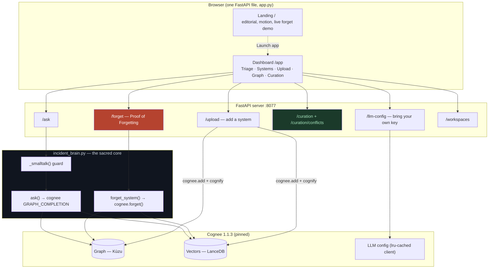
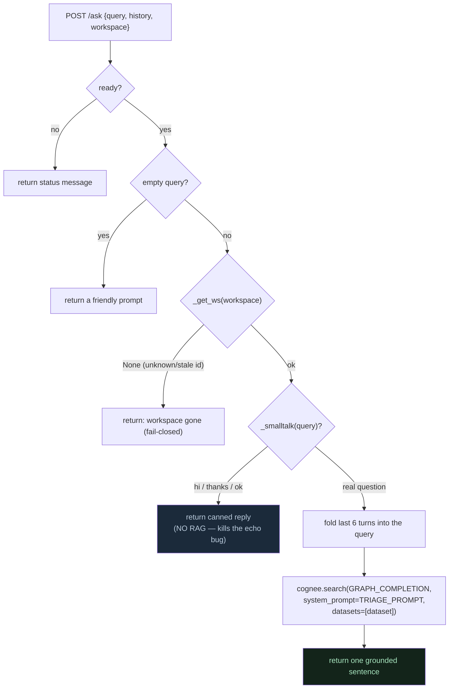
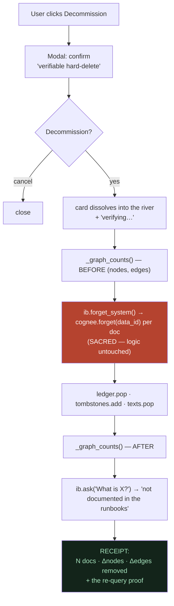
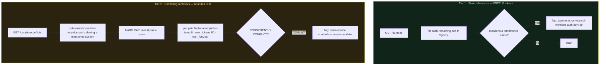
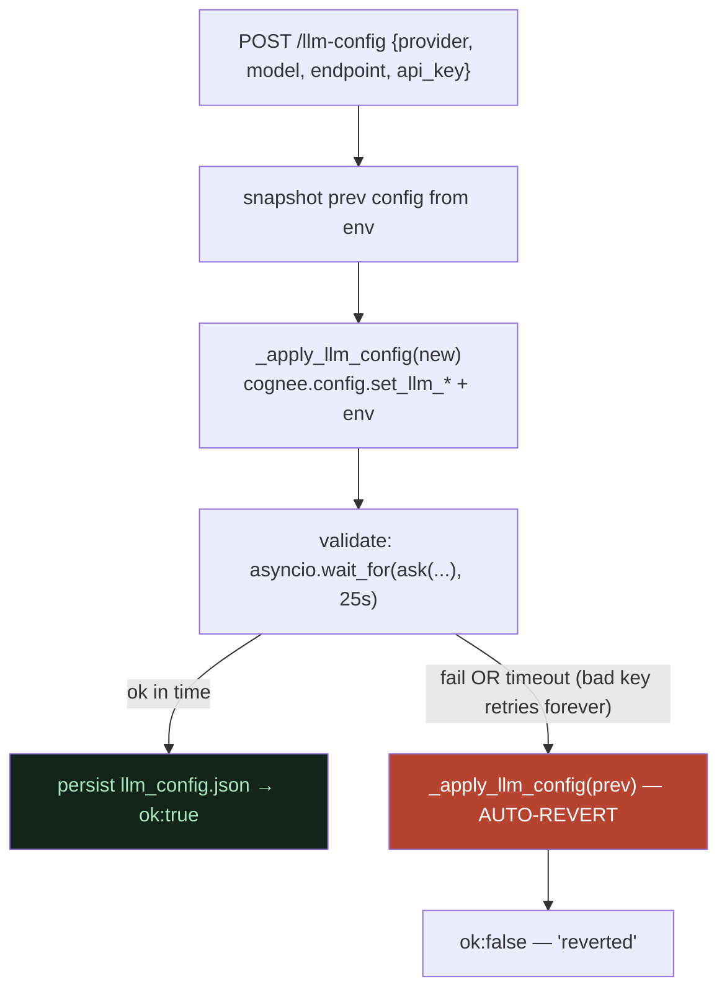
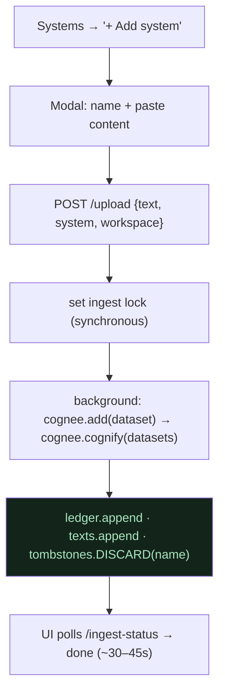
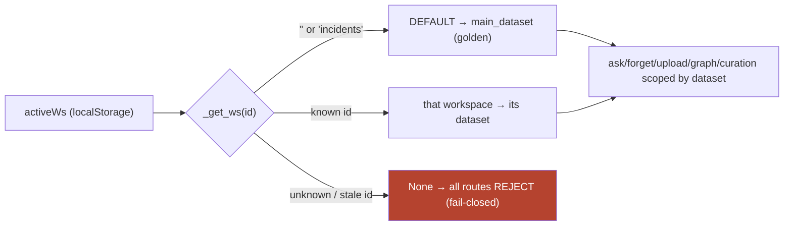
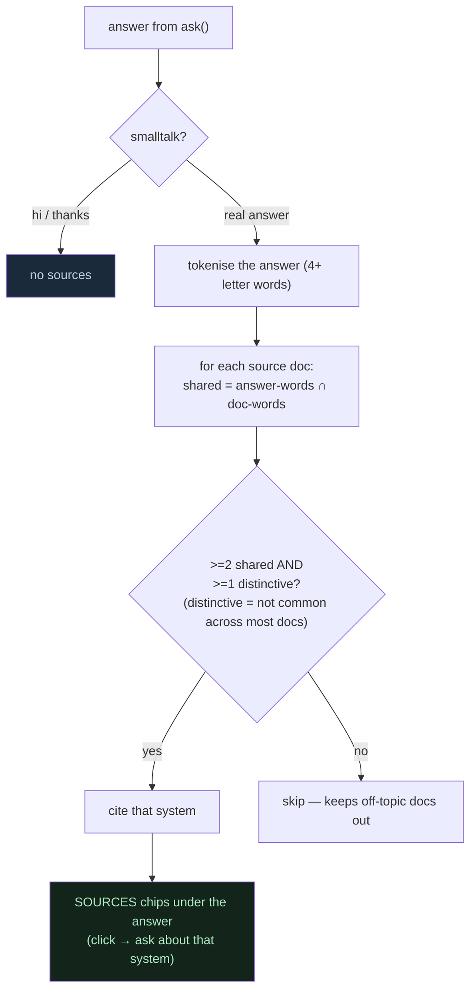
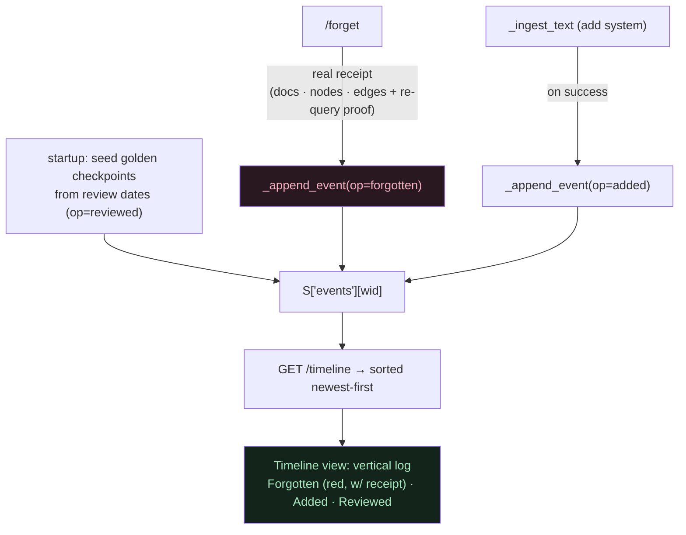

# 06 · The product now — everything built in the June 2026 build session

**In one line:** the original demo (ingest → ask → forget) grew into a real, self-hosted **product** — verifiable forgetting with a receipt, a proactive curation loop, bring-your-own-key, workspaces, chat threads, add/remove systems, and an editorial landing — all on top of the same Cognee core.

**Everyday analogy:** we started with a notebook that could *remember* and *cross out* a page. Now it's a filing cabinet that **proves** what it shredded, **flags** pages that have gone out of date, lets you **swap which pen (model) writes**, keeps **separate drawers** (workspaces) and **conversation tabs** (threads), and tells you exactly **which page an answer came from** (coming next).

> Read [01-how-it-works](01-how-it-works/00-overview-the-pipeline.md) first for the core pipeline. This file documents what was layered on top, with the real control flow for each feature.

---

## The whole product, at a glance

---

## The data model (what state lives where)

The app keeps a small amount of state. Cognee owns the heavy graph/vector data; `app.py` keeps lightweight bookkeeping so features like curation and workspaces work without re-querying the graph.

| Store | Where | Holds | Notes |
|---|---|---|---|
| `ledger.json` | disk (golden) | `{system: [data_id,…]}` for the **Incidents** workspace | the map Cognee needs to forget by id; restored by `reset_demo.py` |
| `ledger_<id>.json` | disk, gitignored | per-workspace ledgers | one per extra workspace |
| `workspaces.json` | disk, gitignored | `[{id,name,dataset}]` registry | each workspace = one Cognee dataset |
| `llm_config.json` | disk, gitignored | the user's BYO provider/model/endpoint/key | re-applied on startup; holds a secret → never committed |
| `golden_snapshot/` | disk | a clean prebuilt graph + ledger | `reset_demo.py` restores it instantly (no re-ingest, no quota) |
| `S["texts"]` | memory | `{ws: {system: [doc text,…]}}` | seeded from `ib.WIKI`; feeds curation **without any LLM call** |
| `S["tombstones"]` | memory | `{ws: {decommissioned names}}` | what curation scans *for*; updated on forget, cleared on re-add |
| `S["llm_default"]` | memory | the `.env` provider, captured at startup | so **Reset to default** can restore it |

> **Why a separate `S["texts"]` mirror?** Curation's staleness scan is *deterministic text matching* — it must read the raw doc text without touching the LLM or even the graph. Keeping a text mirror is what makes that scan cost **zero tokens**.

---

## The HTTP surface

| Method · Route | Purpose |
|---|---|
| `GET /` · `GET /app` | landing page · dashboard |
| `GET /health` | ready flag, systems, **active model badge** |
| `POST /ask` | triage answer (multi-turn, workspace-scoped) — non-stream; MCP + fallback path |
| `POST /ask-stream` | **streaming** triage answer (NDJSON, token-by-token) — what the web chat uses |
| `POST /forget` | decommission a system → **Proof of Forgetting receipt** |
| `POST /upload` · `GET /ingest-status` | ingest a doc (add a system) · poll progress |
| `GET /systems` · `GET /graph` | list systems · live knowledge graph |
| `GET /curation` | **staleness** scan (deterministic, 0 tokens) |
| `GET /curation/conflicts` | **conflict** scan (bounded LLM, capped) |
| `GET /curation/aging` | **aging** scan — overdue-for-review (deterministic, 0 tokens) |
| `POST /curation/review` | **mark reviewed** — refresh a runbook's review date + emit a timeline event (0 tokens) |
| `GET /timeline` | **memory timeline** — durable audit log of forget/add/review events (0 tokens) |
| `GET/POST /llm-config` · `POST /llm-config/reset` | bring-your-own-key |
| `GET/POST /workspaces` | list · create a workspace |

---

## Flow 1 — Ask (the everyday path)

The triage answer path, with the two guards that were added this session (smalltalk + workspace scoping).

**Why the smalltalk guard exists:** with multi-turn history folded into the retrieval query, a content-free message like `hi` used to make the model just re-summarise the previous answer (the "echo" bug a real user hit). `_smalltalk()` short-circuits pure greeting/thanks/filler **before** RAG. Real follow-ups (`who owns it?`) still fold history and resolve correctly.

---

## Flow 2 — Proof of Forgetting (the signature)

Decommissioning is no longer a silent delete — it produces a **verifiable receipt** with a measured graph diff and a live re-query proof.

**Real numbers (legacy-cache):** 2 documents, **10 graph nodes + 18 relationships** removed, and the re-query returns *"It is not documented in the runbooks…"*. Those counts are measured before→after, not hardcoded. No competitor surfaces measured proof of deletion.

---

## Flow 3 — The Curation loop (proactive memory hygiene)

The unique wedge: forgetting goes from **reactive** (you click) to **proactive** (Lethe tells you what's rotting). Built in two tiers, **cheapest first**.

**The guardrail philosophy (the user's principle, made literal):** Tier 1 proves the loop delivers value before spending a single token. Tier 2 only reaches for the LLM after a *deterministic pre-filter* narrows the work, then a *hard cap* bounds it, and each call is *time-bounded*. The UI prints the cost on each card: **"Free · 0 tokens"** vs **"Uses your model · capped at 8 checks."**

**Verified:** clean data → 0 conflicts (no false positives on the tricky legacy-cache/session-store pair); a seeded contradiction → 1 conflict, correctly explained.

**Tier 3 · Aging knowledge (deterministic, 0 tokens):** a third scan flags runbooks **not reviewed in over N days** (default 180) as likely stale *by age* — not because anything was forgotten, but because the system has probably moved on since. Pure date math against a per-system "last reviewed" date (`GET /curation/aging`). Together the three make the **curation trilogy** — stale references · contradictions · aging — two free/deterministic, one bounded-LLM.

---

## Flow 4 — Bring your own key (runtime LLM swap, safely)

Anyone can point Lethe at their own provider — applied **at runtime, no restart** — and a typo'd key **cannot break the running app**.

**The hard-won detail:** Cognee lru-caches its LLM client *by config values*, so changing the config rebuilds the client (and reverting hits the original cached client instantly). A **bad** key makes litellm retry for minutes — which once hung a whole request — so validation is wrapped in `asyncio.wait_for(25s)` and auto-reverts. Round-trip verified: bad key → reject + revert (hero still answers); valid key → applies; reset → default.

---

## Flow 5 — Add a system (and re-add a forgotten one)

**Re-add is honest:** there is **no soft-undo** of a forget (that would contradict "it's provably gone"). Re-adding a decommissioned name means providing fresh content — and ingesting it **clears its tombstone** so curation doesn't keep flagging references to a system that's back.

---

## Flow 6 — Workspaces (multi-tenant isolation)

**Fail-closed is a safety fix:** an unknown workspace id must **not** alias to the golden dataset — otherwise a stale-id `/forget` could corrupt the hero graph. Unknown id → `None` → every mutating route rejects it. Verified: a bogus id leaves the golden 17 systems untouched.

---

## Flow 7 — Source citations (provenance, the other half of the thesis)

Forgetting proves a fact is *gone*; provenance proves *why a kept fact exists*. Every grounded answer shows the source docs it drew from — deterministically, with **no extra LLM call**.

**Why this design:** a "not documented" answer shares no distinctive content with any doc → **cites nothing** (the trust-critical case). Common domain words like `service`/`auth` are filtered as non-distinctive so they don't over-cite. **Under-citing (a miss) is safer than over-citing (a wrong source)** — provenance you can't trust is worse than none. (Cognee's `only_context` retrieval was probed and dropped: graph-contributed sources aren't in the raw context blob, and it cost an extra call — answer↔doc matching is both faithful and free.)

---

## Flow 8 — Memory timeline (a durable, verifiable audit log)

The Proof-of-Forgetting receipt used to be *ephemeral* — shown once at decommission, then gone. The timeline makes it **durable**: every memory event lands on a chronological audit log, and every forget carries its real removal receipt. On-thesis governance — *prove what you forgot and when* (the GDPR / right-to-be-forgotten angle).

**Honest design (no fabricated history):** a literal "query memory state as of date X" time-machine would need a complete add/forget event log that golden never had — so we don't invent one. Instead the timeline shows **real captured events going forward** (forgets + adds) plus the existing review-checkpoint dates (the same dates the Aging scan uses — same provenance, labelled `reviewed`, not mislabelled as "added").

**Hero-safe persistence:** the golden `incidents` timeline is **in-memory only**, re-seeded from the review dates at startup. A `reset_demo.py` + restart returns it to the clean baseline — a demo forget can never leave a stale "legacy-cache forgotten" entry that contradicts the restored golden graph. User workspaces persist to `events_<wid>.json` (durable, not hero-protected). Deterministic, **0 tokens** (it just reads the event log).

---

## The current feature list

- **Core:** remember (ingest) · recall (triage answer) · **forget** (verifiable hard-delete) — Cognee's full loop.
- **Proof of Forgetting:** measured graph-diff receipt + live re-query proof.
- **Source citations:** every grounded answer shows the source docs it drew from (deterministic, 0 tokens); ungrounded answers cite nothing.
- **Curation trilogy:** Tier 1 stale references (deterministic, 0 tokens) + Tier 2 conflict detection (bounded LLM, capped at 8) + Tier 3 aging knowledge (deterministic, 0 tokens). Aging is **actionable** — each finding has a **"Mark reviewed"** button that refreshes the review date (so it leaves the overdue list) and records a `reviewed` event on the Memory Timeline. Detection → action, not just a report. The Curation view opens as a **live dashboard** — the two free (0-token) scans (stale refs + aging) auto-run on open; the token-costing conflict scan stays manual (cost opt-in + transparent). The same freshness signal is surfaced **on the Systems page** too — every system card shows "reviewed Nd ago", overdue ones get an amber badge + an inline "Mark reviewed", so hygiene lives where you manage systems, not only in a separate scan.
- **Bring-your-own-key:** runtime provider swap (OpenAI/Anthropic/OpenRouter/Groq/Ollama/custom) with validate + auto-revert.
- **Workspaces:** isolated Cognee datasets, fail-closed routing.
- **Chat:** multi-turn context, persistent per-workspace threads, a visible sidebar history, smalltalk handling, markdown-lite + Copy.
- **Memory timeline:** durable audit log of every memory event (forgotten/added/reviewed); each forget carries its real removal receipt (deterministic, 0 tokens; golden timeline is in-memory + hero-safe).
- **Add / remove systems:** "+ Add system" modal · Decommission flow.
- **Graph:** obsidian-style, degree-sized, hover-focus, per-workspace. **Click a node → a detail panel** lists its domain connections in plain text (e.g. legacy cache → *caused* memory eviction storm → *impacted* login system), its type, and an "Ask about this" jump — the canvas edge labels are tiny, so the panel makes the connected reasoning legible. Structural plumbing edges (`contains`/`is a`-to-chunks) are filtered out; the "is a" → EntityType edges become the node's type chips.
- **Local model:** env-switch to Ollama, proven offline; live active-model badge.
- **Landing:** editorial dark theme, hero entrance motion, interactive forget demo, scroll-reactive "river of Lethe" flow-wave, a capabilities grid.

---

## Design decisions & guardrails (the hard-won rules)

1. **`CACHING=false` before `import cognee`** — or a cached answer masks a live forget.
2. **Pinned to Cognee 1.1.3** — 1.2.x's structured extraction fails with `llama-3.3-70b` (returns plain text, builds an empty graph). The path forward is a structured-output build model (now reachable via BYO-key) — re-test at the build window.
3. **Reset with `reset_demo.py`, never `setup.py`** — restore the golden snapshot; the build does not affect answer quality.
4. **Verify by reading actual output strings** — never substring-score; test through real HTTP routes.
5. **Protect the hero** — every change re-verifies the same-question-twice flip; golden restored after any destructive test.
6. **Deterministic before LLM** — curation Tier 1 spends no tokens; Tier 2 is pre-filtered, capped, and time-bounded. The cost is printed in the UI.
7. **Fail closed** — unknown workspace ids reject; bad BYO keys auto-revert.

---

## What's next (the shortlist, ranked)

The feature direction, ranked:

1. ~~**Source citations / provenance**~~ ✅ **DONE** (Flow 7) — the missing half of the thesis.
2. ~~**Staleness-by-age (decay-lite)**~~ ✅ **DONE** — Tier 3 of the curation trilogy (Aging knowledge).
3. ~~**Time-travel / memory timeline**~~ ✅ **DONE** (Flow 8) — durable audit log; every forget lands with its real receipt. Built as an honest forward-capturing audit log, *not* a fabricated-history time-machine (the literal "state as of date X" needs an event log golden never had).
4. **Graph forget/provenance overlay** — click a node → detail; grey out forgotten nodes on the graph.
5. **Node dedup/merge** — closes the one Cognee "Lint" canon gap we don't cover (we do conflict, not dedup).

> **Honest framing to keep:** we are *not* "the only ones who can forget" (mem0 ships a forgetting policy too). Our defensibility is the **product**: entity-level, **verifiable**, self-hosted, workflow-wired forgetting + proactive curation — and the research confirmed our curation is already ahead of the canonical Cognee Company Brain starter.

---

_Related: [01-how-it-works](01-how-it-works/00-overview-the-pipeline.md) (the core pipeline) · [02-cognee-deep-dive](02-cognee-deep-dive/why-cognee-not-just-rag.md) · [running-cognee-locally.md](running-cognee-locally.md) · [security-review.md](security-review.md) · the living [PROJECT_STATE.md](../PROJECT_STATE.md)._
