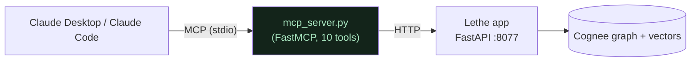

# 08 · The MCP server — Lethe's memory, callable from any AI client

_Added 2026-06-24. Built + self-verified over the real MCP stdio protocol; the live client plug-in is the user's step._

## In one line
`mcp_server.py` puts a standard **MCP doorway** on Lethe so other AI assistants (Claude Desktop, Claude Code, Cursor) can use its incident memory — triage, decommission, curate — **without opening the web UI.** Our whole thesis (remember → recall → **forget**) becomes callable tools.

## Why it's a thin proxy (the key design choice)
The MCP server does **not** re-implement anything or open its own Cognee instance. Each tool just forwards an HTTP call to the **already-running Lethe app** (`http://127.0.0.1:8077`). So there is **one source of truth** — the app's live workspaces, ledger, review dates and the forget receipt — and a `forget` through MCP is identical to one through the web UI. Zero duplicated logic, zero risk to the hero.



## The tools (what each AI client can call)
| Tool | Maps to | What it does |
|---|---|---|
| `triage(question, workspace?)` | `POST /ask` | graph-grounded on-call answer (+ sources) |
| `decommission_system(system, workspace?)` | `POST /forget` | **the hero** — forget + verifiable removal receipt + re-query proof |
| `list_systems(workspace?)` | `GET /systems` | systems + doc counts + review freshness (OVERDUE flags) |
| `curation_scan(workspace?)` | `GET /curation` + `/curation/aging` | FREE (0-token) stale-reference + aging scan |
| `check_conflicts(workspace?)` | `GET /curation/conflicts` | contradiction scan — **uses your model** (call deliberately) |
| `mark_reviewed(system, workspace?)` | `POST /curation/review` | freshen a runbook → leaves overdue list + lands on timeline |
| `memory_timeline(workspace?, limit?)` | `GET /timeline` | chronological audit log (forget events carry receipts) |
| `list_workspaces()` | `GET /workspaces` | the separate knowledge bases |
| `run_curation_cycle(workspace?, dry_run?)` | `POST /curation/cycle` | one bounded decay pass — auto-demote (reversible) + queue hard-deletes for approval; dry-run by default |
| `restore_system(system, workspace?)` | `POST /curation/restore` | undo a demotion (the reversible counterpart to forget) |

Deliberately **not** exposed (yet): workspace create/delete and document upload (async/mutating — awkward over MCP; add later if needed).

## How to run it
**1. The Lethe app must be running** (the MCP server proxies to it):
```bash
./.venv/bin/python -m uvicorn app:app --port 8077
```
**2a. Claude Code** — a project [`.mcp.json`](../.mcp.json) is already committed; open this folder in Claude Code and approve the `lethe` server when prompted (or `claude mcp list` to confirm).

**2b. Claude Desktop** — add this to `~/Library/Application Support/Claude/claude_desktop_config.json`, then restart Claude Desktop:
```json
{
  "mcpServers": {
    "lethe": {
      "command": "<path-to-repo>/.venv/bin/python",
      "args": ["<path-to-repo>/mcp_server.py"]
    }
  }
}
```
(If Claude Desktop already has an `mcpServers` block, add the `lethe` entry alongside the others.)

Override the target app with `LETHE_URL` if it runs elsewhere (default `http://127.0.0.1:8077`).

## Easiest test (one command, no client setup)
With the app running, just run **`./.venv/bin/python scripts/try_mcp.py`** — it starts the MCP server the way Claude would (over stdio), calls `triage` / `list_systems` / `curation_scan`, and prints the results. Read-only (never forgets), safe to run anytime. This is the fastest way to confirm the doorway works before wiring up a real client.

## Verified
Self-tested over the real MCP stdio protocol (spawned exactly as Claude Desktop does): all 10 tools list and execute against the running app — `triage` returns the hero answer + sources, `list_systems` shows OVERDUE flags, `curation_scan`/`memory_timeline`/`mark_reviewed` work, and **`decommission_system` returns the full receipt (2 docs / 10 nodes / 18 edges removed + "not documented" proof)** through MCP. Golden restored afterward. The remaining step is the live in-client demo (add the config above, ask Claude "use Lethe to triage auth-service latency").

## Why this matters for the hackathon
"Best Use of Cognee" rewards **depth of the memory lifecycle**. Exposing remember/recall/**forget** as first-class MCP tools — and making the hero `forget` callable from inside an engineer's editor — shows Cognee memory used as a real, pluggable service, not a thin wrapper. The landing page advertises it too (a **"Callable over MCP"** capability card) so the depth is visible to anyone who never opens the repo.
