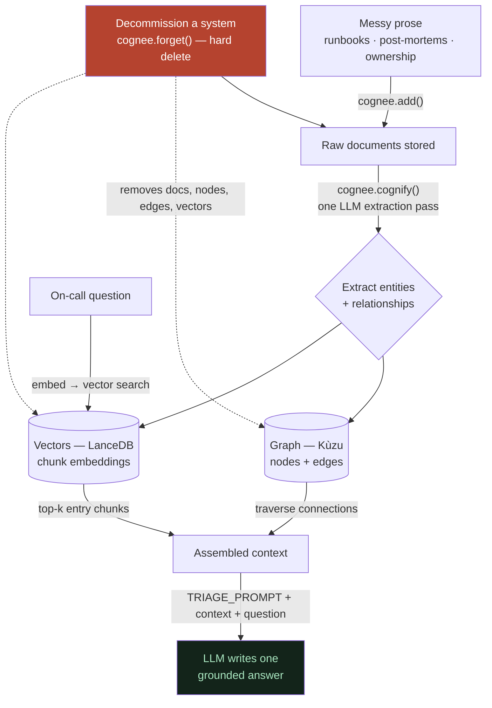

# 📚 Incident Detective — Learning Folder

This folder explains the whole project **twice over**: simply enough for a curious 10‑year‑old, and precisely enough for a hackathon judge. It also doubles as the raw material for the README, the demo script, and the blog — three of the remaining tasks are really just "expand what's written here."

Every file follows the same shape: **In one line → an everyday analogy → the real mechanics with real examples → why it matters → links to related files.** Diagrams are [Mermaid](https://mermaid.js.org/) (they render as real flowcharts on GitHub and in VS Code). Every fact here was verified against the running app and Cognee's source code — not paraphrased from memory.

---

## The whole thing, at a glance

> **The one-sentence version:** drop in messy runbooks and post-mortems; Cognee builds a knowledge graph + vector index from the prose with no schema; you ask plain on-call questions and get grounded answers; and when a system is decommissioned you **forget** it — a real hard delete — so the same question stops giving the stale advice. **Memory that stays current instead of rotting.**

---

## How to read it (pick your path)

- **"Explain it like I'm new"** → [What is this?](00-the-big-picture/what-is-this.md) → [The problem](00-the-big-picture/the-problem-static-memory-rots.md) → [What we built](00-the-big-picture/what-we-built.md) → [Newbie glossary](04-judge-and-learner-qa/newbie-glossary.md).
- **"I'm a judge, give me substance fast"** → [What we built](00-the-big-picture/what-we-built.md) → [Judge questions answered](04-judge-and-learner-qa/judge-questions-answered.md) → [Why Cognee, not just RAG](02-cognee-deep-dive/why-cognee-not-just-rag.md) → [Honest limits](04-judge-and-learner-qa/honest-limits-what-we-dont-claim.md).
- **"How does it actually work?"** → walk [01-how-it-works/](01-how-it-works/00-overview-the-pipeline.md) in order, 00 → 08.
- **"Tell me the story"** → [What we tested and killed](05-the-research-story/what-we-tested-and-killed.md) → [The debugging saga](05-the-research-story/the-debugging-saga-and-lessons.md).

---

## The map

### 00 · The big picture — _start here_
- [what-is-this.md](00-the-big-picture/what-is-this.md) — the whole project, kid version then judge version
- [the-problem-static-memory-rots.md](00-the-big-picture/the-problem-static-memory-rots.md) — why "remember everything" is the wrong goal
- [what-we-built.md](00-the-big-picture/what-we-built.md) — the components + the hero beat, step by step
- [is-the-research-done.md](00-the-big-picture/is-the-research-done.md) — done vs left; the cool things it can do; who it's for

### 01 · How it works — _the pipeline, in order_
- [00-overview-the-pipeline.md](01-how-it-works/00-overview-the-pipeline.md) — the whole flow on one page
- [01-ingest-messy-docs-to-graph.md](01-how-it-works/01-ingest-messy-docs-to-graph.md) — turning prose into a graph
- [02-entities-and-relationships.md](01-how-it-works/02-entities-and-relationships.md) — what's an entity, how they link
- [03-graph-and-vectors-hybrid.md](01-how-it-works/03-graph-and-vectors-hybrid.md) — the two stores, and why both
- [04-embeddings-and-meaning-space.md](01-how-it-works/04-embeddings-and-meaning-space.md) — how "meaning" becomes numbers
- [05-retrieval-graph-completion.md](01-how-it-works/05-retrieval-graph-completion.md) — vectors find the door, the graph walks the rooms
- [06-the-llm-is-the-combiner.md](01-how-it-works/06-the-llm-is-the-combiner.md) — no magic fusion; the model reads text and writes
- [07-the-forget-hero.md](01-how-it-works/07-the-forget-hero.md) — what forget actually removes
- [08-the-same-question-flip.md](01-how-it-works/08-the-same-question-flip.md) — the money shot, explained as an experiment

### 02 · Cognee deep dive
- [what-is-cognee.md](02-cognee-deep-dive/what-is-cognee.md) — the memory layer we build on
- [why-cognee-not-just-rag.md](02-cognee-deep-dive/why-cognee-not-just-rag.md) — the honest graph-vs-RAG story
- [the-cognee-api-we-use.md](02-cognee-deep-dive/the-cognee-api-we-use.md) — add, cognify, search, forget
- [config-and-the-self-hosted-stack.md](02-cognee-deep-dive/config-and-the-self-hosted-stack.md) — the local, self-hosted setup

### 03 · The tech stack — _our code_
- [the-whole-stack.md](03-the-tech-stack/the-whole-stack.md) — every file and how it fits
- [the-triage-prompt-and-prompt-leverage.md](03-the-tech-stack/the-triage-prompt-and-prompt-leverage.md) — the one knob that changed everything
- [determinism-and-the-golden-snapshot.md](03-the-tech-stack/determinism-and-the-golden-snapshot.md) — making the demo bulletproof

### 04 · Judge & learner Q&A
- [judge-questions-answered.md](04-judge-and-learner-qa/judge-questions-answered.md) — the FAQ, grounded
- [newbie-glossary.md](04-judge-and-learner-qa/newbie-glossary.md) — every term, in plain English
- [honest-limits-what-we-dont-claim.md](04-judge-and-learner-qa/honest-limits-what-we-dont-claim.md) — what we deliberately don't claim

### 05 · The research story — _the blog spine_
- [what-we-tested-and-killed.md](05-the-research-story/what-we-tested-and-killed.md) — 3 differentiators tested, only forget held
- [the-debugging-saga-and-lessons.md](05-the-research-story/the-debugging-saga-and-lessons.md) — how we found the real root cause

### 06 · The product now — _everything built in the June 2026 session_
- [06-the-product-now.md](06-the-product-now.md) — the demo became a product: **Proof of Forgetting**, the **curation loop** (staleness + conflict), **bring-your-own-key**, workspaces, threads, add/remove systems, **memory timeline** — with a **Mermaid control-flow flowchart for every feature**, the data model, the HTTP surface, and the hard-won guardrails. _Read this to understand the current codebase fast._

### 07 · Cognee capability audit — _what we use vs what's on the table_
- [07-cognee-capability-audit.md](07-cognee-capability-audit.md) — a deep read of Cognee's docs **ground-truthed against our installed `1.1.3`**: the real API surface, **how Lethe uses ~20% of it today**, and a ranked, verified, probe-first list of what to add (multi-search-type routing, custom `graph_model` to harden extraction + de-risk the 1.2.x pin, `only_context` evidence, NodeSets, an MCP server). Corrects two wrong beliefs in our own notes and flags the feedback-loop tension with our anti-accumulation thesis.

### 08 · The MCP server — _Lethe's memory callable from any AI client_
- [08-mcp-server.md](08-mcp-server.md) — `mcp_server.py` exposes Lethe's tools (triage · **decommission/forget** · curation · timeline) over MCP as a **thin proxy to the running app**, so Claude Desktop / Claude Code can use the incident memory in-editor. Includes the design, the 8 tools, run + connect steps, and the stdio self-test result.

---

## The five-line cheat sheet

1. **Ingest** — `cognee.add()` raw prose, `cognee.cognify()` extracts a **graph (Kùzu)** + **vectors (LanceDB)** in one LLM pass — no schema, no tagging.
2. **Ask** — `GRAPH_COMPLETION`: vectors find the relevant chunks, the graph walks the connections, the LLM writes one plain-language answer (steered by our `TRIAGE_PROMPT`).
3. **Forget** — `cognee.forget(data_id)` **hard-deletes** a decommissioned system's docs, graph nodes/edges, and vectors (verified: files 7→5, zero residue).
4. **The money shot** — the *same* question, asked before and after forget, flips from the stale system to the current one — a controlled experiment, live.
5. **Honest** — we verified forget *structurally and behaviorally*, we name our limits, and we showed that of three Cognee differentiators tested at temp 0, **only forget held**.
